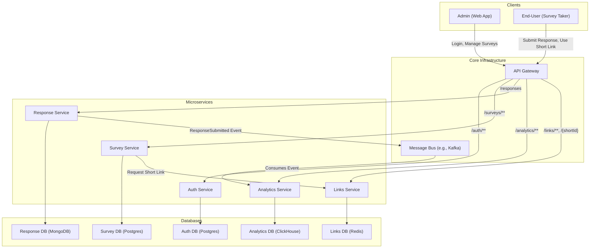

# High-Level Design: Client Survey Application

## 1. Document Information
- **Document Title**: Client Survey Application - High-Level Design
- **Version**: 1.0
- **Date**: 2025-08-25
- **Author**: Jules (AI Agent)
- **Status**: Draft

---

## 2. Executive Summary

### 2.1 Purpose
This document provides a comprehensive high-level design for a "Client Survey Application." The system is designed as a microservices-based platform for creating, distributing, and analyzing surveys.

### 2.2 Scope

**In Scope:**
- User authentication for survey creators (Admins).
- CRUD (Create, Read, Update, Delete) functionality for surveys and questions.
- Collection of survey responses from end-users.
- Generation of unique, shareable links for surveys.
- Asynchronous processing and aggregation of survey data for analytics.
- A dashboard to visualize survey results.

**Out of Scope:**
- Advanced user role management (e.g., Teams, View-only permissions).
- Billing and subscription management.
- Real-time collaboration on survey creation.

### 2.3 High-Level Architecture Overview
The architecture is based on five core microservices: **Auth, Survey, Response, Analytics, and Links**. These services are decoupled, communicating via a central **API Gateway** for synchronous requests and a **Message Bus** for asynchronous events. Each service owns its dedicated database to ensure loose coupling and independent scalability. This design prioritizes scalability, resilience, and maintainability.

---

## 3. System Overview

### 3.1 Business Context
Organizations need an efficient way to gather feedback from clients, customers, and employees. This application provides a scalable and robust platform to build, share, and analyze surveys, enabling data-driven decision-making.

### 3.2 Success Criteria
- **High Availability**: 99.9% uptime for response collection and link redirection.
- **Low Latency**: <150ms latency for submitting a survey response (p99).
- **Scalability**: The system must handle 1,000 concurrent survey submissions and manage millions of responses.
- **Data Integrity**: All submitted responses must be captured accurately.

### 3.3 Assumptions
- The number of survey responses (reads/writes) will be significantly higher than the number of survey creations (writes).
- Analytics data can be eventually consistent. Real-time analytics are not required for the initial version.
- Survey respondents are anonymous and do not require authentication.

---

## 4. Requirements Analysis

### 4.1 Functional Requirements
- **FR-001**: Admins must be able to register and log in to the system.
- **FR-002**: Authenticated admins can create, edit, and delete surveys and their questions.
- **FR-003**: The system shall generate a unique, short URL for each survey.
- **FR-004**: End-users can access a survey via its unique link and submit responses.
- **FR-005**: The system shall record every valid survey response.
- **FR-006**: Admins can view aggregated analytics and visualizations for their surveys.
- **FR-007**: The system shall support QR code generation for survey links.

### 4.2 Non-Functional Requirements
- **Performance**: Response submission latency < 150ms (p99). Analytics dashboard load time < 2s (p99).
- **Scalability**: The Response service must scale independently to handle traffic spikes. The Analytics service must scale to process a high volume of events.
- **Availability**: 99.9% for the `Response` and `Links` services. 99.5% for other services.
- **Security**: Admin access must be protected by strong authentication. All user data must be encrypted in transit and at rest.
- **Reliability**: The system must guarantee the capture of every submitted response.

---

## 5. Architecture Design

### 5.1 Architecture Principles
- **Domain-Driven Design**: Services are modeled around specific business domains (e.g., Surveys, Responses).
- **Database per Service**: Each microservice has its own private data store, preventing direct database access from other services.
- **Asynchronous Communication**: A message bus is used for non-blocking, event-driven communication between services, enhancing resilience and scalability.
- **Stateless Services**: All core services are stateless, allowing for horizontal scaling and high availability.

### 5.2 High-Level Architecture Diagram

### 5.3 Component Overview
- **API Gateway**: The single entry point for all client requests. It handles routing, rate limiting, and some authentication checks.
- **Auth Service**: Manages admin user identity, registration, and login. Issues JWTs for authenticating API requests.
- **Survey Service**: Manages the lifecycle of surveys and questions. Handles all CRUD operations.
- **Response Service**: A high-throughput service responsible for ingesting and validating survey responses. It is optimized for writes. Upon receiving a response, it stores it and publishes a `ResponseSubmitted` event to the message bus.
- **Analytics Service**: Consumes events from the message bus, processes the data asynchronously, and stores it in a denormalized format suitable for fast queries. It powers the analytics dashboard.
- **Links Service**: A "tiny URL" service that generates, manages, and redirects short URLs for surveys. It also provides QR code generation.
- **Message Bus**: A central message broker (like Kafka or RabbitMQ) that enables asynchronous, event-driven communication between services.

### 5.4 Technology Stack
- **Backend**: **Go** (for high-performance services like Response, Links) and **Java/Spring Boot** (for business-logic heavy services like Survey, Auth).
- **Databases**:
    - **PostgreSQL**: For services requiring transactions and structured data (Auth, Survey).
    - **MongoDB**: For the Response service to handle high-volume, schema-flexible response data.
    - **ClickHouse/Druid**: A column-oriented database for the Analytics service, optimized for fast aggregations.
    - **Redis**: For the Links service (fast lookups) and as a general-purpose cache.
- **Frontend**: **React** or **Vue.js** for the admin-facing web application.
- **Message Bus**: **Apache Kafka** for its scalability and durability.
- **Infrastructure**: **Kubernetes** for container orchestration, **Docker** for containerization, all hosted on a major cloud provider (AWS, GCP, Azure).

---

## 6. Data Design
The system employs a decentralized data management approach. Each microservice is responsible for its own data.
- **Auth Service**: Manages `users` table with credentials.
- **Survey Service**: Manages `surveys` and `questions` tables.
- **Response Service**: Manages a `responses` collection containing submitted answers.
- **Analytics Service**: Manages aggregated data tables (e.g., `daily_summary_stats`).
- **Links Service**: Manages a key-value store of `short_id` to `survey_id`.

---

## 7. API Design
A unified RESTful API will be exposed through the API Gateway.
- **Versioning**: APIs will be versioned (e.g., `/api/v1/...`).
- **Authentication**: Most endpoints will be protected and require a valid JWT issued by the Auth Service. The JWT will be passed in the `Authorization` header.
- **Public Endpoints**: The survey submission and link redirection endpoints will be public but will have strict rate limiting.

---

## 8. Security Design
- **Authentication**: JWT-based authentication for admins.
- **Authorization**: The API Gateway and individual services will enforce authorization rules.
- **Data Protection**: All data is encrypted in transit (TLS) and at rest. Sensitive data is handled with care.
- **Network Security**: Services are deployed in a private network (VPC), with access strictly controlled by firewall rules.

---

## 9. Scalability & Performance
- **Horizontal Scaling**: All services are stateless and can be scaled horizontally. Kubernetes Horizontal Pod Autoscaler will be used to automatically adjust the number of replicas based on load.
- **Asynchronous Processing**: The use of a message bus for analytics processing prevents backpressure on the high-throughput Response service.
- **Caching**: A distributed cache (Redis) will be used to cache popular survey data and short links to reduce database load and improve latency.

---

## 10. Deployment & Operations
- **CI/CD**: A fully automated CI/CD pipeline will be used for building, testing, and deploying services to Kubernetes.
- **Monitoring**: Centralized monitoring using Prometheus and Grafana for metrics, and Jaeger/Zipkin for distributed tracing.
- **Logging**: A centralized logging solution (like ELK stack or Loki) will aggregate logs from all services for easier debugging and analysis.
