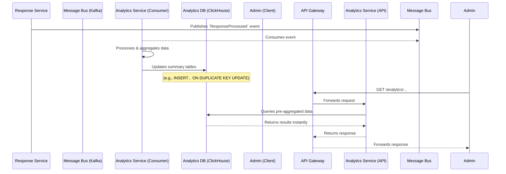
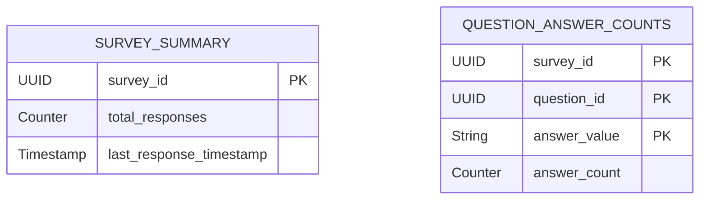

# HLD: Analytics Service

## 1. Service Overview
The **Analytics Service** provides fast, aggregated insights from the collected survey data. It operates asynchronously, consuming events from the message bus, which means it is not on the critical path of survey submission. Its primary design goals are read-performance and scalability to power a responsive analytics dashboard for admin users.

---

## 2. Event-Driven Architecture

The service is fundamentally event-driven. It listens for notifications that a new survey response has been successfully processed and then updates its own aggregated data stores.



**Flow Description:**
1.  **Consumption**: The Analytics Service subscribes to the `ResponseProcessed` topic on the message bus. This event serves as the trigger for all data processing.
2.  **Processing**: For each event, a consumer in the service parses the response data. It extracts key information for aggregation (e.g., which answer was chosen for a specific question).
3.  **Aggregation & Storage**: The service updates pre-aggregated tables in its specialized analytics database (e.g., ClickHouse). For instance, if an answer to a multiple-choice question is "Option A," it increments the counter for "Option A" for that question. This pre-computation is the key to providing fast analytics.
4.  **Serving Data**: When an admin views a survey's dashboard, the frontend makes requests to the Analytics Service's API. The API reads directly from the pre-aggregated tables, ensuring a very fast response time as no complex calculations are needed on the fly.

---

## 3. API Endpoints

The API is read-only and provides data for visualization on the admin dashboard.

- **`GET /api/v1/analytics/surveys/{surveyId}/summary`**
  - **Purpose**: Retrieves summary statistics for a survey.
  - **Response (200 OK)**:
    ```json
    {
      "survey_id": "...",
      "total_responses": 1250,
      "last_response_at": "2025-08-25T12:00:00Z"
    }
    ```

- **`GET /api/v1/analytics/surveys/{surveyId}/questions/{questionId}`**
  - **Purpose**: Retrieves detailed analytics for a single question.
  - **Response (200 OK)**:
    ```json
    {
      "question_id": "...",
      "type": "multiple-choice",
      "total_responses": 1245,
      "results": [
        { "option": "Good", "count": 800 },
        { "option": "Average", "count": 400 },
        { "option": "Bad", "count": 45 }
      ]
    }
    ```

---

## 4. Database Schema

This service uses a column-oriented database (like **ClickHouse** or **Apache Druid**) optimized for OLAP (Online Analytical Processing) queries. The schema is highly denormalized and pre-aggregated.

**Table: `question_answer_counts`**
This table stores the counts for each unique answer to a question.

| Column Name     | Data Type             | Description                                          |
|-----------------|-----------------------|------------------------------------------------------|
| `survey_id`     | `UUID`                | The ID of the survey.                                |
| `question_id`   | `UUID`                | The ID of the question.                              |
| `answer_value`  | `String`              | The specific answer given (e.g., "Option A").        |
| `answer_count`  | `SummingMergeTree`    | A counter that automatically sums up on merge.       |
| `last_updated`  | `DateTime`            | Timestamp of the last update to this row.            |
*Primary Key*: (`survey_id`, `question_id`, `answer_value`)

**Table: `survey_summary`**
This table stores high-level summary information for each survey.

| Column Name               | Data Type             | Description                                          |
|---------------------------|-----------------------|------------------------------------------------------|
| `survey_id`               | `UUID`                | The ID of the survey. (Primary Key)                  |
| `total_responses`         | `SummingMergeTree`    | A counter for the total number of responses received.|
| `last_response_timestamp` | `Max`                 | Stores the maximum (i.e., latest) timestamp.         |

---

## 5. Conceptual Data Model

The data model is flat and denormalized for read performance.


*Note: There are no explicit relationships in this OLAP schema; tables are independent and populated by the consumer.*
