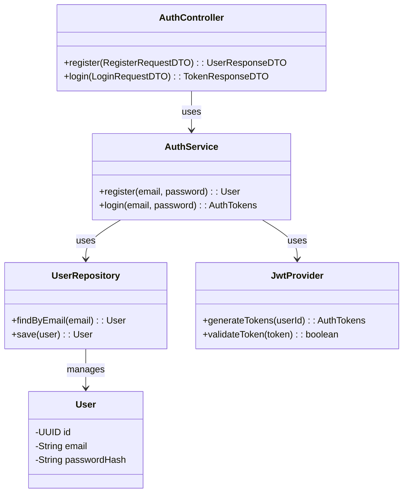

# HLD: Auth Service

## 1. Service Overview
The **Auth Service** is a critical component responsible for managing user identity and authentication for the Client Survey Application. It handles admin user registration, login, and the issuance of JSON Web Tokens (JWTs) used to secure the platform's APIs.

---

## 2. API Endpoints

This service exposes the following endpoints, which will be routed via the API Gateway under the `/auth` path.

### 2.1 `POST /api/v1/auth/register`
- **Purpose**: Registers a new admin user.
- **Request Body**:
  ```json
  {
    "email": "admin@example.com",
    "password": "a-strong-password"
  }
  ```
- **Response (Success - 201 Created)**:
  ```json
  {
    "id": "c4a7f3d8-1b0a-4e9e-8b3a-4f1e5d6c7b8a",
    "email": "admin@example.com"
  }
  ```
- **Error Codes**:
  - `400 Bad Request`: If email is invalid or password is too weak.
  - `409 Conflict`: If a user with the given email already exists.

### 2.2 `POST /api/v1/auth/login`
- **Purpose**: Authenticates a user and returns JWTs.
- **Request Body**:
  ```json
  {
    "email": "admin@example.com",
    "password": "a-strong-password"
  }
  ```
- **Response (Success - 200 OK)**:
  ```json
  {
    "access_token": "eyJhbGciOiJIUzI1NiIsInR5cCI6IkpXVCJ9...",
    "refresh_token": "def50200..."
  }
  ```
- **Error Codes**:
  - `401 Unauthorized`: If credentials are invalid.

---

## 3. Authentication Flow (JWT)

1.  **Login**: An admin user sends their credentials (`email`, `password`) to the `/login` endpoint.
2.  **Validation**: The Auth Service validates the credentials against the records in its database. Passwords are first hashed and then compared.
3.  **Token Generation**: Upon successful validation, the service generates two tokens:
    -   **Access Token**: A short-lived JWT (e.g., 15 minutes) containing user identity claims (`user_id`, `role`). This token is signed with a secret key.
    -   **Refresh Token**: A long-lived, opaque token (e.g., 7 days) stored in the database, used to obtain a new access token.
4.  **API Communication**: The client stores these tokens securely. For all subsequent requests to protected microservices, the client sends the **Access Token** in the `Authorization: Bearer <token>` header.
5.  **Gateway Validation**: The API Gateway intercepts incoming requests and validates the Access Token's signature and expiration. If valid, it forwards the request to the appropriate upstream service, often including the user's ID in a request header.
6.  **Token Refresh**: When the Access Token expires, the client sends the **Refresh Token** to an endpoint like `/api/v1/auth/refresh` to get a new Access Token without requiring the user to log in again.

---

## 4. Database Schema

The Auth Service uses a relational database (e.g., PostgreSQL) and owns a single `users` table.

**Table: `users`**

| Column Name     | Data Type             | Constraints                               | Description                              |
|-----------------|-----------------------|-------------------------------------------|------------------------------------------|
| `id`            | `UUID`                | `PRIMARY KEY`, `DEFAULT gen_random_uuid()`| Unique identifier for the user.          |
| `email`         | `VARCHAR(255)`        | `UNIQUE`, `NOT NULL`                      | User's email address, used for login.    |
| `password_hash` | `VARCHAR(255)`        | `NOT NULL`                                | The hashed version of the user's password.|
| `created_at`    | `TIMESTAMPTZ`         | `NOT NULL`, `DEFAULT NOW()`               | Timestamp of user creation.              |
| `updated_at`    | `TIMESTAMPTZ`         | `NOT NULL`, `DEFAULT NOW()`               | Timestamp of the last update.            |

---

## 5. Class Diagram

The internal structure of the Auth Service follows standard layered architecture patterns.


