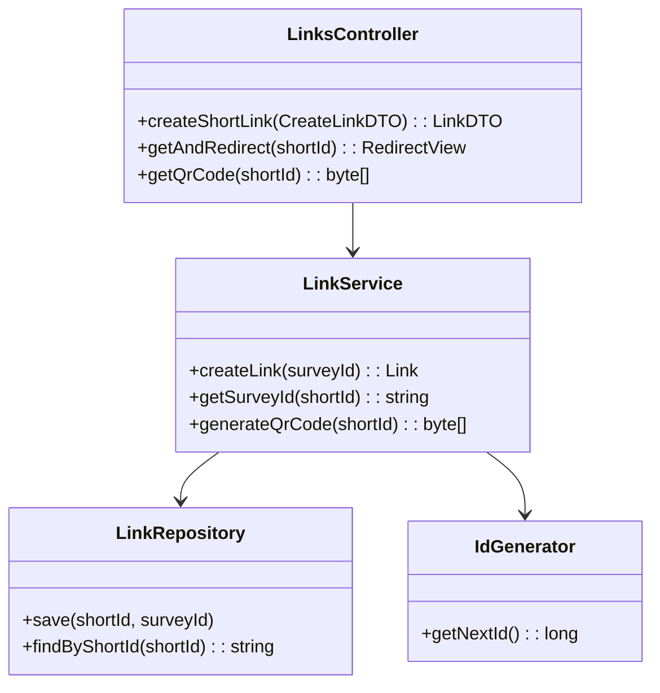

# HLD: Links Service

## 1. Service Overview
The **Links Service** is a specialized, high-performance microservice that functions as an internal "tiny URL" generator. Its responsibilities are to create unique, short, and non-guessable IDs for surveys, handle the redirection from the short link to the full survey URL, and generate QR codes for easy sharing. Low latency on the redirection path is a critical design requirement.

---

## 2. API Endpoints

### 2.1 `POST /api/v1/links` (Internal)
- **Purpose**: Creates a new short link for a survey. This is an internal endpoint intended to be called by the **Survey Service**.
- **Request Body**:
  ```json
  {
    "survey_id": "a1b2c3d4-e5f6-7890-1234-567890abcdef"
  }
  ```
- **Response (201 Created)**:
  ```json
  {
    "short_id": "aB3xZ9c",
    "survey_id": "a1b2c3d4-e5f6-7890-1234-567890abcdef"
  }
  ```

### 2.2 `GET /{short_id}` (Public)
- **Purpose**: Redirects a user from a short link to the full survey URL.
- **Request**: The `short_id` is provided in the URL path, e.g., `http://short.is/{short_id}`.
- **Response**:
  - `302 Found`: Redirects to the frontend application URL, e.g., `Location: https://surveys.example.com/s/a1b2c3d4...`. A `302` redirect is used because the short link is a proxy, not the permanent location of the resource.
  - `404 Not Found`: If the `short_id` does not exist.

### 2.3 `GET /api/v1/links/{short_id}/qr` (Public)
- **Purpose**: Generates a QR code image for a given short link.
- **Response (200 OK)**: A PNG image (`Content-Type: image/png`) of the QR code.

---

## 3. Core Logic

### 3.1 Short ID Generation
To ensure short IDs are unique and not guessable, the following strategy is used:
1.  A request is received from the Survey Service to create a link for a new survey.
2.  The Links Service calls a distributed unique ID generator (e.g., based on Twitter's Snowflake algorithm) to get a 64-bit unique integer.
3.  This integer is then encoded using a **Base62** character set (`[a-zA-Z0-9]`).
4.  The resulting string (e.g., `aB3xZ9c`) becomes the `short_id`. This ID is guaranteed to be unique and non-sequential.
5.  The mapping of `short_id` to `survey_id` is stored in the database.

### 3.2 Redirection Flow

```mermaid
sequenceDiagram
    participant User
    participant Browser
    participant Links Service
    participant Links DB (Redis)

    User->>Browser: Clicks on http://short.is/aB3xZ9c
    Browser->>+Links Service: GET /aB3xZ9c
    Links Service->>+Links DB (Redis): GET "aB3xZ9c"
    Links DB (Redis)-->>-Links Service: Returns "survey_id: a1b2..."
    Links Service->>Links Service: Constructs destination URL
    Links Service-->>-Browser: HTTP 302 Found
    Note right of Links Service: Location: https://surveys.example.com/s/a1b2...
    Browser->>User: Redirects to survey page
```

### 3.3 QR Code Generation
When the `/qr` endpoint is hit, the service constructs the full short URL (e.g., `http://short.is/{short_id}`) and uses a standard library to encode this URL into a QR code, which is returned as a PNG image.

---

## 4. Database Schema

The ideal database for this service is a high-performance, in-memory key-value store like **Redis**. The data model is extremely simple, which is perfect for this use case where read latency is the highest priority.

-   **Data Model**: Key-Value
-   **Key**: `short_id` (e.g., `"aB3xZ9c"`)
-   **Value**: `survey_id` (e.g., `"a1b2c3d4-e5f6-7890-1234-567890abcdef"`)

A cache with a write-back policy to a persistent store could be used for durability, but for many URL shorteners, storing the active link set entirely in Redis is a viable and highly performant strategy.

---

## 5. Class Diagram


