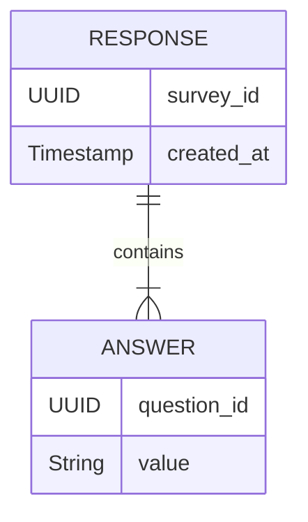

# HLD: Response Service

## 1. Service Overview
The **Response Service** is a high-throughput, write-optimized microservice designed for one critical task: ingesting survey responses from end-users. Its architecture prioritizes speed, scalability, and resilience to ensure that no submission is lost, even under heavy load. It achieves this by decoupling the initial HTTP request from the database write operation using an asynchronous, event-driven flow.

---

## 2. API Endpoint

The service exposes a single public endpoint for submitting survey responses.

### `POST /api/v1/responses`
- **Purpose**: Submits a set of answers for a given survey.
- **Request Body**:
  ```json
  {
    "survey_id": "a1b2c3d4-e5f6-7890-1234-567890abcdef",
    "answers": [
      {
        "question_id": "q1-uuid-goes-here",
        "value": "This is a text answer."
      },
      {
        "question_id": "q2-uuid-goes-here",
        "value": "Option B"
      }
    ]
  }
  ```
- **Response (Success - 202 Accepted)**: An empty body with this status code indicates that the response has been successfully queued for processing. It does not guarantee that the data has been fully validated or saved to the database yet.
- **Error Codes**:
  - `400 Bad Request`: If the request payload is malformed (e.g., missing `survey_id`).
  - `429 Too Many Requests`: If the client exceeds the rate limit.

---

## 3. Asynchronous Data Ingestion Flow

To handle high traffic volumes efficiently, the service uses an asynchronous pattern.

```mermaid
sequenceDiagram
    participant User
    participant API Gateway
    participant Response Service (API)
    participant Message Bus (Kafka)
    participant Response Service (Worker)
    participant Response DB (MongoDB)

    User->>+API Gateway: POST /api/v1/responses
    API Gateway->>+Response Service (API): Forwards request
    Response Service (API)->>-User: Returns HTTP 202 Accepted
    Response Service (API)->>Message Bus: Publishes `ResponseReceived` event
    API Gateway-->>-User: Forwards 202 Accepted

    Response Service (Worker)-->>+Message Bus: Consumes `ResponseReceived` event
    Response Service (Worker)->>Response Service (Worker): Performs validation
    Response Service (Worker)->>+Response DB (MongoDB): Writes response data
    Response DB (MongoDB)-->>-Response Service (Worker): Confirms write
    Response Service (Worker)-->>-Message Bus: Publishes `ResponseProcessed` event
```

**Flow Description:**
1.  **Ingestion**: The user submits a response. The API component of the Response Service performs basic validation on the payload and immediately returns `202 Accepted`.
2.  **Queuing**: The service then publishes the full response payload as a `ResponseReceived` event onto a dedicated topic in the Message Bus (e.g., Kafka).
3.  **Processing**: A separate, independently scalable pool of workers within the Response Service consumes events from this topic.
4.  **Validation & Storage**: The worker performs full validation on the response data (e.g., ensuring the survey exists and is open). If valid, it transforms the data into the database schema and writes it to the high-performance Response DB (MongoDB).
5.  **Notification**: After successfully saving the response, the worker publishes a new event, `ResponseProcessed`, to a different topic. This event signals to the rest of the system (specifically the **Analytics Service**) that a new, clean response is available for aggregation.

---

## 4. Database Schema

A document-based NoSQL database like **MongoDB** is chosen for its high write throughput and flexible schema, which is ideal for storing survey responses. Data is stored in a single `responses` collection.

**Collection: `responses`**

```json
{
  "_id": "ObjectId('...')",
  "survey_id": "a1b2c3d4-e5f6-7890-1234-567890abcdef",
  "created_at": "ISODate('2025-08-25T10:00:00Z')",
  "answers": [
    {
      "question_id": "q1-uuid-goes-here",
      "value": "This is a text answer."
    },
    {
      "question_id": "q2-uuid-goes-here",
      "value": "Option B"
    }
  ]
}
```

- **`_id`**: The primary key, automatically generated by MongoDB.
- **`survey_id`**: Indexed for efficient lookups of all responses for a given survey.
- **`answers`**: An array of embedded documents, where each document represents a single answer. This structure keeps all data for a single response together, which is efficient for writes and simple lookups.

---

## 5. Conceptual Data Model

A traditional ERD is less applicable to a document model. This diagram shows the conceptual relationship.


This illustrates that a single `RESPONSE` document contains an array of `ANSWER` sub-documents.
