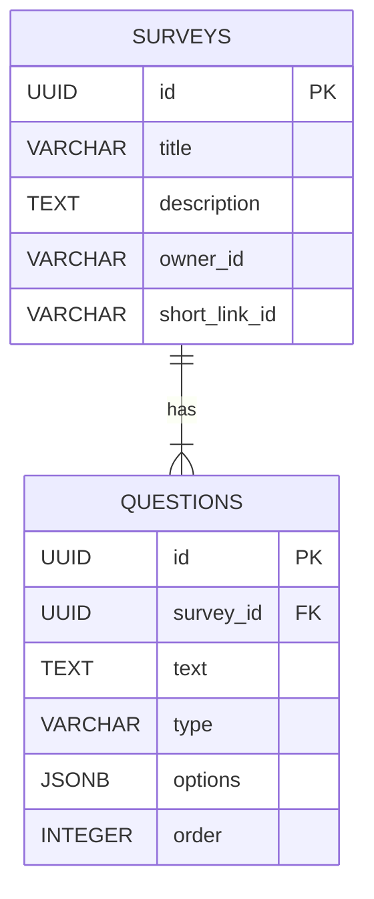
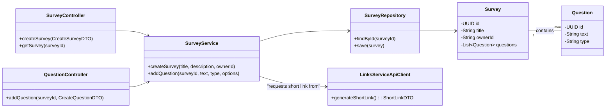

# HLD: Survey Service

## 1. Service Overview
The **Survey Service** is the core component for managing the lifecycle of surveys. It provides functionality for authenticated admin users to create, read, update, and delete surveys and the questions within them. It acts as the source of truth for all survey-related content.

---

## 2. API Endpoints

The following endpoints are exposed by the Survey Service and routed via the API Gateway. All endpoints require authentication.

### 2.1 Survey Management

- **`POST /api/v1/surveys`**: Creates a new survey.
  - **Request Body**: `{ "title": "Customer Feedback Q3", "description": "A survey about..." }`
  - **Response (201 Created)**: The full survey object, including its new ID.

- **`GET /api/v1/surveys`**: Lists all surveys owned by the authenticated user.
  - **Response (200 OK)**: `[ { "id": "...", "title": "..." }, ... ]`

- **`GET /api/v1/surveys/{surveyId}`**: Retrieves a single survey, including all its questions.
  - **Response (200 OK)**: A full survey object with a nested `questions` array.

- **`PUT /api/v1/surveys/{surveyId}`**: Updates a survey's title or description.
  - **Request Body**: `{ "title": "New Title", "description": "New description." }`
  - **Response (200 OK)**: The updated survey object.

- **`DELETE /api/v1/surveys/{surveyId}`**: Deletes a survey and all its associated questions.
  - **Response (204 No Content)**

### 2.2 Question Management

- **`POST /api/v1/surveys/{surveyId}/questions`**: Adds a new question to a survey.
  - **Request Body**: `{ "text": "How was your experience?", "type": "multiple-choice", "options": ["Good", "Bad"] }`
  - **Response (201 Created)**: The new question object.

- **`PUT /api/v1/surveys/{surveyId}/questions/{questionId}`**: Updates an existing question.
  - **Response (200 OK)**: The updated question object.

- **`DELETE /api/v1/surveys/{surveyId}/questions/{questionId}`**: Deletes a question from a survey.
  - **Response (204 No Content)**

---

## 3. Database Schema

This service uses a relational database (e.g., PostgreSQL) with two primary tables: `surveys` and `questions`.

**Table: `surveys`**

| Column Name     | Data Type             | Constraints                               | Description                              |
|-----------------|-----------------------|-------------------------------------------|------------------------------------------|
| `id`            | `UUID`                | `PRIMARY KEY`                             | Unique identifier for the survey.        |
| `title`         | `VARCHAR(255)`        | `NOT NULL`                                | The title of the survey.                 |
| `description`   | `TEXT`                |                                           | A detailed description of the survey.    |
| `owner_id`      | `VARCHAR(255)`        | `NOT NULL`                                | The ID of the admin user who owns it.    |
| `short_link_id` | `VARCHAR(32)`         | `UNIQUE`                                  | The short ID for the survey link.        |
| `created_at`    | `TIMESTAMPTZ`         | `NOT NULL`, `DEFAULT NOW()`               | Timestamp of survey creation.            |
| `updated_at`    | `TIMESTAMPTZ`         | `NOT NULL`, `DEFAULT NOW()`               | Timestamp of the last update.            |

*Note on `short_link_id`*: When a survey is created, the Survey Service makes a synchronous call to the **Links Service** to generate a unique short ID, which is then stored here for reference.

**Table: `questions`**

| Column Name | Data Type      | Constraints           | Description                                       |
|-------------|----------------|-----------------------|---------------------------------------------------|
| `id`        | `UUID`         | `PRIMARY KEY`         | Unique identifier for the question.               |
| `survey_id` | `UUID`         | `FK to surveys.id`    | Links the question to its survey.                 |
| `text`      | `TEXT`         | `NOT NULL`            | The text of the question itself.                  |
| `type`      | `VARCHAR(50)`  | `NOT NULL`            | Type of question (e.g., 'text', 'multiple-choice').|
| `options`   | `JSONB`        |                       | Stores choices for multiple-choice questions.     |
| `order`     | `INTEGER`      | `NOT NULL`            | The display order of the question within the survey.|

---

## 4. Entity-Relationship Diagram (ERD)

---

## 5. Class Diagram

