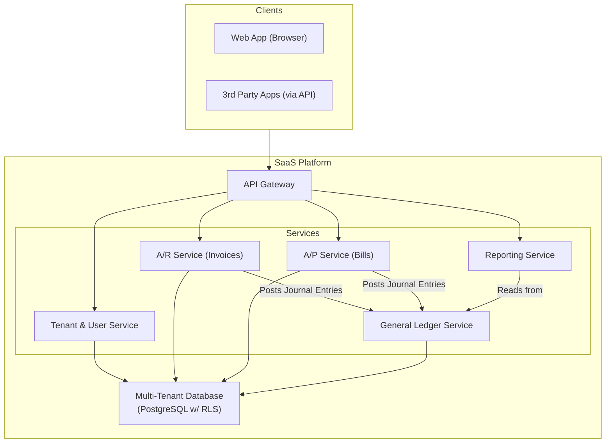

# High-Level Design: Accounting Software

## 1. Document Information

- **Document Title**: SaaS Accounting Software - High-Level Design
- **Version**: 1.0
- **Date**: 2025-08-30
- **Author**: Jules (AI Agent)
- **Status**: Draft

---

## 2. Executive Summary

### 2.1 Purpose
This document provides the high-level design for a multi-tenant, cloud-native Accounting Software platform. The system is designed to serve as a comprehensive financial management tool for small to medium-sized businesses, enabling them to manage their income, expenses, and financial health based on the foundational principles of double-entry bookkeeping.

### 2.2 Scope

**In Scope:**
-   **Multi-tenancy**: The platform will support multiple, distinct business entities (tenants) with complete data isolation.
-   A customizable **Chart of Accounts (CoA)** for each tenant.
-   A core **General Ledger (GL)** to act as the immutable system of record for all financial transactions.
-   An **Accounts Receivable (A/R)** module for creating and managing customer invoices.
-   An **Accounts Payable (A/P)** module for entering and managing bills from suppliers.
-   A **Bank Reconciliation** feature to match bank statement transactions with recorded entries.
-   Generation of standard **Financial Reports** (Balance Sheet, Income Statement, etc.).
-   A public REST API for third-party integrations (e.g., e-commerce, payroll systems).

**Out of Scope:**
-   Payroll processing.
-   Inventory management.
-   Tax filing and compliance services (the system provides data for this, but doesn't perform it).
-   Advanced enterprise resource planning (ERP) features.

### 2.3 High-Level Architecture Overview
The architecture is a multi-tenant SaaS application built on a microservices-based architecture. A central, immutable **General Ledger** service is the core of the system. It is supported by sub-ledger services for **Accounts Receivable** and **Accounts Payable**. All services are designed for strict tenant isolation, ensuring that one business's data is never visible to another. A public-facing **API Gateway** provides a single entry point for both the user-facing web application and third-party integrations.

---

## 3. System Overview

### 3.1 Business Context
Accurate financial record-keeping is a legal and operational necessity for every business. Modern accounting software replaces manual spreadsheets and desktop applications with a collaborative, accessible, and automated cloud platform, simplifying financial management for business owners.

### 3.2 System Purpose
The primary purpose is to provide a reliable, accurate, and user-friendly system of record for a business's finances. It aims to automate common bookkeeping tasks, provide clear insights into financial health through reporting, and simplify collaboration between business owners and their accountants.

### 3.3 Success Criteria
-   **Data Integrity**: The General Ledger for every tenant must be 100% accurate and always balanced. No financial transactions can ever be lost or corrupted.
-   **Tenant Isolation**: There must be zero data leakage between tenants. This is a critical security and privacy requirement.
-   **Usability**: The user interface should be intuitive enough for non-accountants to manage their daily business finances.
-   **Availability**: 99.95% uptime for all user-facing services.

### 3.4 Assumptions
-   The primary users are small to medium-sized business owners, bookkeepers, and accountants.
-   The system will need to integrate with third-party services for functions like bank feeds and payment processing.
-   The system will be designed to primarily support Generally Accepted Accounting Principles (GAAP).

### 3.5 Constraints
-   **Double-Entry Bookkeeping**: All financial transactions must be recorded as balanced debits and credits in the General Ledger. This is a fundamental, non-negotiable constraint.
-   **Multi-Tenancy**: The entire data model and architecture must be designed from the ground up to support secure multi-tenancy.
-   **Auditability**: All financial entries must be traceable back to their source (e.g., an invoice, a bill, a manual journal entry). It should be impossible to delete a financial transaction; instead, it must be reversed with a new entry.

---

## 4. Requirements Analysis

### 4.1 Functional Requirements
-   **FR-001 (Tenant & User Management)**: The system shall allow users to create a new business account (tenant) and invite other users (e.g., their accountant) with specific roles and permissions.
-   **FR-002 (Chart of Accounts)**: Each tenant must be able to customize their Chart of Accounts, which is the list of all financial accounts for their business (e.g., assets, liabilities, equity, revenue, expenses).
-   **FR-003 (Journal Entries)**: The system must allow authorized users to create manual journal entries to the General Ledger.
-   **FR-004 (Accounts Receivable)**: Users must be able to create invoices, send them to customers, track their status (sent, paid, overdue), and record payments against them.
-   **FR-005 (Accounts Payable)**: Users must be able to enter bills received from suppliers, track their due dates, and record payments made against them.
-   **FR-006 (Bank Reconciliation)**: The system shall ingest bank statement data (via a third-party provider) and provide a UI for users to match bank transactions with the entries in their books.
-   **FR-007 (Financial Reporting)**: The system must generate core financial statements (Balance Sheet, Income Statement, Cash Flow Statement) for any given period.

### 4.2 Non-Functional Requirements
-   **Data Integrity**: This is the most critical NFR. All financial logic must be transactional and enforce the rules of double-entry accounting.
-   **Security & Tenant Isolation**: The system must prevent any possibility of one tenant accessing another tenant's data. All data must be encrypted at rest and in transit.
-   **Auditability**: Every financial transaction must be immutable. To correct an error, a new, reversing journal entry must be created. A complete audit trail of all actions must be maintained.
-   **Availability**: The platform must be highly available (99.95%).
-   **Extensibility**: The system should be designed with a public API to allow a healthy ecosystem of third-party apps (e.g., payroll, inventory, CRM) to integrate with it.
-   **Usability**: The system should abstract away the complexities of accounting for novice users while still providing the power and correctness required by professionals.

---

## 5. Architecture Design

### 5.1 Architecture Principles
- **Ledger is Immutable**: The General Ledger is an append-only system. A posted transaction can never be deleted or updated; it can only be reversed with a new, corresponding journal entry. This ensures a perfect audit trail.
- **Strict Tenant Isolation**: The data for one business (tenant) must be logically and physically isolated from all others at every layer of the stack (API, application, database).
- **Service-Oriented**: The system is decomposed into services based on business capabilities (e.g., A/R, A/P, GL).
- **Correctness over Performance**: While performance is important, the absolute correctness and integrity of financial data is the highest priority.

### 5.2 Architecture Patterns
- **Multi-tenant SaaS**: The application is designed from the ground up to serve multiple customers from a single, shared infrastructure, with a strong focus on data isolation.
- **Sub-ledger Accounting**: Modules like Accounts Receivable and Accounts Payable manage their own operational data (invoices, bills) but create summary journal entries that are posted to the General Ledger. This keeps the GL clean and focused on pure financial data.
- **Double-Entry Bookkeeping**: The core pattern enforced by the General Ledger service for every financial event.

### 5.3 High-Level Architecture Diagram

### 5.4 Component Overview
- **API Gateway**: The single, public entry point for all clients. It handles authentication, rate limiting, and routing to the appropriate backend service.
- **Tenant Service**: Manages tenant accounts, user roles, and permissions within a tenant.
- **A/R & A/P Services (Sub-ledgers)**: These services manage the operational workflows for invoices and bills. When a financial event occurs (e.g., an invoice is paid), they are responsible for creating a balanced journal entry and posting it to the General Ledger service.
- **General Ledger (GL) Service**: The heart of the system. It exposes a simple API to post journal entries and enforces the double-entry rule (debits must equal credits). It is the ultimate source of truth for all financial reporting.
- **Reporting Service**: A read-only service that queries the General Ledger to construct and deliver standard financial statements.

### 5.5 Technology Stack
- **Programming Language**: **Java (with Spring Boot)** or **C# (.NET)** for their strong typing, robust transaction management, and enterprise-grade features.
- **Database**: **PostgreSQL** is an excellent choice due to its support for transactions, JSONB, and, critically, **Row-Level Security (RLS)**, which can be used to enforce tenant isolation at the database layer.
- **API**: A public **RESTful API** for broad compatibility.

### 5.6 Architecture Decision Records (ADRs)

#### 5.6.1 ADR-001: Shared Database, Shared Schema Multi-tenancy
- **Decision**: To use a single database and schema for all tenants, with a mandatory `tenant_id` column on all tables.
- **Justification**: This model is the most cost-effective and scalable for a SaaS application with potentially thousands of small business tenants. It simplifies maintenance and operations compared to a database-per-tenant or schema-per-tenant model.
- **Consequences**: Requires strict application-level and database-level (via RLS) checks to ensure there is no possibility of data leakage between tenants.

---

## 6. Detailed Component Design

### 6.1 Component 1: General Ledger (GL) Service
- **Purpose**: To be the immutable, balanced system of record.
- **Responsibilities**:
    -   Expose an internal API to `PostJournalEntry`.
    -   Validate that every journal entry request is balanced (total debits == total credits). Reject any unbalanced request.
    -   Write the journal entry and its corresponding debit/credit lines to the database in a single, atomic transaction.
    -   Provide APIs to query ledger data for the Reporting Service.

### 6.2 Component 2: Accounts Receivable (A/R) Service
- **Purpose**: To manage the workflow of money owed to the business.
- **Responsibilities**:
    -   Provide APIs for creating, sending, and tracking customer invoices.
    -   When an invoice is created, post a journal entry to the GL: `Debit A/R`, `Credit Sales Revenue`.
    -   When a payment is received for an invoice, post a journal entry to the GL: `Debit Cash`, `Credit A/R`.

### 6.3 Component 3: Accounts Payable (A/P) Service
- **Purpose**: To manage the workflow of money the business owes.
- **Responsibilities**:
    -   Provide APIs for creating and tracking bills from suppliers.
    -   When a bill is entered, post a journal entry to the GL: `Debit Expense Account`, `Credit A/P`.
    -   When a bill is paid, post a journal entry to the GL: `Debit A/P`, `Credit Cash`.

### 6.4 Component 4: Reporting Service
- **Purpose**: To generate standard financial statements.
- **Responsibilities**:
    -   Query the General Ledger service for account balances and transaction data for a specific period.
    -   Aggregate the data according to standard accounting formulas.
    -   Format and deliver the reports (e.g., Balance Sheet, Income Statement) via an API. This service is read-only from the GL's perspective.

---

## 7. Data Design

### 7.1 Data Models
The data model is relational and designed for a multi-tenant architecture. Every table contains a `tenant_id` column to ensure data isolation.

- **`tenants` table**: `tenant_id` (PK), `business_name`, `subscription_plan`.
- **`users` table**: `user_id` (PK), `tenant_id` (FK), `email`, `password_hash`, `role` ('admin', 'editor', 'viewer').
- **`chart_of_accounts` table**: `account_id` (PK), `tenant_id` (FK), `account_name`, `account_type` ('Asset', 'Liability', 'Equity', 'Revenue', 'Expense'), `account_code`.
- **`journal_entries` table**: The header for a financial transaction. `entry_id` (PK), `tenant_id` (FK), `date`, `description`, `source_type` ('Invoice', 'Bill', 'Manual').
- **`journal_lines` table**: The individual debit/credit lines for an entry. `line_id` (PK), `entry_id` (FK), `tenant_id` (FK), `account_id` (FK), `debit`, `credit`.

### 7.2 Data Storage Strategy
- **Shared Database, Shared Schema**: A single PostgreSQL database is used for all tenants. This is a cost-effective and operationally simple model for a SaaS application.
- **Row-Level Security (RLS)**: Tenant isolation is enforced at the database level using PostgreSQL's RLS feature. For every query, a policy is automatically applied that is equivalent to adding `WHERE tenant_id = current_setting('app.tenant_id')`. This provides a powerful, fail-safe layer of security against cross-tenant data leakage.
- **Backups**: Backups are taken for the entire database, with point-in-time recovery enabled.

---

## 8. API Design

### 8.1 API Architecture
The system exposes a public, versioned REST API. This API is used by the system's own web front-end and is also made available to third-party developers.

### 8.2 API Specifications
- **Authentication**: Authentication is handled via OAuth 2.0. A client obtains a JWT access token which includes the `user_id` and, critically, the `tenant_id`.
- **Authorization**: The API Gateway and/or the application services inspect the JWT on every request. All subsequent database queries are then scoped to the `tenant_id` from the token. An attempt to access a resource with a different `tenant_id` results in a `404 Not Found` error (not `403 Forbidden`, to avoid revealing the existence of a resource).
- **Core Endpoints**:
    - `GET /v1/invoices`: List all invoices for the tenant.
    - `POST /v1/invoices`: Create a new invoice.
    - `GET /v1/bills`: List all bills for the tenant.
    - `POST /v1/bills`: Create a new bill.
    - `GET /v1/reports/income_statement?start_date=...&end_date=...`: Generate a financial report.

---

## 9. Security Design

### 9.1 Security Architecture
The security model's primary objective is to guarantee the isolation and privacy of each tenant's financial data.

### 9.2 Tenant Data Isolation
This is the most critical security concern and is addressed at multiple layers:
1.  **Application Layer**: The application code is responsible for always scoping database queries with the correct `tenant_id` from the user's authenticated session. This is enforced through mandatory code reviews and shared data access libraries.
2.  **Database Layer (RLS)**: As a fail-safe, PostgreSQL's Row-Level Security is enabled on all tables containing tenant data. This ensures that even if a buggy query were to forget a `WHERE tenant_id = ?` clause, the database itself would prevent any data from another tenant from being returned or modified.

### 9.3 User Security & Permissions
- **Authentication**: Users must be encouraged or required to enable Two-Factor Authentication (2FA).
- **Role-Based Access Control (RBAC)**: Within a single tenant, different users can have different roles. For example, an `admin` can invite other users, while a `viewer` can only see reports but cannot create transactions.

### 9.4 Auditability
- **Financial Audit Trail**: The immutable nature of the General Ledger (correcting entries instead of deleting) provides a complete financial audit trail.
- **Activity Audit Trail**: A separate `activity_log` table records significant user actions (e.g., `user_X_invited_user_Y`, `user_Z_generated_income_statement`). This is useful for security investigations and understanding user behavior.

---

## 10. Scalability & Performance

### 10.1 Performance Requirements
- **UI Responsiveness**: The application should feel fast and responsive to users during common tasks like creating invoices or running reports. P99 API latency should be under 500ms.
- **Reporting**: Generation of standard financial reports for a typical tenant for a full year should complete within a few seconds.

### 10.2 Scalability Strategy
- **Application Tier**: The services are stateless and can be scaled horizontally by adding more instances.
- **Database Tier**: The shared database model scales well for a large number of small-to-medium tenants. For very large tenants ("noisy neighbors") who might degrade performance for others, the architecture supports a "cell-based" approach, where very large tenants can be migrated to their own dedicated database cluster.

---

## 11. Deployment & Operations

### 11.1 Deployment Architecture
The system is a cloud-native application deployed on Kubernetes. A managed PostgreSQL service (like Amazon RDS or Google Cloud SQL) is used for the database to simplify operations.

### 11.2 CI/CD Pipeline
A standard CI/CD pipeline is used to automatically build, test, and deploy the stateless services. Database schema migrations are handled carefully using a tool like Flyway or Liquibase and are always designed to be backward-compatible to avoid downtime.

### 11.3 Operations & Monitoring
- **SRE Team**: Monitors the overall health, performance, and availability of the SaaS platform.
- **Key Monitoring**: In addition to standard metrics, the team monitors for "noisy neighbors" by tracking query performance per tenant.
- **Financial Closing**: The system will have features to help users perform "period close" operations (e.g., month-end close), which prevents further transactions from being recorded in a past period and finalizes the books for reporting.

---

## 12. Testing Strategy

### 12.1 Tenant Isolation Testing
This is the most critical form of testing for a multi-tenant system. Automated tests are written to simulate one tenant trying to access another tenant's data via every single API endpoint. These tests must verify that the access is denied at the application layer and, ideally, also at the database layer by the RLS policies.

### 12.2 Financial Accuracy Testing
A suite of automated tests that perform a series of complex accounting operations (e.g., create invoice, receive partial payment, issue credit note, apply credit) and then verify that the final balances in the General Ledger and the generated financial statements are 100% correct.

### 12.3 User Acceptance Testing (UAT)
Accountants and bookkeepers are engaged to perform UAT on new features to ensure they meet the needs of professionals and follow standard accounting practices.

---

## 13. Risk Analysis

| Risk | Impact | Probability | Mitigation |
|------|--------|-------------|------------|
| Cross-Tenant Data Leakage | Catastrophic | Very Low | A multi-layered defense: strict application-level `tenant_id` checks on all queries, enforced by database-level Row-Level Security (RLS) policies as a fail-safe. |
| Financial Data Inconsistency | Critical | Low | Strict ACID guarantees from the RDBMS, enforcement of double-entry bookkeeping in the GL service, and extensive financial accuracy testing. |
| Noisy Neighbor Problem | Medium | Medium | Monitoring of per-tenant resource consumption. A strategy to isolate very large or demanding tenants onto their own dedicated database infrastructure. |
| Incorrect Financial Report | High | Low | Rigorous financial accuracy testing suite. Cross-referencing reports against each other (e.g., ensuring the Balance Sheet actually balances). |

---

## 14. Implementation Plan (High-Level)

- **Phase 1 (Foundation)**: Build the multi-tenant foundation (Tenant Service) and the core, immutable General Ledger service and data model.
- **Phase 2 (Sub-ledgers)**: Build the A/R module (invoicing) and the A/P module (bills).
- **Phase 3 (Reporting)**: Build the financial reporting engine.
- **Phase 4 (Integrations)**: Build the bank reconciliation feature by integrating with a third-party bank feed provider (e.g., Plaid).
- **Phase 5 (Beta Launch)**: Onboard a small number of beta customers to use the software and provide feedback.
- **Phase 6 (Public Launch)**: Open the platform for public sign-up.

---

## 15. Appendices

### Appendix A: Glossary
- **GL**: General Ledger. The central book of all financial accounts and their balances.
- **CoA**: Chart of Accounts. The list of all accounts in the GL.
- **A/R**: Accounts Receivable. Money owed to a business by its customers.
- **A/P**: Accounts Payable. Money a business owes to its suppliers.
- **Multi-tenancy**: An architecture where a single instance of the software serves multiple customers (tenants).
- **RLS**: Row-Level Security. A database feature that restricts which rows a user can access in a table.
