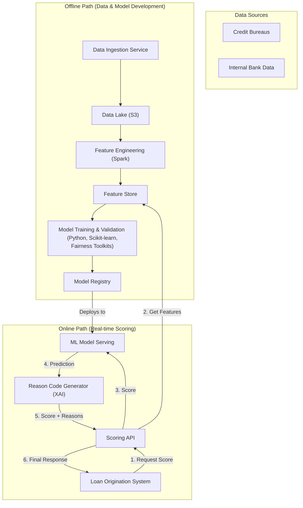

# High-Level Design: Credit Scoring System

## 1. Document Information

- **Document Title**: Credit Scoring System - High-Level Design
- **Version**: 1.0
- **Date**: 2025-08-28
- **Author**: Jules (AI Agent)
- **Status**: Draft

---

## 2. Executive Summary

### 2.1 Purpose
This document provides the high-level design for a Credit Scoring System. This system is an analytical decision-support tool designed to assess the creditworthiness of loan applicants by generating a predictive score. The design emphasizes not only the predictive accuracy of the score but also the critical requirements of fairness, explainability, and regulatory compliance.

### 2.2 Scope

**In Scope:**
-   Ingestion of data from various sources, including third-party credit bureaus and internal customer data.
-   A feature engineering pipeline to transform raw data into meaningful inputs for scoring models.
-   A machine learning model serving platform to generate a credit score in real-time.
-   A component to generate human-readable "reason codes" explaining the key factors that influenced a given score.
-   A synchronous API for other systems (e.g., a Loan Origination System) to request a credit score.
-   An offline environment for training, validating, and auditing scoring models for accuracy, fairness, and bias.

**Out of Scope:**
-   The loan origination or underwriting systems that consume the credit score.
-   The decision logic of whether to grant credit (the system provides a score, it does not make the final loan decision).
-   The data and agreements with the credit bureaus themselves.

### 2.3 High-Level Architecture Overview
The architecture is a dual-path system. A **Real-time Scoring Path** provides low-latency scores via a secure API. This path leverages a **Feature Store** and an **ML Model Serving** component to generate a score and corresponding **Reason Codes**. An **Offline Path** is responsible for ingesting and processing large datasets, engineering features, and running the **Model Training & Validation Pipeline**. This offline pipeline places a heavy emphasis on analyzing models for fairness and bias before they are promoted to the **Model Registry** for deployment.

---

## 3. System Overview

### 3.1 Business Context
Financial institutions need to make fast, consistent, and defensible decisions about lending. A credit scoring system provides a standardized, data-driven assessment of risk, enabling automated decisioning, reducing manual underwriting costs, and ensuring that lending criteria are applied consistently.

### 3.2 System Purpose
The primary purpose is to provide an objective and predictive measure of a person's credit risk. Crucially, it must also be able to explain its reasoning to comply with regulations and ensure fairness.

### 3.3 Success Criteria
-   **Predictive Accuracy**: The system's models must accurately rank-order risk and predict the likelihood of default. This is measured by statistical metrics like AUC ROC and Gini coefficient.
-   **Explainability & Compliance**: The system must generate accurate reason codes for every score it produces, sufficient to meet regulatory requirements (e.g., for generating adverse action notices).
-   **Fairness**: The system must not produce disparate outcomes for individuals in legally protected classes. This must be validated through regular statistical fairness audits.
-   **Availability**: 99.9% uptime for the real-time scoring API.
-   **Latency**: P99 latency for a scoring decision must be < 1 second.

### 3.4 Assumptions
-   The institution has legal access to and contracts with third-party data providers like credit bureaus.
-   A data science team is responsible for developing and validating the statistical models.
-   The system's scores will be one of several inputs into a final lending decision made by an underwriting system.

### 3.5 Constraints
-   **Regulatory Oversight**: The system is heavily constrained by regulations like the Equal Credit Opportunity Act (ECOA) and Fair Credit Reporting Act (FCRA) in the US, which mandate explainability and fairness.
-   **Model Interpretability**: The need for explainability often constrains the choice of ML models. "Black box" models may be difficult to use unless paired with a robust explainability (XAI) framework like SHAP or LIME.
-   **Data Security**: The system processes extremely sensitive Personally Identifiable Information (PII) and financial data, requiring the highest level of security.

---

## 4. Requirements Analysis

### 4.1 Functional Requirements
-   **FR-001 (Data Ingestion)**: The system shall securely connect to and ingest data from multiple sources, including credit bureaus and internal databases.
-   **FR-002 (Feature Engineering)**: The system shall have an offline pipeline to transform raw input data into a library of features (e.g., `credit_utilization_ratio`, `age_of_oldest_account`).
-   **FR-003 (Real-time Scoring API)**: The system shall expose a synchronous API that accepts an application ID and returns a numerical score (e.g., 300-850).
-   **FR-004 (Reason Code Generation)**: Along with the score, the API must return a set of human-readable reason codes (e.g., "High utilization of existing credit") that explain the primary factors influencing the score.
-   **FR-005 (Model Management)**: The system must provide a secure workflow for data scientists to deploy, manage, and monitor different versions of the scoring models.
-   **FR-006 (Audit Trail)**: The system must log the exact data, feature values, and model version used to generate every score for full auditability.

### 4.2 Non-Functional Requirements
-   **Explainability (XAI)**: This is the most critical NFR. The system's output cannot be a "black box." The reason codes must be accurate and reflect the actual logic of the scoring model.
-   **Fairness**: The system must be designed and tested to prevent illegal bias. This involves regular statistical testing for disparate impact across protected classes (e.g., race, gender, age).
-   **Security**: All PII and financial data must be encrypted at rest and in transit. Access to the system must be strictly controlled with role-based permissions and MFA.
-   **Availability**: The real-time scoring API must be highly available (99.9%) with a fail-safe mechanism.
-   **Performance**: P99 latency for a scoring decision should be under 1 second to support real-time lending applications.
-   **Model Governance**: The system must have a robust governance process for deploying new models, including peer review, validation, and executive sign-off.

---

## 5. Architecture Design

### 5.1 Architecture Principles
- **Explainability First**: The architecture must be designed to explain every score it produces. This influences the choice of models and requires dedicated components for generating reason codes.
- **Auditability**: Every step of the scoring process, from the raw data used to the model version executed, must be logged and traceable for regulatory review.
- **Separation of Online & Offline**: The real-time scoring path is kept simple and reliable, while the complex data processing and model training happens in a separate offline environment.
- **Fairness by Design**: The system includes components and processes specifically designed to detect and mitigate illegal bias in the training data and the models themselves.

### 5.2 Architecture Patterns
- **Hybrid Online/Offline Architecture**: A real-time API provides scores on demand, while an offline batch/streaming system handles the heavy lifting of data processing and model training.
- **Feature Store**: A central repository for features that ensures consistency between the features used for training and the features used for real-time scoring.
- **Explainable AI (XAI)**: The architecture includes a dedicated post-processing step that uses an XAI framework (like SHAP or LIME) to generate reason codes for each prediction.

### 5.3 High-Level Architecture Diagram



### 5.4 Component Overview
- **Data Ingestion Service**: Pulls data from various internal and external sources into a central Data Lake.
- **Feature Engineering Pipeline**: Offline jobs that transform raw data into features and populate the Feature Store.
- **Model Training & Validation Pipeline**: The offline environment where data scientists build, train, and, crucially, validate models for both predictive accuracy and fairness.
- **Model Registry**: A version-controlled repository for storing approved, production-ready models.
- **Scoring API**: The synchronous, real-time endpoint that orchestrates the scoring process.
- **Feature Store**: A low-latency database that serves pre-computed features to the Scoring API.
- **ML Model Serving**: A service that hosts the trained ML models and executes them.
- **Reason Code Generator**: A critical component that takes the model's output and the input features, and applies an XAI framework to produce human-readable reasons for the score.

### 5.5 Technology Stack
- **Programming Language**: **Python** is the primary language due to its dominance in the data science and ML ecosystem (Pandas, Scikit-learn, TensorFlow/PyTorch, etc.). Backend services can be built with frameworks like FastAPI or Flask.
- **Data Processing**: **Apache Spark** for large-scale feature engineering.
- **Feature Store**: **Feast** or a custom solution built on **Redis** or **ScyllaDB**.
- **ML Stack**: **Scikit-learn** (for interpretable models like Logistic Regression), **XGBoost/LightGBM**, and XAI libraries like **SHAP**.
- **Model Serving**: **Seldon Core**, **KServe**, or a custom Flask/FastAPI service.

### 5.6 Architecture Decision Records (ADRs)

#### 5.6.1 ADR-001: Post-hoc Explainability for Complex Models
- **Decision**: To allow the use of complex, "black box" models (like Gradient Boosted Trees) by pairing them with a post-hoc XAI framework (like SHAP) in the Reason Code Generator.
- **Justification**: This allows for higher predictive accuracy than simpler, inherently interpretable models, while still meeting the critical regulatory requirement for explainability.
- **Consequences**: Requires an extra processing step in the real-time path (the XAI calculation) and a rigorous validation process to ensure the explanations are faithful to the model's logic.

---

## 6. Detailed Component Design

### 6.1 Component 1: Scoring API
- **Purpose**: To provide a single, synchronous endpoint for generating an explained credit score.
- **Responsibilities**:
    -   Receive an application/user ID.
    -   Fetch the corresponding feature vector from the Feature Store.
    -   Call the ML Model Serving component to get a raw prediction.
    -   Call the Reason Code Generator with the prediction and features to get the final score and reason codes.
    -   Log the entire request, feature vector, model version, and response for audit purposes.
    -   Return the final response to the client.

### 6.2 Component 2: Model Training & Validation Pipeline
- **Purpose**: To produce models that are not only accurate but also fair and robust.
- **Responsibilities**:
    -   Execute a series of automated steps to train a new model candidate.
    -   Generate a comprehensive validation report that includes standard accuracy metrics (AUC ROC, etc.).
    -   Crucially, the report must also include fairness metrics, such as a Disparate Impact Analysis and demographic parity checks across protected classes.
    -   This report is reviewed by a model governance committee before a model can be approved for deployment.

### 6.3 Component 3: Reason Code Generator
- **Purpose**: To make the model's decision understandable to humans.
- **Responsibilities**:
    -   Take the raw model output and the input features for a specific prediction.
    -   Use an XAI library (e.g., SHAP) to calculate the contribution of each feature to the final outcome.
    -   Identify the top 3-5 positive and negative contributing factors.
    -   Map the technical feature names to pre-approved, human-readable, and regulation-compliant reason codes. (e.g., `feat_util_rev_accts` -> "High utilization on revolving credit accounts").

---

## 7. Data Design

### 7.1 Data Models
- **Raw Data Store (Data Lake)**:
  - Data is stored in its raw format, partitioned by source and date. (e.g., `/credit_bureau_x/2025/08/28/data.json.gz`).
- **Feature Store (Key-Value)**:
  - `Key`: `customer_id`.
  - `Value`: A serialized object or hash map containing all engineered features for that customer (e.g., `{'age': 45, 'credit_utilization': 0.3, ...}`).
- **Scoring Log Database (PostgreSQL)**:
  - An immutable, append-only table that is the definitive record of every scoring decision.
  - `scoring_log`: `score_id` (PK), `application_id` (FK), `customer_id` (FK), `timestamp`, `model_version_used`, `input_features_snapshot` (JSONB), `score_value`, `reason_codes` (JSONB).

### 7.2 Data Storage Strategy
- **Data Lake**: **Amazon S3** or a similar object store is used for cheap, durable storage of all raw and processed historical data.
- **Online Feature Store**: A low-latency key-value database like **Redis** or **DynamoDB** is used to serve features to the real-time scoring API.
- **Audit Database**: A standard **PostgreSQL** database is used to store the scoring log for audit and regulatory purposes. Its schema is optimized for querying by `application_id` or `customer_id`.

---

## 8. API Design

### 8.1 API Architecture
The system exposes a single, secure, internal-only synchronous API for real-time scoring. It is not accessible from the public internet.

### 8.2 API Specifications

#### 8.2.1 Real-time Scoring API
- **Endpoint**: `POST /v1/scores`
- **Protocol**: Internal gRPC or REST over HTTP.
- **Authentication**: The calling system (e.g., Loan Origination System) must authenticate using mutual TLS (mTLS).
- **Request Body**: The request provides identifiers, not the raw data itself. This is a key security pattern.
  ```json
  {
    "application_id": "app_12345",
    "customer_id": "cust_abcde"
  }
  ```
- **Response Body (Success - 200 OK)**:
  ```json
  {
    "score_id": "score_zyxw_9876",
    "score": 720,
    "reason_codes": [
      "BALANCE_ON_REVOLVING_ACCOUNTS_IS_TOO_HIGH",
      "TIME_SINCE_MOST_RECENT_INQUIRY_IS_TOO_SHORT"
    ]
  }
  ```
- **Error Handling**: The API is designed to fail safe. If any internal component fails or times out, it can return a specific error code indicating that a score could not be generated, allowing the calling system to route the application for manual review.

---

## 9. Security Design

### 9.1 Security Architecture
The security model is designed to protect highly sensitive PII and financial data, and to ensure the integrity and fairness of the scoring process.

### 9.2 Data Security
- **Data Encryption**: All data must be encrypted at rest (in the data lake, feature store, and databases) and in transit (using TLS 1.2+).
- **PII Protection**: The system must be designed to minimize the exposure of raw PII. During model training and feature engineering, PII can be pseudonymized. Access to the raw data in the data lake is heavily restricted and audited.
- **Principle of Least Privilege**: All components and users are granted the absolute minimum permissions required to function. For example, the model serving component has no access to the data lake.

### 9.3 Model & Process Governance
- **Model Governance**: The process of promoting a new model to production is a critical security and compliance control. It requires:
    1.  Rigorous validation reports (accuracy and fairness).
    2.  Peer review by other data scientists.
    3.  Sign-off from a governance committee that includes representatives from business, legal, and compliance teams.
- **Immutable Audit Trail**: The `scoring_log` table provides a complete and immutable record of every decision. It allows auditors or regulators to see exactly which data, features, and model version were used to produce a specific score for any given application.
- **Access Control**: Access to model training environments and the model registry is strictly controlled and requires MFA.

---

## 10. Scalability & Performance

### 10.1 Performance Requirements
- **API Latency**: The P99 latency for the real-time scoring API must be under 1 second to support interactive loan application workflows.
- **Offline Pipeline Performance**: The feature engineering and model training pipelines must be able to process the entire historical dataset within a reasonable timeframe (e.g., a few hours) to allow for rapid iteration by data scientists.

### 10.2 Scalability Strategy
- **Online Path**: The Scoring API and ML Model Serving components are stateless and can be scaled horizontally to handle high volumes of scoring requests.
- **Offline Path**: The data processing and model training pipelines are built on scalable frameworks like Apache Spark, which can be scaled out by adding more nodes to the cluster.

---

## 11. Deployment & Operations

### 11.1 Deployment Architecture
The system is deployed on a cloud platform using a combination of Kubernetes for microservices and managed services for data processing (e.g., AWS EMR for Spark) and databases.

### 11.2 MLOps (Machine Learning Operations)
- **Model Deployment**: The process of deploying a new scoring model is a critical, highly-controlled operation. It is managed by an MLOps pipeline that automates the deployment of a model from the Model Registry to the ML Model Serving component.
- **Model Monitoring**: The system must continuously monitor live models for performance degradation. This includes:
    - **Data Drift**: Monitoring the statistical distribution of input features to detect if it has changed significantly from the training data.
    - **Concept Drift**: Monitoring the model's predictive accuracy on recent, labeled data to see if the relationship between features and the target variable has changed.
- **Alerting**: Alerts are triggered if model accuracy or fairness metrics drop below a predefined threshold, or if significant data drift is detected.

---

## 12. Testing Strategy

### 12.1 Offline Model Validation
This is the most critical testing phase. Before a model is even considered for deployment, it must pass a rigorous offline validation process that includes:
- **Accuracy Testing**: Measuring predictive power on a held-out test set.
- **Fairness Testing**: A comprehensive audit to ensure the model does not have a disparate impact on protected classes. This is a formal, sign-off step.
- **Explainability Testing**: Validating that the generated reason codes are logical and faithful to the model's behavior.

### 12.2 Backtesting
The system must provide a framework to simulate how a new model candidate would have performed on historical applications, allowing for comparison with the current production model.

### 12.3 Integration Testing
The Scoring API is tested as part of the broader loan origination system in a staging environment to ensure the end-to-end workflow is correct.

---

## 13. Risk Analysis

| Risk | Impact | Probability | Mitigation |
|------|--------|-------------|------------|
| Model Bias / Unfairness | Critical | Medium | A rigorous, multi-stage validation process including statistical fairness audits and review by a governance committee. Continuous monitoring for bias in production. |
| Model Drift | High | High | Continuous monitoring of data distributions and model predictions. A robust process for regularly retraining and deploying new models. |
| Lack of Explainability | High | Low | Building the system around an interpretable model or a validated XAI framework. Regular audits of reason code quality. |
| Data Privacy Breach | Critical | Low | Strict access controls, encryption of all PII at rest and in transit, data pseudonymization where possible, and regular security audits. |

---

## 14. Implementation Plan (High-Level)

- **Phase 1 (Data Foundation)**: Build the data ingestion pipeline and establish the data lake with historical data.
- **Phase 2 (Model Development)**: Build the offline feature engineering and model training/validation pipelines. Develop and validate a baseline model.
- **Phase 3 (Real-time Serving)**: Build the real-time scoring path (API, Feature Store, Model Serving, Reason Code Generator).
- **Phase 4 (Human-in-the-Loop)**: Go live with the system providing scores as a *recommendation* to human underwriters, who make the final decision.
- **Phase 5 (Automation)**: Once there is high confidence in the model's accuracy and fairness, use the system to automate decisions for certain segments of the applicant pool.

---

## 15. Appendices

### Appendix A: Glossary
- **XAI**: Explainable Artificial Intelligence. A set of techniques that allow humans to understand and trust the results of machine learning models.
- **SHAP / LIME**: Specific XAI frameworks for explaining model predictions.
- **Fairness / Disparate Impact**: Statistical measures to check if a model's outcomes are biased with respect to a protected class.
- **Model Drift**: The degradation of a model's predictive power over time due to changes in the data or the underlying relationships.
- **Feature Store**: A centralized repository for ML features.
