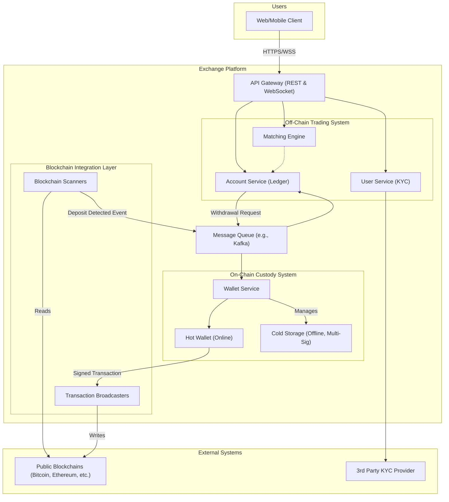

# High-Level Design: Cryptocurrency Exchange

## 1. Document Information

- **Document Title**: Cryptocurrency Exchange Platform - High-Level Design
- **Version**: 1.0
- **Date**: 2025-08-26
- **Author**: Jules (AI Agent)
- **Status**: Draft

---

## 2. Executive Summary

### 2.1 Purpose
This document provides the high-level design for a secure, scalable, and reliable cryptocurrency exchange. The platform is designed to provide retail and institutional users with a robust venue for depositing, trading, and withdrawing digital assets 24/7. The design prioritizes security of user funds above all other considerations.

### 2.2 Scope

**In Scope:**
-   User account management, including registration, authentication (with 2FA), and a tiered KYC/AML verification process.
-   A secure wallet system for managing user deposits and withdrawals across multiple blockchains (e.g., Bitcoin, Ethereum).
-   A high-throughput matching engine for spot trading of crypto-to-crypto and fiat-to-crypto pairs.
-   Publicly accessible REST and WebSocket APIs for trading and accessing market data.
-   An admin interface for customer support, compliance checks, and operational management.

**Out of Scope:**
-   Advanced trading products like derivatives (futures, options).
-   Margin trading and lending.
-   NFT marketplaces.
-   Decentralized exchange (DEX) components.
-   The fiat currency payment processing gateway itself (this will be integrated via a third-party provider).

### 2.3 High-Level Architecture Overview
The architecture is a hybrid system composed of a high-performance, off-chain trading system and a highly secure on-chain wallet and blockchain interaction system. The core components include public-facing APIs, a central matching engine for trading, a secure wallet infrastructure with hot and cold storage, and a blockchain integration layer for processing deposits and withdrawals. Security is embedded at every layer, from user authentication to infrastructure and operational procedures.

---

## 3. System Overview

### 3.1 Business Context
Cryptocurrency exchanges are the primary gateways for users to access the global digital asset ecosystem. They provide essential liquidity, price discovery, and custody services for a wide range of cryptocurrencies, serving millions of users in a 24/7 global market.

### 3.2 System Purpose
The primary purpose is to provide a trusted and secure platform for users to trade digital assets. The system must protect user funds from all threats, provide a reliable and responsive trading experience, and comply with evolving financial regulations.

### 3.3 Success Criteria
-   **Security**: Zero loss of user funds from hacks, theft, or operational error.
-   **Availability**: 99.99% uptime for all user-facing services (trading, deposits, withdrawals).
-   **Performance**: P99 latency for API trading operations < 50ms. The system must handle traffic surges during peak market volatility.
-   **Data Integrity**: User balances must be 100% accurate at all times. All transactions must be correctly recorded.
-   **Compliance**: The platform must successfully implement and enforce KYC/AML policies required in its operating jurisdictions.

### 3.4 Assumptions
-   Users are global, retail customers with varying levels of technical sophistication.
-   The exchange will need to integrate with third-party KYC providers and fiat payment processors.
-   The regulatory environment for cryptocurrencies is fluid and can change rapidly.

### 3.5 Constraints
-   **Security is the Top Priority**: All design decisions must be evaluated for their security implications first. Performance or usability cannot come at the cost of security.
-   **Irreversibility of Transactions**: Blockchain transactions are final. The system must have robust controls to prevent erroneous withdrawals.
-   **24/7/365 Operations**: The market never closes, requiring a highly available system with seamless maintenance and update procedures.
-   **Multi-Blockchain Support**: The system must interact with multiple, disparate blockchains, each with its own unique protocol and characteristics.

---

## 4. Requirements Analysis

### 4.1 Functional Requirements
-   **FR-001 (User Onboarding)**: Users must be able to register with an email and password, enable Two-Factor Authentication (2FA), and submit documents for KYC verification.
-   **FR-002 (Wallet - Deposits)**: The system shall generate a unique deposit address for each user for each supported cryptocurrency. It must monitor the respective blockchains and credit the user's account upon confirmation of a deposit.
-   **FR-003 (Wallet - Withdrawals)**: Users must be able to withdraw funds to an external blockchain address. Withdrawals must require 2FA and email confirmation.
-   **FR-004 (Trading)**: Users can place market and limit orders on available trading pairs. Users can view their open orders and trade history.
-   **FR-005 (Accounting)**: The system must maintain an accurate, real-time ledger of each user's balance for every asset.
-   **FR-006 (Customer Support Interface)**: An admin interface shall allow support staff to view user account details, track transactions, and assist with issues.

### 4.2 Non-Functional Requirements
-   **Security**:
    -   **Wallet Architecture**: A multi-layered wallet system (hot/cold/warm) must be used, with >95% of funds held in secure, offline cold storage.
    -   **Withdrawal Security**: Withdrawals must be protected by multi-signature or MPC (Multi-Party Computation) schemes, rate limits, and whitelisted addresses.
    -   **User Security**: User passwords must be hashed and salted. 2FA (e.g., TOTP, YubiKey) must be enforced for critical actions.
-   **Availability**: 99.99% uptime. The system must be deployed across multiple availability zones and support automated failover.
-   **Scalability**: The platform must scale to handle millions of concurrent users. Components like the matching engine and API gateways must be horizontally scalable.
-   **Reliability**: The accounting ledger must be durable and transactional. No loss of user balance data is acceptable.
-   **Latency**: P99 API response time for non-trading requests < 200ms. P99 for order placement/cancellation < 50ms.
-   **Usability**: The user interface for both web and mobile should be intuitive for non-technical users.

---

## 5. Architecture Design

### 5.1 Architecture Principles
- **Security in Depth**: Every component is designed with a security-first mindset, with multiple layers of controls.
- **Decouple Trading from Custody**: The systems that manage trading (matching engine, APIs) must be strictly separated from the systems that manage private keys and funds (wallets). A breach in the trading system should not lead to a loss of funds.
- **Assume Breach**: Components are designed to minimize their "blast radius." For example, the online hot wallet has a strictly limited amount of capital.
- **Asynchronous On-Chain Operations**: Interactions with public blockchains (deposits, withdrawals) are inherently slow and are handled asynchronously to avoid blocking the core trading system.

### 5.2 Architecture Patterns
- **Microservices Architecture**: The platform is decomposed into services with specific responsibilities (e.g., User Service, Trading Service, Wallet Service).
- **Three-Tier Wallet System**: A tiered approach to wallet management is used to balance liquidity with security:
    -   **Hot Wallet**: Online, automated, holds a small fraction of funds (<5%) for instant withdrawals.
    -   **Warm Wallet**: Semi-online, requires some manual operational intervention to access funds.
    -   **Cold Wallet**: Completely offline (air-gapped), holding the vast majority of funds, protected by multi-signature and physical security measures.
- **Event-Driven Architecture**: A message queue is used to communicate events between the major systems, such as a confirmed deposit event from the blockchain layer to the accounting layer.

### 5.3 High-Level Architecture Diagram

### 5.4 Component Overview
- **API Gateway**: Terminates public API traffic, handles authentication (JWT), and routes requests to the appropriate microservices.
- **Off-Chain Trading System**: The core real-time trading platform. It includes services for managing user accounts, an internal ledger for balances, and the high-performance matching engine. All trades happen here and are simply updates in the internal ledger.
- **Blockchain Integration Layer**: A set of services that run full nodes for each supported blockchain. They scan for incoming deposit transactions and broadcast outgoing withdrawal transactions.
- **Wallet Service**: The gatekeeper for all fund movements. It orchestrates withdrawals from the hot wallet and movements between hot and cold storage. It is the only component with access to private keys.
- **Message Queue**: Decouples the asynchronous on-chain world from the real-time off-chain trading world.

### 5.5 Technology Stack
- **Trading Engine**: **Rust** or **C++** for performance and memory safety.
- **API Gateways & Backend Services**: **Go** for its excellent concurrency and networking support.
- **Wallet & Blockchain Services**: **Go** or **Python** due to strong library support for blockchain interactions.
- **Databases**: **PostgreSQL** or **TiDB** for transactional user and account data. **Redis** for caching.
- **Message Queue**: **Kafka** for its durability and scalability.

### 5.6 Architecture Decision Records (ADRs)

#### 5.6.1 ADR-001: Decoupled Trading and Wallet Systems
- **Decision**: To strictly separate the off-chain trading/accounting systems from the on-chain wallet and blockchain interaction systems, connected only by a message queue.
- **Justification**: This is a critical security control. A compromise of the user-facing API or even the matching engine does not grant an attacker access to private keys or the ability to initiate withdrawals.
- **Consequences**: Increased architectural complexity and a need for robust reconciliation between the systems.

---

## 6. Detailed Component Design

### 6.1 Component 1: Matching Engine & Account Service
- **Purpose**: To run the central limit order book and maintain the internal user balance ledger.
- **Responsibilities**:
    -   Accept orders from authenticated users via the API gateway.
    -   Perform credit checks against the internal ledger (does the user have enough BTC to sell?).
    -   Match orders using Price-Time priority.
    -   Update user balances in the ledger atomically upon a successful trade.
    -   Provide real-time order book and trade data via WebSockets.

### 6.2 Component 2: Blockchain Integration Layer
- **Purpose**: To be the exchange's eyes and ears on the public blockchains.
- **Responsibilities**:
    -   Run and maintain full nodes for each supported blockchain.
    -   Scan every new block for transactions sent to the exchange's deposit addresses.
    -   After sufficient block confirmations, publish a `DepositConfirmed` event to the message queue with user ID, amount, and asset.
    -   Receive signed transaction data from the Wallet Service and broadcast it to the appropriate blockchain network.

### 6.3 Component 3: Wallet Management Service
- **Purpose**: To provide secure custody of user funds.
- **Responsibilities**:
    -   Generate unique deposit addresses for users.
    -   Manage the private keys for all wallets, ideally using Hardware Security Modules (HSMs).
    -   Enforce withdrawal policies (2FA, address whitelisting, velocity limits).
    -   Orchestrate the signing of withdrawal transactions using a multi-signature or MPC scheme.
    -   Manage the movement of funds between hot and cold wallets to maintain the hot wallet's target balance.

---

## 7. Data Design

### 7.1 Data Models
- **User Accounts Database (PostgreSQL)**:
    - `users`: `user_id`, `email`, `password_hash`, `kyc_level`, `status`, `created_at`.
    - `user_balances`: `user_id`, `asset` (e.g., 'BTC', 'ETH', 'USD'), `total_balance`, `available_balance`. This table is the core ledger. A `(user_id, asset)` index is critical.
    - `deposits` / `withdrawals`: Tables to track the history and status of all funding operations, linking them to blockchain transaction IDs.

- **Trading Data (In-Memory & Redis)**:
    - **Order Book**: The live Central Limit Order Book (CLOB) is held entirely in memory within the matching engine for performance.
    - **Recent Trades**: A cache of recent trades is kept in Redis to quickly serve API requests.

### 7.2 Data Storage Strategy
- **Transactional Ledger**: A relational database like PostgreSQL is used for the user balance ledger to ensure ACID compliance and data integrity. Every change in a user's balance is the result of a transaction (trade, deposit, withdrawal).
- **Event Sourcing**: The ledger can be built using an event sourcing pattern. All events (e.g., `DepositConfirmed`, `TradeExecuted`, `WithdrawalRequested`) are stored in an immutable log. User balances are a projection of this log. This provides a complete and verifiable audit trail.
- **Data Segregation**: The production database is highly secured. Analytics and business intelligence queries are run on a read-replica database to avoid impacting production performance.

---

## 8. API Design

### 8.1 API Architecture
The exchange exposes public, versioned REST and WebSocket APIs, which are the standard for the cryptocurrency industry.

### 8.2 API Specifications

#### 8.2.1 REST API
- **Authentication**: Private endpoints require requests to be signed with an API key and secret, with a timestamp and nonce to prevent replay attacks.
- **Public Endpoints**:
    - `GET /api/v1/products`: List all tradable pairs.
    - `GET /api/v1/products/{product_id}/book`: Get the current order book for a pair.
    - `GET /api/v1/products/{product_id}/trades`: Get recent trades for a pair.
- **Private Endpoints**:
    - `POST /api/v1/orders`: Create a new order.
    - `DELETE /api/v1/orders/{order_id}`: Cancel an order.
    - `GET /api/v1/accounts`: Get user account balances.
    - `POST /api/v1/withdrawals`: Request a crypto withdrawal.
    - `GET /api/v1/deposits/address`: Get a deposit address for a specific asset.

#### 8.2.2 WebSocket API
- **Purpose**: Provides real-time, push-based updates to active traders and applications.
- **Channels (Topics) to Subscribe to**:
    - **`level2`**: Real-time order book updates for a specific product.
    - **`matches`**: Real-time notifications of new trades as they happen.
    - **`user`**: Private channel for a user to receive real-time updates on their own orders (e.g., acknowledgements, fills).

---

## 9. Security Design

### 9.1 Security Architecture
Security is the highest priority. The architecture uses a defense-in-depth approach, assuming any single component could be compromised.

### 9.2 Wallet & Custody Security
- **Cold Storage**: The vast majority (>95%) of funds are held in cold storage. Private keys are generated and stored on air-gapped hardware devices located in physically secure, geographically distributed vaults.
- **Multi-Signature & MPC**: Moving funds from cold storage requires a quorum of M-of-N key holders to approve the transaction. This prevents theft by a single rogue employee or a single compromised key. Multi-Party Computation (MPC) can be used as a more advanced alternative to multi-sig.
- **Hardware Security Modules (HSMs)**: Hot wallet private keys, which are used for automated withdrawals, are stored in FIPS 140-2 Level 3 certified HSMs. These devices will perform signing operations without ever exposing the private key to the host server.
- **Withdrawal Process**: All withdrawals are subject to a rigorous security pipeline:
    1. Automated checks for velocity, amount, and address reputation.
    2. Mandatory 2FA confirmation by the user.
    3. Time-locks on newly whitelisted addresses.
    4. Potential manual review by the security operations team for large or suspicious transactions.

### 9.3 User & Application Security
- **Authentication**: Strong password policies and mandatory 2FA (TOTP, U2F/YubiKey) for all users.
- **API Key Security**: API keys have granular permissions (e.g., read-only, trade-only, withdrawal-enabled). Withdrawal-enabled keys require IP whitelisting.
- **Web Security**: Standard web security best practices (OWASP Top 10) are followed for the user-facing website, including CSRF protection, XSS prevention, and Content Security Policies.

### 9.4 Infrastructure & Operations Security
- **Network Isolation**: The wallet and custody systems are on a completely separate, highly restricted network segment with strict firewall rules, isolated from the trading systems and general corporate network.
- **Least Privilege Access**: Engineers and operators have the minimum level of access required to perform their duties. All access to production systems is logged and audited.

---

## 10. Scalability & Performance

### 10.1 Performance Requirements
The system is designed to provide a responsive user experience, with P99 API latencies under 50ms for trading and under 200ms for other requests. The matching engine must be able to handle volume surges of 10x the average during peak volatility.

### 10.2 Scalability Strategy
- **Horizontal Scaling**: The entire platform is designed to be horizontally scalable. API Gateways, backend microservices, and the matching engine (sharded by trading pair) can all be scaled out by adding more instances.
- **Cloud-Native**: The system is designed to be deployed on a cloud platform (e.g., AWS, GCP) to leverage auto-scaling groups and managed services (like Kubernetes clusters and databases).
- **Blockchain Nodes**: The blockchain integration layer is scaled by adding more full nodes to ensure redundant connectivity to the blockchains.

---

## 11. Deployment & Operations

### 11.1 Deployment Architecture
A hybrid deployment model is used. The off-chain trading systems and APIs are deployed as microservices on a Kubernetes cluster. The blockchain full nodes may be deployed on dedicated bare-metal servers for I/O performance and stability.

### 11.2 Environment Strategy
- **Staging**: A full staging environment that mirrors production and is connected to blockchain testnets (e.g., Ethereum's Sepolia testnet). This is used to test new features and blockchain integrations.
- **Production**: The live, user-facing environment, deployed across multiple availability zones for high availability.

### 11.3 CI/CD Pipeline
A standard CI/CD pipeline is used for the off-chain microservices, with automated testing and deployment to staging. Deployment to production requires manual approval and is done with strategies like blue-green or canary releases to minimize downtime.

### 11.4 Operations & Monitoring
- **24/7 SRE & SOC**: A Site Reliability Engineering (SRE) team and a Security Operations Center (SOC) are required to monitor the platform around the clock.
- **Wallet Operations**: A dedicated finance/operations team is responsible for managing the cold storage and authorizing the movement of large funds. This is a manual, multi-person process.
- **Alerting**: Extensive alerting is set up for system health, performance metrics, and, most importantly, security events (e.g., large withdrawal requests, repeated failed logins).

---

## 12. Testing Strategy

### 12.1 Security Audits & Penetration Testing
This is the most critical form of testing. The platform must undergo regular, rigorous security audits and penetration tests by reputable third-party security firms. This includes audits of the smart contracts, wallet systems, and web platform.

### 12.2 Chaos Engineering
The resilience of the platform is tested by intentionally injecting failures into the staging environment (e.g., terminating services, blocking network connections) to ensure that failover mechanisms work as expected.

### 12.3 Blockchain Interaction Testing
All interactions with blockchains are first tested extensively on public testnets to ensure deposit crediting and withdrawal broadcasting work correctly for each supported asset.

---

## 13. Risk Analysis

| Risk | Impact | Probability | Mitigation |
|------|--------|-------------|------------|
| Theft of Cold Wallet Keys | Catastrophic | Very Low | Physical security, air-gapped hardware, M-of-N multi-signature scheme, geographic distribution of key holders. |
| Hot Wallet Compromise | Critical | Low | HSMs for key storage, strict withdrawal policies, automated monitoring for anomalous behavior, keeping hot wallet balance to a minimum. |
| Smart Contract Exploit | Critical | Low | Does not apply if not using smart contracts. If integrating with DeFi, only interact with heavily audited, reputable contracts. |
| Social Engineering of Staff | High | Medium | Extensive employee training, strict access controls (least privilege), and requiring multi-person approval for all critical operations (e.g., moving funds from cold storage). |

---

## 14. Implementation Plan (High-Level)

- **Phase 1 (Custody & Security)**: Build the secure wallet system (hot & cold), the blockchain integration layer, and the core accounting ledger. This is the foundation.
- **Phase 2 (User & Compliance)**: Build the user onboarding service and integrate with KYC/AML providers.
- **Phase 3 (Trading)**: Build the matching engine and the public REST/WebSocket APIs.
- **Phase 4 (Launch)**: Begin with a private beta for a limited number of users and assets.
- **Phase 5 (Expansion)**: Gradually add more assets and open the platform to the public.

---

## 15. Appendices

### Appendix A: Glossary
- **Hot/Cold Wallet**: A separation of cryptocurrency wallets based on their online status. Hot wallets are online for liquidity; cold wallets are offline for security.
- **KYC/AML**: Know Your Customer / Anti-Money Laundering. Regulatory procedures to verify user identity.
- **HSM**: Hardware Security Module. A physical device that securely stores cryptographic keys and performs operations.
- **MPC**: Multi-Party Computation. A cryptographic technique that allows multiple parties to jointly compute a function (like signing a transaction) without any one party ever seeing the other parties' secret inputs.
- **Air-gapped**: A computer or device that is physically isolated from any network.
