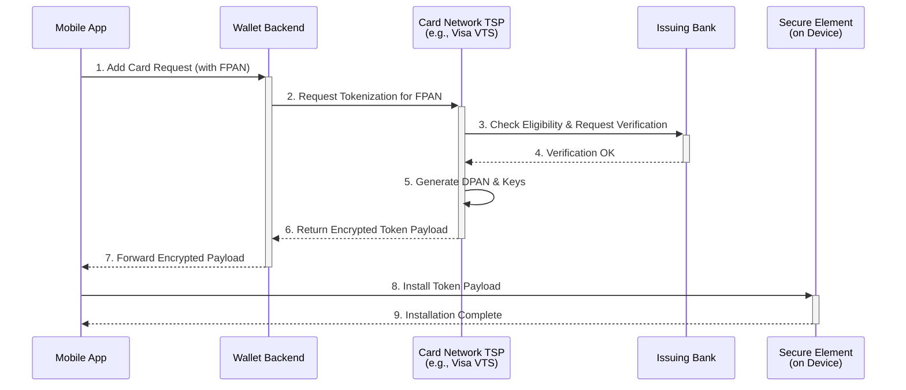
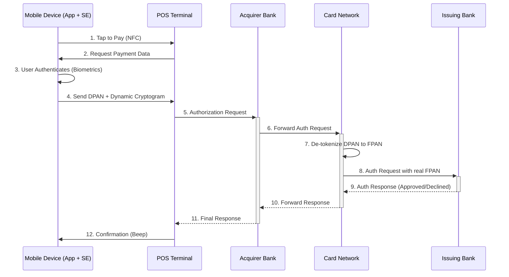

# High-Level Design: Digital Wallet

## 1. Document Information

- **Document Title**: Digital Wallet Platform (NFC Payments) - High-Level Design
- **Version**: 1.0
- **Date**: 2025-08-28
- **Author**: Jules (AI Agent)
- **Status**: Draft

---

## 2. Executive Summary

### 2.1 Purpose
This document provides the high-level design for a Digital Wallet platform (similar to Apple Pay or Google Pay). The system is designed to allow users to securely digitize their existing credit and debit cards on a mobile device and use it for convenient and secure contactless payments at NFC-enabled terminals and for online purchases.

### 2.2 Scope

**In Scope:**
-   A mobile application for users to add, manage, and view their payment cards.
-   The secure provisioning of payment cards, which involves tokenizing the real card number (FPAN) into a device-specific card number (DPAN).
-   Integration with card network tokenization services (e.g., Visa VTS, Mastercard MDES).
-   NFC (Near Field Communication) "tap-to-pay" functionality at physical POS terminals.
-   In-app and web payment capabilities for e-commerce.
-   Display of recent transaction history for payments made via the wallet.

**Out of Scope:**
-   The issuance of new credit cards (we are digitizing existing cards).
-   Peer-to-peer payments.
-   Storing value within the wallet itself (the wallet is a proxy for existing bank cards).
-   The POS terminal hardware and software.
-   The card networks and issuing banks themselves.

### 2.3 High-Level Architecture Overview
The architecture is a client-server model with a heavy emphasis on on-device security and integration with external financial networks. The user's mobile device contains a **Secure Element (SE)** or uses **Host Card Emulation (HCE)** to store a payment token. Backend services, acting as a **Token Service Provider (TSP)**, orchestrate the provisioning of this token by communicating with card network platforms. When a payment is made, the device communicates directly with the POS terminal, and the resulting tokenized data is routed through the standard payment rails.

---

## 3. System Overview

### 3.1 Business Context
Mobile payments have become a standard feature of modern life, offering greater convenience and security than traditional plastic cards. By replacing the static card number with a dynamic, device-specific token, digital wallets significantly reduce the risk of fraud from physical card skimming or merchant data breaches.

### 3.2 System Purpose
The primary purpose is to provide a secure and frictionless payment experience for users. The system must securely store a representation of a user's payment card on their mobile device and allow them to use it seamlessly wherever contactless payments are accepted.

### 3.3 Success Criteria
-   **Security**: Zero compromise of users' underlying, real card numbers (Funding PANs). All payment tokens must be stored in a certified secure environment on the device.
-   **Usability**: The "tap-to-pay" transaction time must be under one second and perceived as instant by the user. The process of adding a card should be simple and intuitive.
-   **Reliability**: A high success rate (>99.5%) for both card provisioning and payment transactions.
-   **Interoperability**: The wallet must be compatible with all standard EMV-compliant contactless payment terminals worldwide.

### 3.4 Assumptions
-   Users have modern smartphones equipped with NFC hardware and a hardware-backed security environment (like a Secure Element).
-   The wallet provider has established business agreements and technical integrations with major card networks (Visa, Mastercard, etc.).
-   Issuing banks are willing to participate and approve the tokenization of their cards in the wallet.

### 3.5 Constraints
-   **Hardware Dependency**: The security model relies heavily on the presence of a Secure Element or trusted execution environment on the mobile device.
-   **Card Network Certification**: The entire system (app, backend) must go through a rigorous certification process with each card network before it can go live.
-   **User Authentication**: The device's biometric or passcode authentication is a critical dependency for authorizing payments.

---

## 4. Requirements Analysis

### 4.1 Functional Requirements
-   **FR-001 (Card Provisioning)**: Users must be able to initiate the process of adding a card, typically by scanning it with the device's camera or entering the details manually.
-   **FR-002 (Identity Verification)**: The system must orchestrate a verification step where the issuing bank confirms the user's identity before approving tokenization (e.g., via an SMS one-time password or an approval prompt in the banking app).
-   **FR-003 (Token Installation)**: Once approved, the system shall securely deliver and install the payment token (DPAN) and cryptographic keys into the device's Secure Element.
-   **FR-004 (NFC Payment)**: Users must be able to authorize a payment using their device's biometric sensor or passcode and then tap their device on a POS terminal to pay.
-   **FR-005 (In-App/Web Payment)**: Users must be able to select the digital wallet as a payment option within other apps or on websites and authorize the payment using their device's authentication methods.
-   **FR-006 (Card Management)**: Users can view their digitized cards, set a default card for payments, and suspend or delete a card from the wallet.
-   **FR-007 (Transaction History)**: The wallet shall display a list of recent transactions made using the wallet, with enriched merchant information where possible.

### 4.2 Non-Functional Requirements
-   **Security**:
    -   **Tokenization**: The real card number (FPAN) must never be stored on the mobile device or transmitted to the merchant during a transaction.
    -   **Secure On-Device Storage**: The payment token (DPAN) and its cryptographic keys must be stored in a hardware-certified Secure Element or a secure software equivalent (HCE).
    -   **User Authentication**: Every transaction must be authenticated by the user via the device's high-security biometric or passcode mechanism.
-   **Performance**: NFC transaction latency (from tap to terminal beep) should be < 1 second.
-   **Availability**: Backend services for card provisioning and token lifecycle management must be highly available (99.99%).
-   **Regulatory**: The system must adhere to regional financial regulations and data privacy laws (e.g., GDPR). While the wallet itself may not be fully in PCI DSS scope (as it doesn't store the FPAN), it must operate according to security principles defined by the card networks.
-   **Usability**: The process of making a payment should require minimal user interaction (ideally, just authenticate and tap).

---

## 5. Architecture Design

### 5.1 Architecture Principles
- **Security through Tokenization**: The core principle is to never store or transmit the user's real card number (Funding PAN or FPAN). It is replaced by a device-specific token (Device PAN or DPAN) that is useless if stolen, as it is cryptographically tied to the specific device.
- **Leverage Secure Hardware**: The security of the system relies on using the dedicated, tamper-resistant hardware on the mobile device, known as the Secure Element (SE).
- **Backend is Off-Path for Payments**: For maximum speed and offline capability, the wallet's backend servers are not involved in the real-time NFC payment transaction loop.

### 5.2 Architecture Patterns
- **Token Service Provider (TSP) Integration**: The wallet backend acts as a "Token Requestor" and integrates with the TSPs of the major card networks (e.g., Visa Token Service - VTS; Mastercard Digital Enablement Service - MDES). These networks manage the creation and lifecycle of the tokens.
- **Secure Element (SE)**: A dedicated, secure coprocessor chip within the smartphone that is isolated from the main operating system. It stores the DPAN and cryptographic keys and performs the signing operations for payments.

### 5.3 High-Level Architecture Diagrams

#### 5.3.1 Flow 1: Card Provisioning (Tokenization)
This is the one-time process of adding a card to the wallet.

#### 5.3.2 Flow 2: NFC Payment Transaction
This is the real-time flow at a point-of-sale. Note the Wallet Backend is not involved.

### 5.4 Component Overview
- **Mobile Wallet App**: The user-facing application. Its primary roles are to capture card details for provisioning and to trigger the on-device payment process.
- **Secure Element (SE)**: The hardware root of trust on the device. It securely stores the DPAN and limited-use cryptographic keys. It is responsible for generating the dynamic cryptogram for each transaction.
- **Wallet Backend**: A set of microservices that orchestrate the card provisioning process. It communicates with the card networks but does not store raw card numbers.
- **Card Network TSP**: External platforms (VTS, MDES) that are the authorities for tokenization.

### 5.5 Technology Stack
- **Mobile App**: Native iOS (Swift) and Native Android (Kotlin) to allow for deep integration with the underlying OS and hardware security features.
- **Backend Services**: **Go** or **Java** for their performance and robust handling of secure server-to-server communication.
- **Database**: **PostgreSQL** or a similar relational database to store user account information and metadata about the provisioned tokens (e.g., token status, device ID), but not the tokens or keys themselves.

---

## 6. Detailed Component Design

### 6.1 Component 1: Mobile App & Secure Element
- **Purpose**: To provide the user interface and the secure environment for payments.
- **Responsibilities**:
    -   Securely capture card details and transmit them to the backend.
    -   Interact with the mobile OS to push the token payload into the Secure Element.
    -   Manage the UI for card selection and transaction history.
    -   Upon user authentication, instruct the SE to perform a payment transaction via the NFC controller.

### 6.2 Component 2: Card Provisioning Service (Backend)
- **Purpose**: To orchestrate the complex, multi-party process of tokenizing a card.
- **Responsibilities**:
    -   Provide a secure API for the mobile app.
    -   Format provisioning requests according to the specifications of each card network TSP.
    -   Manage the state of the provisioning process (e.g., `pending_verification`, `active`).
    -   Handle the secure delivery of the encrypted token data to the mobile app.

### 6.3 Component 3: Token Lifecycle Management Service (Backend)
- **Purpose**: To manage the state of a token after it has been provisioned.
- **Responsibilities**:
    -   Process requests from the user to `suspend` or `delete` a token.
    -   Receive notifications from the card networks about token status changes (e.g., if the user reports their physical card stolen, the network will notify the service to deactivate the token).
    -   Provide an API for the app to query the status of its tokens.

---

## 7. Data Design

### 7.1 Data Models
The system has two distinct data domains: the backend server and the mobile device's secure storage.

- **Backend Data Model (PostgreSQL)**: The backend only stores non-sensitive metadata about the provisioned tokens. It **never** stores the real card number (FPAN) or the device-specific token (DPAN).
    - `users`: `user_id`, `email`, `status`.
    - `devices`: `device_id`, `user_id` (FK), `device_type`, `os_version`.
    - `provisioned_tokens`: `token_id` (PK), `device_id` (FK), `user_id` (FK), `token_status` ('active', 'suspended'), `last_4_digits_of_fpan`, `card_network`.

- **On-Device Data Model (in Secure Element)**: This is where the actual sensitive payment credentials reside.
    - `DPAN`: The Device Primary Account Number, a tokenized card number.
    - `Cryptographic Keys`: A set of limited-use keys for generating transaction cryptograms. These keys are refreshed as needed.
    - `Transaction Counter`: A counter to ensure each transaction has a unique cryptogram.

### 7.2 Data Storage Strategy
- **Backend**: A standard highly available relational database cluster is sufficient for the metadata.
- **On-Device**: The Secure Element (SE) is the hardware root of trust. It is a tamper-resistant chip designed to securely host applications and their confidential data. Data written to the SE cannot be read or extracted by the main phone OS or any other app.

---

## 8. API Design

### 8.1 API Architecture
The APIs are internal to the system, facilitating communication between the mobile app and the wallet backend, and between the wallet backend and the card networks. There is no public API for third-party developers in this core design.

### 8.2 API Specifications

#### 8.2.1 App-to-Backend API (REST)
This API is used to orchestrate the provisioning and management of cards.
- **Authentication**: The mobile app authenticates to the backend using a standard JWT or session token obtained after the user logs in.
- **Core Endpoints**:
    - `POST /v1/cards/provision`: Initiates the process of adding a card. The app sends the raw card details (FPAN) over a TLS-encrypted channel. The backend immediately forwards this to the card network and does not log or store it.
    - `POST /v1/cards/{tokenId}/verify`: Submits the one-time password that the user received from their bank to complete the verification step.
    - `POST /v1/cards/{tokenId}/suspend`: Allows the user to temporarily suspend a card in their wallet.
    - `DELETE /v1/cards/{tokenId}`: Permanently removes a card from the wallet on a specific device.

#### 8.2.2 Backend-to-Network API
This is not an API we design, but one we must implement as a client. It is a proprietary REST or SOAP API defined by the card network TSPs (Visa VTS, Mastercard MDES) for requesting and managing tokens.

---

## 9. Security Design

### 9.1 The Tokenization Process
The security of the entire system is founded on the tokenization flow.
1.  The real card number (FPAN) is only ever handled in transit, over TLS, from the app to the backend, and from the backend to the card network. The backend is a simple pass-through and does not store the FPAN.
2.  The card network TSP returns a token payload that is encrypted with a key known only to the Secure Element on that specific device.
3.  The app receives this encrypted blob and passes it to the SE. The SE is the only component that can decrypt it and install the DPAN and keys. This ensures that the wallet provider itself cannot see the token's cryptographic keys.

### 9.2 On-Device Security
- **Secure Element (SE)**: As the hardware root of trust, the SE provides protection against even a fully compromised main operating system.
- **Biometric Authentication**: The main OS is responsible for user authentication (e.g., Face ID, Fingerprint). Upon successful authentication, the OS grants the SE permission to perform a payment operation for a very short period. The biometric data itself is stored securely on the device and is not accessible to the wallet app or backend.

### 9.3 Transaction Security (EMV Contactless)
- **Dynamic Cryptogram**: For every transaction, the Secure Element generates a unique, one-time-use cryptographic signature called a cryptogram. This is based on the transaction details (amount, currency), the transaction counter, and the secret keys stored in the SE.
- **Replay Attack Prevention**: This cryptogram proves to the card network that the transaction is genuine and originated from the legitimate device. An attacker who intercepts the NFC communication cannot reuse the data for a new transaction because the cryptogram would be invalid. This is the core principle of EMV security.

---

## 10. Scalability & Performance

### 10.1 Performance Requirements
- **NFC Transaction Speed**: The end-to-end "tap-to-pay" interaction at a POS terminal must be < 1 second to be faster than using a physical card. This performance is primarily a function of the on-device SE and NFC controller, not the backend.
- **Backend API Latency**: P99 latency for backend API calls (e.g., during provisioning) should be < 300ms.

### 10.2 Scalability Strategy
- **Backend Services**: The backend is a standard set of microservices that can be horizontally scaled to handle millions of users managing their digital cards.
- **Stateless Services**: Backend services are stateless, allowing for easy scaling and high availability behind a load balancer.

---

## 11. Deployment & Operations

### 11.1 Deployment Architecture
- **Backend**: Deployed on a standard cloud platform (e.g., AWS, GCP) using Kubernetes for container orchestration.
- **Mobile App**: Deployed through the official mobile app stores (Apple App Store, Google Play Store).

### 11.2 Environment Strategy
- **Development**: Standard development environments.
- **Integration & Certification**: A dedicated environment that connects to the sandbox platforms of the card network TSPs. This environment is used for development and for running the official certification tests.
- **Production**: The live, highly available environment connected to the production card network platforms.

### 11.3 CI/CD Pipeline
A standard CI/CD pipeline is used for the backend microservices. Mobile app releases follow the review and rollout processes of the respective app stores.

### 11.4 Operations & Monitoring
- **SRE Team**: A 24/7 SRE team monitors the availability and performance of the backend services.
- **Partner Management**: An operations team manages the technical and business relationships with the card networks and issuing banks.

---

## 12. Testing Strategy

### 12.1 Card Network Certification
This is the most critical and mandatory testing phase. Before launch, the entire end-to-end solution (mobile app, backend, security architecture) must pass a rigorous certification process defined by each card network (Visa, Mastercard, etc.). This validates compliance with their security and functional requirements.

### 12.2 Hardware Interoperability Testing
The mobile app must be tested on a wide range of physical smartphone models to ensure compatibility with their specific Secure Element implementations and NFC controllers.

### 12.3 POS Terminal Testing
The wallet's NFC functionality is tested against a lab of common POS terminals from different manufacturers to ensure broad interoperability.

---

## 13. Risk Analysis

| Risk | Impact | Probability | Mitigation |
|------|--------|-------------|------------|
| Compromise of Device OS | Critical | Low | The Secure Element is designed to be resilient even if the main OS is compromised. Remote suspension of tokens can be initiated from the backend if a large-scale OS vulnerability is discovered. |
| Backend System Breach | High | Low | A backend breach cannot compromise private keys or the DPAN stored on the SE. An attacker might be able to suspend tokens, but not initiate fraudulent payments. Standard security best practices mitigate. |
| Low Bank Adoption | High | Medium | Strong business development efforts to create partnerships with major issuing banks. Providing clear value propositions (e.g., reduced fraud) to banks. |
| Card Network Certification Failure | High | Medium | Engage with card network experts early in the design process. Pre-certification testing in the sandbox environment to identify gaps. |

---

## 14. Implementation Plan (High-Level)

- **Phase 1 (Partnerships)**: Establish legal and business agreements with at least one major card network and a few partner issuing banks.
- **Phase 2 (Core Backend)**: Build the backend services and integrate with the card network's sandbox TSP platform.
- **Phase 3 (Mobile App)**: Develop the mobile application for one platform (e.g., iOS), including the complex integration with the on-device Secure Element APIs.
- **Phase 4 (Certification)**: Undergo the full, formal security and functional certification process with the partner card network.
- **Phase 5 (Pilot Launch)**: Launch the wallet for users of the initial partner banks.
- **Phase 6 (Expansion)**: Onboard more issuing banks and expand to other mobile platforms and regions.

---

## 15. Appendices

### Appendix A: Glossary
- **FPAN**: Funding Primary Account Number. The real, physical card number printed on a plastic card.
- **DPAN**: Device Primary Account Number. The tokenized card number that is specific to a single device.
- **TSP**: Token Service Provider. A platform, typically run by a card network, that manages the tokenization process.
- **Secure Element (SE)**: A tamper-resistant chip on a mobile device that securely stores sensitive data like the DPAN and cryptographic keys.
- **EMV**: Europay, Mastercard, and Visa. The global standard for chip-based and contactless card payments.
