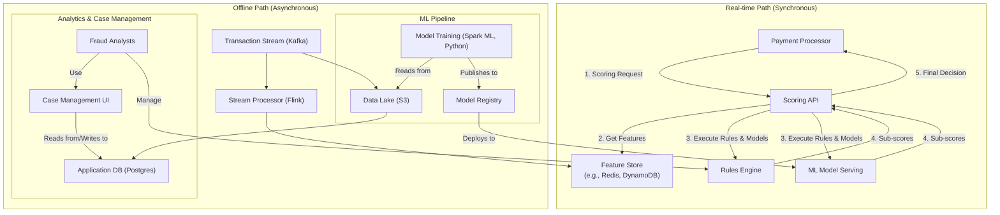

# High-Level Design: Fraud Detection System for Payments

## 1. Document Information

- **Document Title**: Real-time Fraud Detection System - High-Level Design
- **Version**: 1.0
- **Date**: 2025-08-28
- **Author**: Jules (AI Agent)
- **Status**: Draft

---

## 2. Executive Summary

### 2.1 Purpose
This document provides the high-level design for a Fraud Detection System for payments. The system is designed to operate in real-time, analyzing incoming payment transactions to generate a risk score and a decision (`ALLOW`, `REVIEW`, `DENY`). It leverages a combination of a configurable rules engine and machine learning models to identify and block fraudulent activity, thereby minimizing financial losses for merchants.

### 2.2 Scope

**In Scope:**
-   A low-latency, synchronous API for providing real-time risk assessments of payment transactions.
-   A rules engine that allows fraud analysts to define and manage fraud detection rules.
-   A platform for serving machine learning models to score transactions.
-   A feature engineering pipeline to compute and serve data for the rules engine and ML models in real-time.
-   A case management user interface for human analysts to review flagged transactions.
-   An offline data pipeline for analytics and model retraining.

**Out of Scope:**
-   The payment processing system itself (this system is a dependency).
-   The training of machine learning models (this HLD covers the serving infrastructure, not the data science).
-   Chargeback processing and representation.
-   User authentication and identity management.

### 2.3 High-Level Architecture Overview
The architecture is a hybrid real-time and batch processing system. A synchronous **Real-time Path** provides low-latency risk scores to the payment processor. This path includes a **Scoring API**, a **Feature Store**, a **Rules Engine**, and an **ML Model Serving** component. In parallel, an **Offline Path** uses a data pipeline to ingest all transaction data into a data lake, which is used for analytics, reporting, feature engineering, and training new ML models that can then be deployed to the real-time path.

---

## 3. System Overview

### 3.1 Business Context
Payment fraud is a significant and ever-evolving threat in e-commerce. A sophisticated fraud detection system is a critical tool for any payment processor or large merchant to minimize losses, reduce operational overhead from chargebacks, and protect customers.

### 3.2 System Purpose
The primary purpose is to accurately distinguish between legitimate and fraudulent transactions in real-time, enabling the business to block fraud without impacting the experience of legitimate customers.

### 3.3 Success Criteria
-   **Accuracy**: The system's performance will be measured by its precision and recall.
    -   **Precision**: Minimize "false positives" (legitimate transactions that are blocked).
    -   **Recall**: Maximize "true positives" (fraudulent transactions that are caught).
-   **Latency**: P99 latency for a risk score decision must be < 100ms.
-   **Availability**: 99.99% uptime for the real-time scoring API.
-   **Adaptability**: The system must be able to quickly adapt to new fraud patterns through the rapid deployment of new rules and models.

### 3.4 Assumptions
-   The fraud detection system will be called synchronously by a payment processing system during the payment authorization flow.
-   The system will have access to a real-time stream of all payment transactions.
-   A team of fraud analysts and data scientists will use the system to manage rules and build models.

### 3.5 Constraints
-   **Decision Time Window**: The system must return a decision within a strict, short time window (e.g., < 100ms) to avoid delaying the overall payment transaction.
-   **Evolving Threat Landscape**: Fraudsters constantly change their tactics, so the system must be designed for rapid evolution.
-   **Data Privacy**: The system handles sensitive transaction data and must comply with data privacy regulations.

---

## 4. Requirements Analysis

### 4.1 Functional Requirements
-   **FR-001 (Real-time Scoring API)**: The system shall expose a synchronous API that accepts transaction data (e.g., amount, currency, card details, user info) and returns a risk score and a decision (`ALLOW`, `REVIEW`, `DENY`).
-   **FR-002 (Feature Computation)**: The system must compute behavioral features in near real-time, such as `user_spending_in_last_hour` or `is_shipping_address_new`.
-   **FR-003 (Rules Engine)**: The system shall allow fraud analysts to write, test, and deploy human-readable rules that can modify the risk score.
-   **FR-004 (ML Model Serving)**: The system must be able to host multiple machine learning models and execute them to generate a fraud probability score as part of the overall risk assessment.
-   **FR-005 (Case Management UI)**: The system shall provide a user interface where analysts can search for transactions, review those flagged by the system, and label them with a final outcome (e.g., `CONFIRMED_FRAUD`).
-   **FR-006 (Feedback Loop)**: The labels provided by analysts in the Case Management UI must be fed back into the offline system to be used as training data for future model iterations.

### 4.2 Non-Functional Requirements
-   **Performance & Latency**: The scoring API must have a P99 latency of < 100ms. The Feature Store must provide P99 read latencies of < 10ms.
-   **Availability**: 99.99% uptime for the scoring API. The system should have a "fail-safe" mechanism; if a score cannot be generated within the time limit, it should default to a safe decision (e.g., `ALLOW` or `REVIEW`, depending on business risk tolerance).
-   **Scalability**: The system must scale horizontally to handle transaction volumes from major sales events.
-   **Extensibility**: The architecture must make it easy to add new data sources, features, rules, and ML models without re-architecting the system.
-   **Security**: The system must protect the sensitive transaction data it processes. Access to the system and its data must be strictly controlled.
-   **Model Governance**: The system should provide tools for A/B testing and shadowing new models in production to evaluate their performance before they are fully enabled.

---

## 5. Architecture Design

### 5.1 Architecture Principles
- **Separation of Online & Offline Paths**: The architecture is fundamentally divided into two parts: a low-latency **online** path for real-time scoring and a high-throughput **offline** path for data processing, analytics, and model training.
- **Extensibility**: The system is designed as a framework where new rules, features, and ML models can be easily added and tested without impacting the core infrastructure.
- **Fail-Safe by Default**: The real-time scoring endpoint is designed to be highly resilient and to always return a response within its SLA, even if it's a default "safe" score. It should not be a source of failure for its clients (e.g., the payment processor).

### 5.2 Architecture Patterns
- **Hybrid Lambda/Kappa Architecture**: The system uses a hybrid approach to data processing. A real-time streaming pipeline computes features with low latency, while a batch pipeline processes large historical datasets for model training and deep analytics.
- **Feature Store**: A centralized service that decouples feature creation from feature consumption. The offline pipeline writes features to the store, and the online pipeline reads them with low latency.
- **Model Shadowing & A/B Testing**: The model serving component supports deploying new models in a "shadow" mode (receiving live traffic but not acting on the results) or A/B testing mode to safely evaluate performance before a full rollout.

### 5.3 High-Level Architecture Diagram



### 5.4 Component Overview
- **Scoring API**: The synchronous, low-latency entry point for real-time risk scoring.
- **Feature Store**: A key-value store optimized for low-latency reads, providing feature data to the scoring API.
- **Rules Engine**: Executes a set of human-defined rules.
- **ML Model Serving**: A service that hosts ML models and executes them to generate a fraud score.
- **Offline Data Pipeline**: A stream and batch processing pipeline that ingests all transaction data, populates the Feature Store and a Data Lake, and prepares data for model training.
- **Model Registry**: A repository for storing versioned, trained ML models.
- **Case Management UI**: A web interface for human analysts to review and label suspicious transactions.

### 5.5 Technology Stack
- **Real-time Services**: **Go** or **Java** for low-latency APIs.
- **Feature Store**: **Redis** or **DynamoDB** for fast key-value lookups.
- **Stream Processing**: **Apache Flink** or **Kafka Streams**.
- **Batch Processing & ML Training**: **Apache Spark** with **Python** (using libraries like Scikit-learn, PyTorch, TensorFlow).
- **ML Model Serving**: **Triton Inference Server**, **Seldon Core**, or a custom-built service.
- **Data Lake**: **Amazon S3** or similar object storage.

### 5.6 Architecture Decision Records (ADRs)

#### 5.6.1 ADR-001: Separation of Online and Offline Paths
- **Decision**: To architect the system into two distinct paths: a synchronous online path for scoring and an asynchronous offline path for data processing.
- **Justification**: This separation allows each path to be optimized for its specific needs. The online path can be simple and optimized purely for low latency and high availability. The offline path can handle complex, high-throughput computations without any risk of impacting live transaction processing.
- **Consequences**: Requires a robust bridge between the two worlds, which is the role of the Feature Store and the Model Registry.

---

## 6. Detailed Component Design

### 6.1 Component 1: Real-time Scoring API
- **Purpose**: To provide a single, unified risk score within a strict latency SLA.
- **Responsibilities**:
    -   Receive a synchronous API call with the transaction data.
    -   Fetch pre-computed features from the Feature Store in parallel.
    -   Call the Rules Engine and ML Model Serving components in parallel.
    -   Combine the outputs (e.g., a list of triggered rules and an ML score) using a defined logic to produce a final score and decision.
    -   Respond within the SLA (e.g., < 100ms).

### 6.2 Component 2: Feature Engineering Pipeline (Streaming)
- **Purpose**: To provide fresh, near real-time features to the scoring service.
- **Responsibilities**:
    -   Consume the live stream of transactions from Kafka.
    -   For each transaction, update aggregated features (e.g., increment `card_velocity_1hr`, update `avg_user_purchase_value`).
    -   Write the updated feature values to the Feature Store with low latency.

### 6.3 Component 3: ML Model Serving
- **Purpose**: To serve ML model predictions with low latency.
- **Responsibilities**:
    -   Load new models from the Model Registry without downtime.
    -   Expose a simple API to accept a feature vector and return a model's prediction.
    -   Support hosting multiple model versions simultaneously for shadowing and A/B testing.
    -   Monitor the technical performance (latency, error rate) of the models.

### 6.4 Component 4: Case Management System
- **Purpose**: To enable human-in-the-loop fraud analysis.
- **Responsibilities**:
    -   Provide a UI for analysts to search for transactions and review cases that were flagged by the real-time system.
    -   Display all the features, rules, and model scores that led to the decision.
    -   Allow analysts to assign a definitive label (e.g., `CONFIRMED_FRAUD`, `NOT_FRAUD`). This labeled data is the most valuable input for retraining and improving the ML models and rules.

---

## 7. Data Design

### 7.1 Data Models
- **Transaction Event**: The input data model for a scoring request. It's a rich object containing dozens or hundreds of raw data points about the payment (e.g., amount, currency, card BIN, user ID, IP address, shipping address, etc.).
- **Feature Vector**: The internal data model used by the scoring engine. This is a key-value map where keys are feature names (e.g., `user_txn_count_24h`) and values are the computed feature values.
- **Case Management Data**: A relational model storing the state of analyst investigations.
    - `cases`: `case_id`, `transaction_id`, `status` ('open', 'closed'), `final_label` ('fraud', 'not_fraud'), `analyst_id`.

### 7.2 Data Storage Strategy
- **Feature Store (Online)**: A low-latency key-value store like **Redis** or **ScyllaDB**. It stores pre-computed features needed for real-time scoring. For example, the key might be `user_id` and the value would be a hash map of all features for that user.
- **Data Lake (Offline)**: All raw transaction events are streamed into a cost-effective, durable object store like **Amazon S3**. This becomes the source of truth for all offline analysis and model training.
- **Case Management Database**: A standard **PostgreSQL** database to back the Case Management UI.

---

## 8. API Design

### 8.1 API Architecture
The system has one primary, critical, synchronous API for real-time scoring. Other APIs for the case management UI are standard internal REST APIs.

### 8.2 API Specifications

#### 8.2.1 Real-time Scoring API
- **Endpoint**: `POST /v1/scores`
- **Protocol**: Internal gRPC or REST over HTTP. Low-overhead protocols are preferred.
- **Request Body**: A rich JSON object containing all available details about the payment transaction.
  ```json
  {
    "transaction_id": "...",
    "user": { "id": "...", "email_hash": "...", "ip_address": "..." },
    "payment": { "amount": 123.45, "currency": "USD", "card_bin": "424242" },
    "merchant": { "id": "...", "category": "..." }
  }
  ```
- **Response Body (Success - 200 OK)**: A JSON object containing the decision and supporting information.
  ```json
  {
    "score": 850,
    "decision": "DENY",
    "reasons": ["RULE_HIGH_RISK_COUNTRY", "MODEL_XGB_V2_SCORE_HIGH"]
  }
  ```
- **SLA**: The API must have a strict P99 latency SLA of < 100ms. If the system cannot produce a full score within this time, it must return a default "safe" response (e.g., `{ "score": -1, "decision": "ALLOW", "reasons": ["TIMEOUT"] }`).

---

## 9. Security Design

### 9.1 Security Architecture
The security model focuses on protecting the sensitive transaction data the system processes and ensuring the integrity of its decision-making components (rules, models).

### 9.2 Authentication & Authorization
- **System-to-System Authentication**: The real-time scoring API is an internal-only endpoint. The calling system (e.g., a payment processor) must authenticate using mutual TLS (mTLS).
- **User Authorization (Case Management)**: Access to the Case Management UI is protected by strong authentication (MFA). Authorization is role-based (RBAC), e.g., analysts can review cases, but only senior analysts or admins can deploy new rules.

### 9.3 Data Security
- **Data Minimization & Tokenization**: The system should not ingest raw sensitive data where possible. For example, it should receive a tokenized card number or a hash of the card number, not the full PAN.
- **Encryption**: All data is encrypted in transit using TLS and at rest in the data lake and databases.
- **Access Control**: Access to the underlying data stores (Feature Store, Data Lake) is heavily restricted and audited.

### 9.4 Model and Rule Security
- **Model/Rule Governance**: The process for deploying a new rule or ML model to production is a critical security control point.
- **Process**: Changes must be peer-reviewed, tested extensively in a staging environment, and deployed with an automated system that logs a full audit trail of who deployed what, and when. Rollback capabilities must be in place.

---

## 10. Scalability & Performance

### 10.1 Performance Requirements
- **Real-time Path**: The P99 latency of the synchronous scoring API must be under 100ms.
- **Offline Path**: The data pipeline must be able to process the entire stream of production transactions in near real-time to keep features fresh. The batch model training process must complete within a reasonable timeframe (e.g., daily or weekly).

### 10.2 Scalability Strategy
- **Real-time Services**: The Scoring API, Rules Engine, and ML Model Serving components are stateless and can be scaled horizontally by adding more instances.
- **Feature Store**: The Feature Store is scaled using a clustered in-memory database like Redis Cluster, which can be scaled by adding more nodes.
- **Offline Processing**: The stream and batch processing jobs (Flink, Spark) are inherently scalable and can be given more resources to handle larger data volumes.

---

## 11. Deployment & Operations

### 11.1 Deployment Architecture
The system is deployed on a cloud platform using Kubernetes for container orchestration. This allows for easy scaling and management of the various microservices.

### 11.2 Model & Rule Deployment
This is a critical operational flow, managed by a specialized MLOps/FraudOps team.
1.  **Offline Evaluation**: A new model is first rigorously evaluated on a held-out test dataset.
2.  **Shadowing**: The new model is deployed to the ML Serving platform in "shadow mode." It receives a copy of live production traffic, and its predictions are logged but not used in the final decision.
3.  **A/B Testing**: The model is promoted to an A/B test, where it handles a small percentage (e.g., 5%) of live traffic, and its performance is compared directly against the current champion model.
4.  **Full Rollout**: If the new model performs well, it is promoted to the champion model, and the old model is decommissioned.

### 11.3 Operations & Monitoring
- **SRE Team**: Monitors the health, performance, and availability of the real-time and offline systems.
- **Fraud Analyst Team**: Uses the Case Management UI daily to review cases, identify new fraud patterns, and write new rules. They provide the critical human feedback loop.
- **Data Science Team**: Monitors the performance (precision/recall) of the live models and retrains them regularly with newly labeled data.

---

## 12. Testing Strategy

### 12.1 Offline Model Validation
Before deployment, every model candidate must be validated against a "golden" test set of historical data. Key metrics like Precision, Recall, and AUC ROC are calculated and must meet a predefined threshold.

### 12.2 Online A/B Testing
The platform's ability to run A/B tests between different models and rule sets is its most important testing feature. This allows for data-driven decisions about which strategies are most effective at stopping fraud without harming legitimate user experience.

### 12.3 Backtesting
The system must provide a facility to "backtest" a new rule or model against historical transaction data. This simulates how the rule/model would have performed over the last days or weeks, providing insight into its potential impact before it goes live.

---

## 13. Risk Analysis

| Risk | Impact | Probability | Mitigation |
|------|--------|-------------|------------|
| Poor Model Performance | High | Medium | A new model causes too many false positives (blocking good users) or false negatives (missing fraud). Mitigation: Rigorous offline evaluation, shadowing, and gradual A/B testing rollout. Automated alerting on model performance degradation. |
| Feature Store Unavailability | Critical | Low | The Feature Store is a single point of failure for the real-time path. Mitigation: Use a highly available, clustered database. Have a fail-safe in the Scoring API to return a default score if the store is down. |
| Adversarial Attacks | High | High | Fraudsters will constantly adapt. Mitigation: A continuous feedback loop where human analysts identify new patterns, and data scientists use this to create new features and retrain models. |
| Rule Engine Error | High | Low | A poorly written rule could block many legitimate users. Mitigation: Rules are treated like code, with mandatory peer review, testing in a staging environment, and a controlled deployment process. |

---

## 14. Implementation Plan (High-Level)

- **Phase 1 (Data Foundation)**: Build the data ingestion pipeline to get a stream of transactions into a data lake.
- **Phase 2 (Analysis & First Model)**: Build the Case Management UI for manual review and labeling. Use this initial labeled data to train a baseline ML model.
- **Phase 3 (Real-time Serving)**: Build the core real-time path: Scoring API, Feature Store, and ML Model Serving. Deploy the baseline model in shadow mode.
- **Phase 4 (Rules & Feedback Loop)**: Build the Rules Engine and the feedback mechanism to pipe analyst labels back into the training pipeline.
- **Phase 5 (Go-Live)**: Begin using the system's decisions to block fraud, starting with the highest-confidence predictions.

---

## 15. Appendices

### Appendix A: Glossary
- **Feature Store**: A centralized repository to store, share, and serve machine learning features.
- **Rules Engine**: A system that executes human-defined logic (rules) on a set of data.
- **Precision**: Of all the transactions we blocked, what percentage were actually fraudulent? (True Positives / (True Positives + False Positives)).
- **Recall**: Of all the fraudulent transactions that occurred, what percentage did we catch? (True Positives / (True Positives + False Negatives)).
- **Model Shadowing**: Deploying a new model alongside a production model, feeding it the same live traffic, but only logging its output for analysis.
