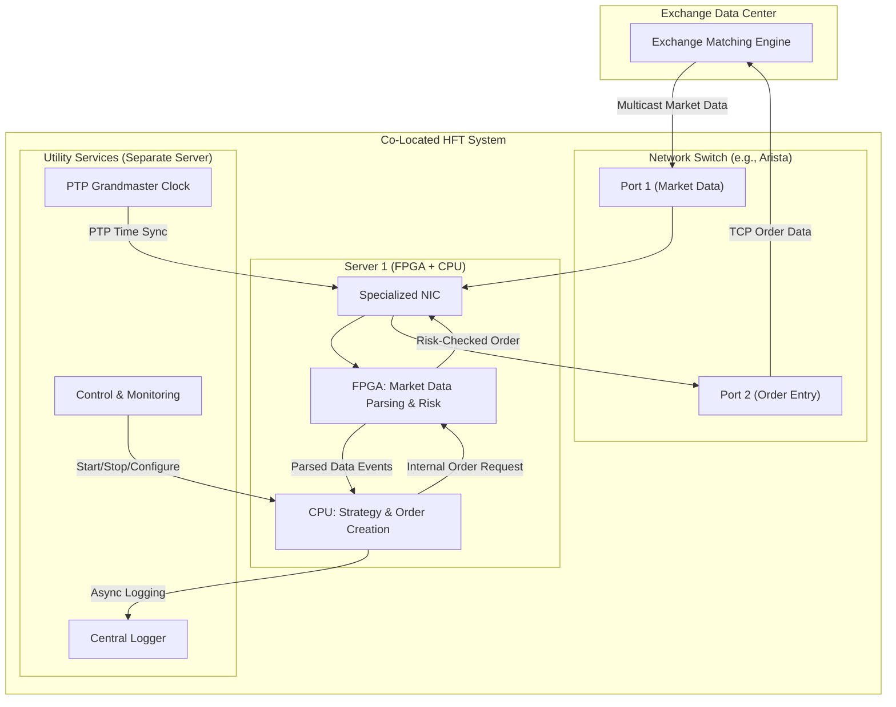

# High-Level Design: High-Frequency Trading (HFT) Platform

## 1. Document Information

- **Document Title**: High-Frequency Trading (HFT) Platform - High-Level Design
- **Version**: 1.0
- **Date**: 2025-08-26
- **Author**: Jules (AI Agent)
- **Status**: Draft

---

## 2. Executive Summary

### 2.1 Purpose
This document outlines the high-level design for an ultra-low-latency High-Frequency Trading (HFT) platform. The system is designed to execute algorithmic trading strategies at speeds measured in microseconds, capitalizing on fleeting market opportunities by co-locating hardware within exchange data centers.

### 2.2 Scope

**In Scope:**
-   Direct connectivity to multiple financial exchanges for market data ingestion and order execution.
-   An event-driven engine capable of processing millions of market data messages per second.
-   A framework for developing, testing, and deploying latency-sensitive trading strategies.
-   An ultra-low-latency order management system (OMS) for placing, tracking, and canceling orders.
-   Pre-trade and real-time risk management controls to prevent erroneous or catastrophic trades.
-   High-precision, timestamped logging of all messages and actions for auditing and compliance.

**Out of Scope:**
-   Post-trade clearing and settlement processes.
-   Development of the trading algorithms themselves (the platform is the execution venue).
-   Complex user interfaces for traders (the system is designed for fully automated "headless" operation).
-   Historical market data storage and large-scale backtesting platforms (these are separate, less latency-sensitive systems).

### 2.3 High-Level Architecture Overview
The proposed architecture is a highly optimized, event-driven system built for extreme performance. It consists of physically co-located hardware in exchange data centers, utilizing custom hardware (FPGAs), kernel bypass networking, and a lean software stack written in C++. The core components include Market Data Adapters, a Strategy Engine, an Order Execution Gateway, and a real-time Risk Management System, all designed to operate with sub-millisecond, deterministic latency.

---

## 3. System Overview

### 3.1 Business Context
High-frequency trading is a quantitative trading discipline where technology and speed are the primary competitive advantages. HFT firms execute a vast number of orders at extremely high speeds to profit from small price discrepancies and market inefficiencies. This platform is the core infrastructure that enables such strategies, forming the technological backbone of the business.

### 3.2 System Purpose
The primary purpose is to provide the fastest possible path from receiving market information to executing a trade. The system must be a deterministic, low-latency machine that can be trusted to execute high volumes of trades safely and reliably within predefined risk limits.

### 3.3 Success Criteria
-   **P99 Latency**: End-to-end latency (from market data packet ingress to order packet egress) must be below 10 microseconds (< 10 µs).
-   **Throughput**: Capacity to process over 10 million market data messages per second per exchange feed.
-   **Availability**: 99.999% uptime during market trading hours.
-   **Reliability**: Zero dropped market data messages and zero lost or duplicated orders.
-   **Risk & Compliance**: No breaches of pre-trade risk limits and full compliance with regulatory logging requirements (e.g., SEC Rule 15c3-5).

### 3.4 Assumptions
-   The system will be deployed on dedicated, bare-metal servers co-located in exchange data centers (e.g., NYSE in Mahwah, NJ; NASDAQ in Carteret, NJ).
-   Access to direct exchange feeds (not consolidated feeds) is available.
-   Specialized hardware, including high-end network cards (NICs) that support kernel bypass and FPGAs, is available.

### 3.5 Constraints
-   **Physical Proximity**: The system must be physically as close to the exchange's matching engine as possible.
-   **Hardware Dependency**: The software design is tightly coupled to the underlying hardware capabilities.
-   **Regulatory Scrutiny**: The system must adhere to strict financial regulations and be designed for auditability.
-   **Determinism**: Performance must be predictable and consistent, with minimal jitter. Garbage collection or other non-deterministic runtime features are unacceptable in the critical path.

---

## 4. Requirements Analysis

### 4.1 Functional Requirements

-   **FR-001 (Market Data Ingestion)**: The system shall connect to exchange-specific multicast feeds and parse various market data protocols (e.g., ITCH, PITCH) in real-time.
-   **FR-002 (Strategy Execution)**: The system shall provide a framework for executing pre-compiled trading strategy logic based on incoming market data.
-   **FR-003 (Order Submission)**: The system shall be able to create and submit orders to exchanges using their specific order entry protocols (e.g., OUCH, FIX).
-   **FR-004 (Order Management)**: The system shall track the state of all active orders (e.g., `sent`, `acknowledged`, `filled`, `canceled`).
-   **FR-005 (Risk Management)**: The system must apply pre-trade risk checks on every potential order, including position limits, credit exposure, and rate limits.
-   **FR-006 (High-Precision Logging)**: The system must log every significant event (market data received, strategy decision, order sent, acknowledgement received) with nanosecond-precision timestamps.

### 4.2 Non-Functional Requirements

-   **Latency**:
    -   Network I/O: < 1 microsecond for packet processing using kernel bypass.
    -   End-to-End (Market-to-Order): P99 latency of < 10 microseconds.
    -   Jitter: Standard deviation of latency should be < 2 microseconds.
-   **Throughput**:
    -   Must handle market data bursts exceeding 10 million messages/sec.
    -   Must support submitting over 10,000 orders/sec.
-   **Availability**:
    -   99.999% availability during trading hours.
    -   Automated failover between redundant components must complete in under 50 milliseconds.
-   **Reliability**:
    -   Guaranteed, in-order processing of messages from a single market data feed.
    -   The system must be architected to prevent "lost" orders and tolerate single hardware failures without interruption.
-   **Security**:
    -   Access to the trading systems must be strictly controlled via multi-factor authentication and private networks.
    -   The system must be hardened against network intrusion.
-   **Compliance**:
    -   All message traffic and state changes must be logged and archived in a tamper-evident manner to meet regulatory requirements.
-   **Scalability**:
    -   The architecture must allow for adding new exchange connections or new trading strategies with minimal impact on existing operations.

---

## 5. Architecture Design

### 5.1 Architecture Principles
- **Hardware/Software Co-Design**: The software is designed with intimate knowledge of the hardware it runs on, including CPU architecture, cache behavior, and network card features.
- **Zero-Garbage-Collection**: The critical path must not contain languages or libraries that use garbage collection or other sources of non-deterministic latency.
- **Simplicity on the Critical Path**: The path from market data ingress to order egress must be as lean as possible, with any non-essential operations (e.g., logging to disk) handled asynchronously by non-critical threads.
- **Determinism**: The system's performance must be predictable and repeatable.

### 5.2 Architecture Patterns
- **Event-Driven Architecture**: The system is built around an asynchronous flow of events, primarily market data updates and order acknowledgements.
- **Kernel Bypass**: To achieve the lowest possible network latency, the application communicates directly with the network card's hardware buffers, bypassing the kernel's network stack entirely (e.g., using Solarflare's OpenOnload or Mellanox's VMA).
- **CPU Pinning & Cache Affinity**: Critical threads are pinned to specific CPU cores to prevent context switching and ensure that the CPU's L1/L2/L3 caches remain "hot" with the necessary data and instructions.

### 5.3 High-Level Architecture Diagram



### 5.4 Component Overview
- **Specialized NIC**: A network interface card capable of kernel bypass and feeding data directly to userspace applications or an FPGA.
- **FPGA (Field-Programmable Gate Array)**: A piece of reconfigurable hardware used for the most latency-critical tasks. In this design, it parses the raw market data feed and performs "bump-in-the-wire" risk checks on outgoing orders, all with deterministic, nanosecond-level latency.
- **CPU (Strategy Engine)**: A high-clock-speed CPU with large caches running the core trading logic. It receives simplified events from the FPGA, makes trading decisions, and constructs order requests.
- **Control & Monitoring**: A separate system for starting/stopping strategies, monitoring system health, and providing a human interface. It is not on the critical trading path.
- **High-Precision Clock**: A source for Precision Time Protocol (PTP) to synchronize clocks across all components with nanosecond accuracy, which is essential for accurate timestamping and regulatory compliance.

### 5.5 Technology Stack
- **Programming Language**: **C++20/23** for performance-critical components. Python or Java for non-latency-sensitive control and monitoring tools.
- **Hardware**: **FPGAs** (e.g., Xilinx Alveo), **multi-core Intel/AMD CPUs** with high clock speeds, **Solarflare/Mellanox NICs**.
- **Networking**: **Kernel Bypass** (OpenOnload, DPDK), custom UDP/TCP handling.
- **Operating System**: A stripped-down, real-time Linux distribution (e.g., a custom-tuned RHEL or CentOS).
- **Compiler**: **Clang/GCC** with aggressive optimization flags (`-O3`, LTO, PGO).

### 5.6 Architecture Decision Records (ADRs)

#### 5.6.1 ADR-001: Use of FPGAs for Critical Path
- **Decision**: To offload market data parsing and pre-trade risk checks to an FPGA.
- **Justification**: FPGAs provide lower and more deterministic latency than a CPU-based software solution for these tasks. Parsing complex binary feeds and applying risk rules can be heavily parallelized in hardware, freeing the CPU to focus solely on strategy logic.
- **Consequences**: Increased development complexity and cost. Requires specialized hardware and HDL (Hardware Description Language) expertise.

---

## 6. Detailed Component Design

### 6.1 Component 1: Market Data Adapter (on FPGA)
- **Purpose**: To decode raw exchange data feeds at line rate.
- **Responsibilities**:
    -   Receive raw UDP packets from the exchange multicast feed.
    -   Identify and parse different message types (e.g., New Order, Cancel, Trade).
    -   Filter for instruments relevant to the active trading strategies.
    -   Construct a simplified internal event format.
    -   Push these events into a lock-free queue for the CPU to consume.

### 6.2 Component 2: Strategy Engine (on CPU)
- **Purpose**: To execute the trading algorithm.
- **Responsibilities**:
    -   Read market data events from the lock-free queue shared with the FPGA.
    -   Maintain an in-memory representation of the order book for relevant instruments.
    -   Execute the strategy's decision logic based on the latest market state.
    -   When a trading opportunity is identified, generate an internal order object (e.g., {Side: Buy, Price: 100.50, Qty: 100}).
    -   Send the internal order object to the Risk Management component.

### 6.3 Component 3: Risk Management & Order Execution (on FPGA)
- **Purpose**: To apply final risk checks and send the order to the exchange.
- **Responsibilities**:
    -   Receive the internal order object from the CPU.
    -   Perform "bump-in-the-wire" risk checks: max order size, max position, rate limits, etc.
    -   If a check fails, the order is rejected and an event is sent back to the CPU.
    -   If checks pass, a pre-formatted order packet is sent to the exchange via the NIC.

---

## 7. Data Design

### 7.1 Data Models (Internal Representation)
For performance, all data on the critical path is represented as simple C++ structs or classes with fixed memory layouts to avoid dynamic allocation and pointer chasing.

- **Market Data Event Struct**:
  ```cpp
  struct MarketEvent {
      uint64_t timestamp;      // Nanosecond-precision PTP timestamp
      uint32_t instrument_id;  // Internal ID for the financial instrument
      uint32_t price_level;    // Price represented as an integer (e.g., cents * 100)
      uint32_t quantity;
      uint8_t  side;           // 0 for Buy, 1 for Sell
      uint8_t  event_type;     // E.g., Add, Modify, Delete, Trade
  };
  ```

- **Internal Order Struct**:
  ```cpp
  struct InternalOrder {
      uint64_t order_id;
      uint32_t instrument_id;
      uint32_t price;
      uint32_t quantity;
      uint8_t  side;
      uint8_t  status;         // E.g., New, Sent, Acknowledged, Canceled
  };
  ```

### 7.2 Data Storage Strategy
- **In-Memory Storage**: The primary data store for the live trading system is the application's own memory space (RAM). Order books and positions are maintained in custom data structures (e.g., hash maps, arrays) optimized for low-latency access.
- **Durable Logging**: All incoming market data and outgoing order messages are captured and written to an append-only log file on a high-speed NVMe SSD. This writing is handled by a dedicated, non-critical thread to ensure it does not impact the latency of the trading path.
- **No Traditional Database**: A traditional RDBMS or NoSQL database is never queried or written to on the critical trading path. Doing so would introduce unacceptable and non-deterministic latency.

---

## 8. API Design

### 8.1 API Architecture
The system's "APIs" are not traditional REST or RPC APIs. They are highly specialized, low-level binary protocols designed for machine-to-machine communication where every nanosecond counts.

### 8.2 API Specifications
- **External Market Data API**: This is defined by the exchange. The HFT system is a client that must implement a parser for the exchange's specific binary protocol (e.g., **NASDAQ ITCH**, **NYSE PITCH**).
- **External Order Entry API**: This is also defined by the exchange. The system must implement the exchange's order entry protocol, such as **OUCH** (a low-latency binary protocol) or a binary variant of **FIX**.
- **Internal Control API**: A separate, higher-latency API used by operators to manage the system.
    - **Method**: Simple TCP-based request-response or a message queue (e.g., ZeroMQ).
    - **Purpose**: To allow the non-latency-sensitive Control & Monitoring system to send commands like `START_STRATEGY`, `STOP_STRATEGY`, `UPDATE_RISK_LIMIT`.
    - **Path**: This API is exposed on a separate network interface, isolated from the trading network.

---

## 9. Security Design

### 9.1 Security Architecture
Security is paramount and is based on a defense-in-depth model, starting with physical isolation.

### 9.2 Authentication & Authorization
- **Physical Access**: The servers are located in secure, audited data centers with strict access controls (biometrics, security guards).
- **Network Isolation**: The trading network is a physically separate network. It has no connection to the internet or the corporate network. Communication is restricted via access control lists (ACLs) on the network switches to only allow traffic between the HFT system and the exchange's gateways.
- **Operator Access**: Human access to the system is only possible through a hardened bastion host that requires multi-factor authentication. Operators are granted specific, role-based permissions.

### 9.3 Data Security
- **Encryption in Transit**: Connections to the exchange for order entry are over dedicated, secure lines. Internal communication between components is typically not encrypted to save latency, as the network is assumed to be physically secure.
- **Encryption at Rest**: The durable logs of market data and orders are encrypted on the SSD to prevent unauthorized access or tampering.

### 9.4 Application Security
- **Input Validation**: The market data parsers must be robust against malformed or unexpected packets to prevent crashes.
- **Kill Switch**: A critical safety feature. The system must have a reliable "kill switch" (which can be a physical button or a software command) that immediately:
    1.  Blocks all new outgoing orders.
    2.  Attempts to cancel all open orders at the exchange.
    This is a regulatory requirement and a crucial safeguard against runaway algorithms.
- **Code Reviews & Audits**: All strategy and platform code must undergo rigorous peer review and regular security audits.

---

## 10. Scalability & Performance

### 10.1 Performance Requirements
The system is designed to meet the sub-10 microsecond end-to-end latency requirements detailed in Section 4.2. Performance is not a feature but the core design driver.

### 10.2 Scalability Strategy
- **Horizontal Scaling**: The system scales by partitioning the problem space. New strategies or markets are handled by adding new, dedicated servers. Each server runs an independent instance of the trading logic for a subset of instruments, preventing cross-strategy impact.
- **Vertical Scaling**: The primary method for improving the performance of a single strategy is through vertical scaling: utilizing the latest generation of CPUs, FPGAs, and networking hardware.

### 10.3 Caching Strategy
The system operates almost entirely from RAM. The order book and all other necessary market state are considered a highly specialized, in-memory cache of the live market. There is no traditional caching tier; the application's memory is the cache.

### 10.4 Performance Monitoring
- **Hardware-level Monitoring**: Latency is measured using hardware timestamps from the NIC and CPU performance counters.
- **Out-of-Band Monitoring**: Monitoring data is collected on the server and sent to a separate, non-critical network to ensure that the act of observing the system does not affect its performance.

---

## 11. Deployment & Operations

### 11.1 Deployment Architecture
Deployment is a physical process of racking and provisioning bare-metal servers in co-location data centers provided by the exchanges.

### 11.2 Environment Strategy
- **Development**: Local developer workstations.
- **Certification & Simulation Lab**: A dedicated lab with hardware identical to production. This lab includes a market data simulator capable of replaying historical data at line rate to test strategy performance and system stability.
- **Production**: The live trading environment in the co-location facility.

### 11.3 CI/CD Pipeline
There is no traditional, fully automated CI/CD pipeline for production deployment due to the high risk involved.
1.  **Continuous Integration**: Code commits trigger automated builds and a suite of unit and integration tests.
2.  **Staging Deployment**: Successful builds are deployed to the simulation lab for rigorous, automated system testing.
3.  **Production Deployment**: This is a manual, carefully controlled process. It is performed during off-market hours and involves a detailed checklist, pre-flight checks, and manual sign-off before the system is enabled for live trading.

### 11.4 Monitoring & Alerting
- **Real-time Dashboards**: An operations team monitors real-time dashboards showing P&L, position sizes, latency histograms, and system health (CPU, memory, network).
- **Automated Alerting**: Alerts are triggered for any metric that deviates from its expected bounds (e.g., latency spike, unexpected message rate, risk limit breach). Alerts are sent to an on-call team via systems like PagerDuty.

### 11.5 Logging Strategy
- **Local Logging**: The critical path logs events to a local, memory-mapped file.
- **Asynchronous Shipping**: A separate, low-priority thread reads from this file and ships the logs to a central, long-term storage system for analysis and compliance.

---

## 12. Testing Strategy

### 12.1 Unit & Integration Testing
Standard unit tests for individual functions and integration tests for component interactions are required.

### 12.2 Market Simulation Testing
This is the most critical testing phase. The entire system is tested in the lab against a simulator that replays historical market data. This validates the strategy's profitability and, more importantly, its behavior during periods of extreme volatility or unusual market conditions.

### 12.3 Conformance Testing
Before connecting to a live exchange, the system must pass a certification or conformance test provided by the exchange to ensure it behaves according to their rules of engagement.

---

## 13. Risk Analysis

| Risk | Impact | Probability | Mitigation |
|------|--------|-------------|------------|
| Runaway Algorithm | Critical | Low | Hardware-based risk controls (FPGA), strict pre-trade limits, automated monitoring, and a manual "kill switch". |
| Hardware Failure (CPU/NIC) | High | Medium | Redundant servers with automated, low-latency failover procedures. |
| Extreme Market Volatility | High | Medium | Dynamic risk limits that adjust to market volatility. Logic to reduce or halt trading during chaotic conditions. |
| Network Packet Loss | High | Medium | Subscribing to redundant A/B market data feeds. Application-level logic to detect and handle sequence gaps. |

---

## 14. Implementation Plan (High-Level)

- **Phase 1 (Infrastructure)**: Procure and rack servers in co-location data centers. Establish network connectivity with exchanges.
- **Phase 2 (Platform Development)**: Develop the core software components: market data parsers, order execution gateway, risk engine, and logging.
- **Phase 3 (Strategy Integration)**: Implement a first, simple trading strategy on the platform.
- **Phase 4 (Testing & Certification)**: Conduct exhaustive simulation testing and pass exchange conformance tests.
- **Phase 5 (Go-Live)**: Deploy the system with a single strategy on a single instrument, with very limited capital allocation. Gradually increase exposure as confidence in the system grows.

---

## 15. Appendices

### Appendix A: Glossary
- **Co-location**: Placing privately-owned servers in the same data center as an exchange's matching engine to minimize network latency.
- **FPGA**: Field-Programmable Gate Array. A type of integrated circuit that can be reconfigured by a developer for a specific task.
- **Kernel Bypass**: A networking technique that allows a userspace application to interact directly with the NIC, bypassing the operating system's kernel and its associated overhead.
- **PTP**: Precision Time Protocol. A protocol used to synchronize clocks throughout a computer network with nanosecond accuracy.
- **FIX / OUCH**: Protocols used for order entry in financial markets. OUCH is a simpler, lower-latency binary protocol.
