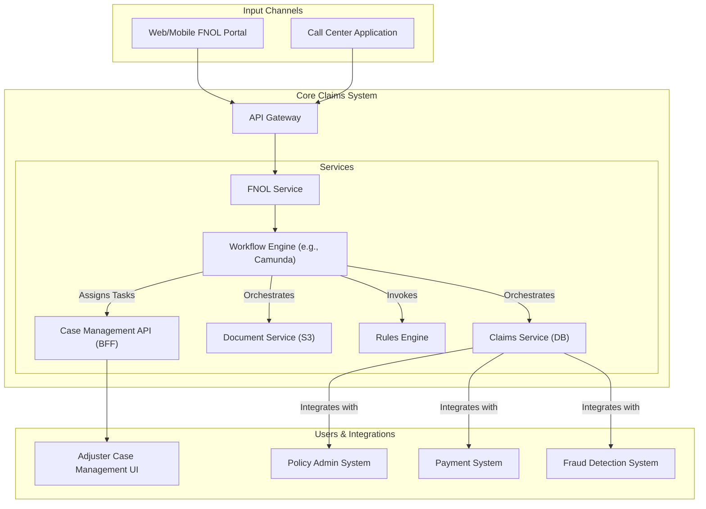

# High-Level Design: Insurance Claims Processing System

## 1. Document Information

- **Document Title**: Insurance Claims Processing System - High-Level Design
- **Version**: 1.0
- **Date**: 2025-08-29
- **Author**: Jules (AI Agent)
- **Status**: Draft

---

## 2. Executive Summary

### 2.1 Purpose
This document provides the high-level design for a modern Insurance Claims Processing System. The system is designed to manage the end-to-end lifecycle of an insurance claim, from the initial report to final settlement. It aims to improve operational efficiency, ensure accurate and consistent claims handling, and enhance customer satisfaction through a streamlined, transparent process.

### 2.2 Scope

**In Scope:**
-   **First Notice of Loss (FNOL)** intake from multiple channels (web portal, mobile app, call center).
-   A **Workflow Engine** to orchestrate the claim through its various stages (e.g., investigation, assessment, settlement).
-   A **Case Management UI** for claims adjusters and managers to handle their caseload, manage tasks, and document their actions.
-   A **Document Management System** for ingesting and storing claim-related documents (photos, police reports, invoices, etc.).
-   A **Rules Engine** to automate initial validation, claim assignment, and fraud checks.
-   Integration with other core insurance systems, such as a Policy Administration System and a payment system.
-   A complete and immutable audit trail for every claim.

**Out of Scope:**
-   The Policy Administration System (which manages customer policies).
-   The financial accounting and general ledger systems of the insurer.
-   The user-facing portals and mobile apps themselves (they are clients of this system).
-   Underwriting and pricing of insurance policies.

### 2.3 High-Level Architecture Overview
The architecture is a workflow-driven system composed of several key microservices. At its heart is a **Workflow Engine** that manages the state of each claim. A **Claims Service** provides the core business logic and data persistence. It is supported by a **Document Service** for handling files, a **Rules Engine** for automated decision-making, and a **Case Management API** that serves the primary user interface for adjusters. The system is designed for reliability, auditability, and integration with other enterprise systems.

---

## 3. System Overview

### 3.1 Business Context
Claims processing is the moment of truth for an insurer, where they deliver on their promise to the policyholder. An efficient, fair, and transparent claims process is a major driver of customer retention and brand reputation. Legacy claims systems are often rigid and inefficient, leading to high operational costs and poor customer experiences.

### 3.2 System Purpose
The primary purpose is to provide a robust and flexible platform that standardizes and automates the claims process. It empowers claims adjusters with the tools and information they need to handle claims accurately and efficiently, from simple, automated settlements to complex, multi-party investigations.

### 3.3 Success Criteria
-   **Efficiency**: Reduce the average claim lifecycle time by a target percentage (e.g., 30%).
-   **Accuracy**: Reduce the rate of payment errors and ensure consistent application of policy rules.
-   **Auditability & Compliance**: Pass all internal and external audits with a complete and clear record for every claim.
-   **Customer Satisfaction**: Improve Net Promoter Score (NPS) related to the claims experience.

### 3.4 Assumptions
-   The system will integrate with an existing Policy Administration System to retrieve policy and coverage details.
-   The system will integrate with an existing payment system to disburse funds.
-   A team of claims adjusters, investigators, and managers are the primary users of the system.

### 3.5 Constraints
-   **Integration with Legacy Systems**: The system must be designed to integrate with older, potentially less flexible, core insurance systems.
-   **Regulatory Compliance**: The system must adhere to insurance regulations in all jurisdictions where the company operates, which can vary significantly.
-   **Data Privacy**: The system will handle highly sensitive Personally Identifiable Information (PII) and, in some cases, medical data, requiring strict security and compliance (e.g., with HIPAA for health-related claims).

---

## 4. Requirements Analysis

### 4.1 Functional Requirements
-   **FR-001 (First Notice of Loss - FNOL)**: The system must provide an API to capture initial claim details from various channels.
-   **FR-002 (Claim Creation & Triage)**: Upon FNOL, the system shall create a new claim record, validate it against the policy system, and use a rules engine to assign it to the appropriate adjuster or team.
-   **FR-003 (Document Management)**: The system must allow users to upload and attach documents, photos, and other evidence to a claim file. It should support OCR to extract text from documents.
-   **FR-004 (Workflow Management)**: The system must manage the claim's progression through a configurable set of states and tasks (e.g., `FNOL` -> `Contact Claimant` -> `Schedule Inspection` -> `Review Assessment` -> `Approve Settlement`).
-   **FR-005 (Case Management UI Support)**: The system must provide a comprehensive set of APIs to power a Case Management UI, allowing adjusters to view their assigned claims, complete tasks, add notes, and communicate with stakeholders.
-   **FR-006 (Rules Engine)**: The system shall use a rules engine to automate decisions, such as identifying potentially fraudulent claims for review or approving low-value, simple claims automatically.
-   **FR-007 (Settlement & Payment)**: The system shall allow an authorized adjuster to approve a settlement amount and trigger a payment request to the integrated payment system.

### 4.2 Non-Functional Requirements
-   **Reliability & Data Integrity**: This is the most critical NFR. The claim record is a system of record and must be accurate and durable. No data loss is acceptable.
-   **Security**: The system must secure sensitive claimant PII. For claims involving bodily injury, compliance with health data regulations like HIPAA is required. Access control must be role-based and strictly enforced.
-   **Auditability**: Every action performed on a claim (viewing a document, adding a note, changing a status, approving a payment) must be logged in a tamper-evident audit trail, including the user and timestamp.
-   **Availability**: The system must be highly available (e.g., 99.9%) during business hours to support the claims handling staff.
-   **Extensibility**: The workflow, rules, and data models should be configurable to allow the business to easily launch new insurance products or adapt to changing processes without extensive re-coding.
-   **Interoperability**: The system must be designed to integrate smoothly with various internal and external systems (policy admin, payments, fraud detection, third-party data providers).

---

## 5. Architecture Design

### 5.1 Architecture Principles
- **Workflow-centric Design**: The entire system is modeled around the lifecycle of a claim. The state and progression of the claim are first-class citizens in the architecture.
- **Extensibility & Configurability**: The system is designed to be easily adapted for new insurance products (e.g., auto, home, travel) which have different claim workflows, rules, and data requirements.
- **Separation of Concerns**: The core business logic of a claim is separated from the orchestration (workflow), document handling, and user interface concerns.
- **Auditability**: Every step in the workflow is an event that is captured in an immutable audit log.

### 5.2 Architecture Patterns
- **Workflow Engine**: The architecture is centered on a dedicated workflow engine. This component is responsible for orchestrating the flow of work between human users and automated services.
- **Service-Oriented Architecture (SOA)**: The system is composed of services with clear business functions (e.g., Claims Service, Document Service). These services communicate via well-defined APIs.
- **Event-Driven Integrations**: Events are used to communicate state changes and trigger actions in other systems asynchronously. For example, a `ClaimSettled` event could be published for the finance department to take note.

### 5.3 High-Level Architecture Diagram

### 5.4 Component Overview
- **FNOL Service**: The entry point for new claims. It captures initial data and starts a new workflow instance in the Workflow Engine.
- **Workflow Engine**: The central orchestrator. It manages the state of each claim according to a predefined process model (e.g., a BPMN diagram). It assigns tasks to human adjusters or calls other automated services.
- **Claims Service**: The system of record for all structured claim data (the "claim file"). It provides CRUD APIs for managing this data.
- **Document Service**: Manages the storage and retrieval of all unstructured data (documents, images) associated with a claim, typically using an object store like S3.
- **Rules Engine**: A service that executes business rules to automate decisions, such as validating a claim, flagging it for fraud, or assigning it to the right team.
- **Case Management API**: A Backend-for-Frontend (BFF) that provides a unified API for the adjuster's UI, aggregating data from the workflow engine, claims service, and document service.

### 5.5 Technology Stack
- **Programming Language**: **Java (with Spring Boot)** or **C# (.NET)**. These are strong choices for enterprise applications with mature libraries for database access, integration, and security.
- **Workflow Engine**: A dedicated engine like **Camunda**, **Flowable**, or **Temporal**.
- **Database**: **PostgreSQL** or **SQL Server** for the structured claims data.
- **Document Storage**: **Amazon S3** or a similar object storage solution.
- **API Gateway**: A standard API gateway like Kong or Spring Cloud Gateway.

### 5.6 Architecture Decision Records (ADRs)

#### 5.6.1 ADR-001: Adopt a Dedicated Workflow Engine
- **Decision**: To use a dedicated, off-the-shelf workflow engine to manage the claims process instead of building custom state management logic.
- **Justification**: A dedicated engine provides powerful features out-of-the-box, including visual process modeling (BPMN), state persistence, task management for humans, and operational dashboards. This significantly speeds up development and makes the complex business process transparent and easier to change.
- **Consequences**: Adds a new component to learn, manage, and operate. Introduces a licensing cost if a commercial engine is chosen.

---

## 6. Detailed Component Design

### 6.1 Component 1: Workflow Engine
- **Purpose**: To orchestrate the end-to-end claims process.
- **Responsibilities**:
    -   Instantiate a new workflow when a claim is created.
    -   Maintain the current state of the claim (e.g., `Awaiting_Inspection`).
    -   Assign tasks to human users (e.g., "Review adjuster's report") and place them in their work queues.
    -   Automatically call other services' APIs at the appropriate step in the process (e.g., call the Rules Engine for validation).
    -   Wait for events (e.g., the completion of a human task or an API call) before advancing the workflow.

### 6.2 Component 2: Claims Service
- **Purpose**: To act as the central repository for all structured claim data.
- **Responsibilities**:
    -   Provide a secure, transactional API for creating and updating the claim file.
    -   Enforce data validation and business rules at the database level.
    -   Integrate with the Policy Administration System to fetch coverage details when a claim is created.
    -   Log every change to the claim data in a detailed audit table.

### 6.3 Component 3: Document Service
- **Purpose**: To manage all files and documents associated with a claim.
- **Responsibilities**:
    -   Provide an API to upload a file and associate it with a claim ID.
    -   Store the file durably in an object store (e.g., S3).
    -   Manage metadata about the document (e.g., document type, upload date, user who uploaded).
    -   (Optional) Integrate with an OCR service to extract text from documents and make them searchable.

### 6.4 Component 4: Case Management API (BFF)
- **Purpose**: To provide a single, convenient API for the claims adjuster's user interface.
- **Responsibilities**:
    -   Provide an endpoint to get an adjuster's task list by querying the Workflow Engine.
    -   Provide an endpoint to get a complete, aggregated view of a single claim by fetching data from the Claims Service and the Document Service.
    -   Provide endpoints for adjusters to complete tasks, which then signals the Workflow Engine to advance the claim to the next step.

---

## 7. Data Design

### 7.1 Data Models
The system uses a combination of a relational database for structured data and an object store for unstructured documents.

- **Claims Database (PostgreSQL)**:
    -   `claims`: The master table for each claim. `claim_id` (PK), `policy_number`, `claimant_id`, `status` (e.g., 'OPEN', 'PENDING_SETTLEMENT', 'CLOSED'), `workflow_instance_id`.
    -   `claim_notes`: `note_id` (PK), `claim_id` (FK), `adjuster_id` (FK), `note_text`, `timestamp`.
    -   `claim_participants`: `participant_id` (PK), `claim_id` (FK), `role` ('claimant', 'witness', 'third_party'), `contact_info`.
    -   `audit_log`: An immutable, append-only table. `log_id` (PK), `claim_id` (FK), `user_id`, `timestamp`, `action_description` (e.g., "Status changed from Investigation to Assessment").

- **Document Store (Amazon S3)**:
    -   Stores all unstructured files (images, PDFs, audio files).
    -   Objects are named with a key that includes the `claim_id`, e.g., `claims/{claim_id}/documents/{document_id}.pdf`.

### 7.2 Data Storage Strategy
- **Primary Database**: A highly available PostgreSQL cluster is used for the structured claim data and audit logs to ensure transactional integrity.
- **Document Storage**: Amazon S3 is used for durable, scalable, and cost-effective storage of all claim-related documents. Access is granted via pre-signed URLs generated by the Document Service to ensure security.
- **Workflow State**: The Workflow Engine maintains the state of all active workflows in its own dedicated database.

---

## 8. API Design

### 8.1 API Architecture
The system primarily exposes internal APIs consumed by the Case Management UI and other internal systems. A Backend-for-Frontend (BFF) pattern is used for the Case Management API.

### 8.2 API Specifications

#### 8.2.1 Case Management API (BFF)
- **Protocol**: Internal RESTful API over HTTPS.
- **Authentication**: Authenticates the logged-in user (the adjuster) via a JWT.
- **Core Endpoints**:
    - `GET /v1/my-tasks`: Returns a list of open workflow tasks assigned to the authenticated adjuster.
    - `GET /v1/claims/{id}`: Returns an aggregated view of a claim, combining data from the Claims Service and a list of associated documents from the Document Service.
    - `POST /v1/tasks/{id}/complete`: Allows an adjuster to complete a task (e.g., 'Review Police Report') and submit any required data, which in turn signals the Workflow Engine.
    - `POST /v1/claims/{id}/documents`: Uploads a new document for a claim. The API handles streaming the file to the Document Service.

#### 8.2.2 FNOL API
- **Protocol**: Internal RESTful API over HTTPS.
- **Authentication**: Authenticates the calling system (e.g., the web portal backend) using a system-level API key or mTLS.
- **Endpoint**: `POST /v1/claims`: Accepts a payload with all the initial information for a new claim (First Notice of Loss).

---

## 9. Security Design

### 9.1 Security Architecture
The security model is designed to protect sensitive claimant data and ensure that only authorized personnel can perform actions on a claim.

### 9.2 Authentication & Authorization
- **Authentication**: All human users (adjusters, managers, etc.) are authenticated through the company's central Identity Provider (e.g., Active Directory, Okta) using SAML or OpenID Connect.
- **Role-Based Access Control (RBAC)**: This is a critical part of the design.
    -   An `adjuster` role can only view and act upon claims assigned to them.
    -   A `manager` role can view all claims within their team and has higher authority for approvals.
    -   A `payments_specialist` role might only have permission to process an approved settlement but not change other claim details.
    -   Permissions are enforced at the API gateway and within each service.

### 9.3 Data Security
- **PII Protection**: All Personally Identifiable Information is treated as sensitive. It is encrypted at rest in the database and in transit over the network.
- **HIPAA Compliance**: For claims involving personal health information (e.g., from an auto accident), the system must be designed to be HIPAA compliant. This involves stricter access controls, more detailed audit logging, and specific policies for data handling. Access to medical documents is restricted to only those with a legitimate, documented need.
- **Data Segregation**: The system ensures that data from one claim is not accessible from another unless there is a legitimate link.

### 9.4 Auditability
The immutable `audit_log` is the core of the system's compliance strategy. It provides a non-repudiable, chronological record of every single action taken on a claim, by whom, and when. This is essential for resolving disputes, internal reviews, and regulatory audits.

---

## 10. Scalability & Performance

### 10.1 Performance Requirements
- **UI Responsiveness**: The Case Management API must have a P99 latency of < 500ms to ensure a smooth experience for adjusters.
- **Throughput**: The system must be able to process the daily volume of new claims and workflow tasks without creating backlogs.

### 10.2 Scalability Strategy
- **Stateless Services**: The API gateway, FNOL service, and Case Management API are stateless and can be scaled horizontally by adding more instances.
- **Workflow Engine**: Modern workflow engines are designed to be clustered for both high availability and scalability, allowing them to manage hundreds of thousands of active workflow instances.
- **Database**: The primary database can be scaled up vertically or use read-replicas for any reporting workloads.

---

## 11. Deployment & Operations

### 11.1 Deployment Architecture
The system is deployed on a cloud platform using Kubernetes for the stateless services and a dedicated, managed database cluster. The workflow engine can also be deployed on Kubernetes or on its own dedicated virtual machines.

### 11.2 Workflow Versioning & Deployment
Deploying changes to a business workflow is a major challenge, as there may be thousands of claims already in progress on the old version.
- **Strategy**: The workflow engine must support versioning. When a new version of a workflow is deployed, new claims will use the new version, while existing claims will continue to run on the version they were started with until they are complete. This ensures a graceful transition without disrupting in-flight work.

### 11.3 Operations & Monitoring
- **Business Process Monitoring**: In addition to technical metrics, the system must provide dashboards for business operations managers to monitor the health of the claims pipeline. This includes metrics like the number of claims in each stage, the average time spent in each stage, and identifying bottlenecks.
- **IT Operations**: An SRE team monitors the health and performance of the underlying services and infrastructure.

---

## 12. Testing Strategy

### 12.1 End-to-End Workflow Testing
This is the most critical form of testing. The testing strategy must involve automated tests that simulate the entire lifecycle of a claim, including mocking the completion of human tasks, to validate that the workflow logic is correct.

### 12.2 User Acceptance Testing (UAT)
Before any new workflow or major feature is rolled out, a period of UAT is required. A group of power-users (experienced adjusters and managers) test the new functionality in a staging environment to ensure it meets business requirements and is easy to use.

### 12.3 Integration Testing
The integrations with external systems (Policy Admin, Payments, etc.) must be thoroughly tested in a dedicated integration environment.

---

## 13. Risk Analysis

| Risk | Impact | Probability | Mitigation |
|------|--------|-------------|------------|
| Workflow Engine Failure | Critical | Low | Use a reputable, battle-tested workflow engine. Deploy it in a clustered, high-availability configuration with a durable persistence layer. |
| Faulty Workflow Definition | High | Medium | Treat workflow models (e.g., BPMN diagrams) as code, with version control and peer reviews. Extensive E2E testing and UAT before deployment. |
| Downstream System Outage | Medium | Medium | Implement resilient integration patterns like the circuit breaker, retries with exponential backoff, and dead-letter queues for asynchronous messages. |
| Data Privacy Breach (e.g., PII/HIPAA) | Critical | Low | Strict, role-based access control, encryption of data at rest and in transit, and regular security audits. |

---

## 14. Implementation Plan (High-Level)

- **Phase 1 (Foundation)**: Build the core Claims Service, Document Service, and integrate with the Policy Admin system. Select and set up the Workflow Engine.
- **Phase 2 (First Workflow)**: Model and implement the workflow for a single, simple product line (e.g., auto glass repair). Build the initial version of the Case Management UI.
- **Phase 3 (Pilot)**: Onboard a small pilot team of adjusters to use the system for the selected product line.
- **Phase 4 (Expansion)**: Build out integrations with other systems (Payments, Fraud). Add more complex workflows for other insurance products.
- **Phase 5 (Rollout)**: Gradually migrate more product lines and user teams onto the new system.

---

## 15. Appendices

### Appendix A: Glossary
- **FNOL**: First Notice of Loss. The initial report that starts a claim.
- **Workflow Engine**: A system that manages and executes long-running, stateful business processes.
- **BPMN**: Business Process Model and Notation. A graphical standard for modeling business processes.
- **Case Management**: The type of application used by knowledge workers like claims adjusters to manage a portfolio of cases.
- **OCR**: Optical Character Recognition. Technology to extract text from images.
