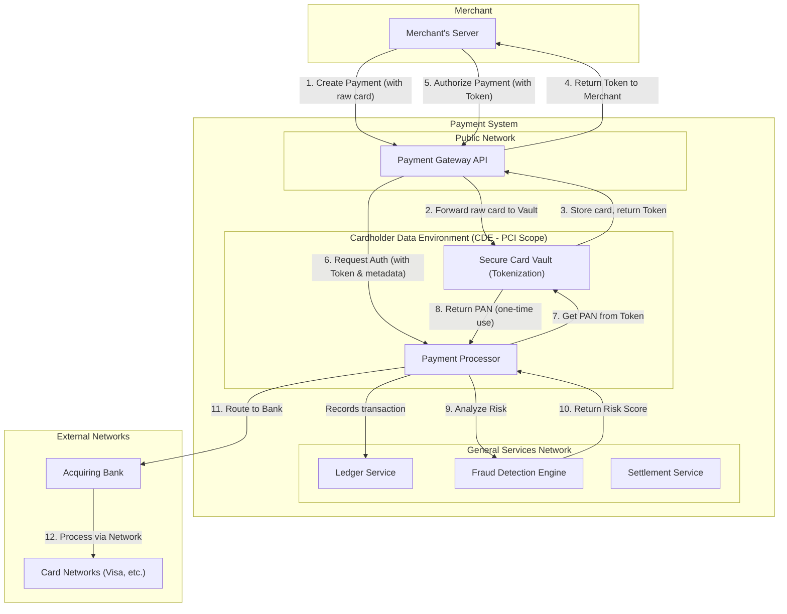

# High-Level Design: Payment Processing System

## 1. Document Information

- **Document Title**: Payment Processing System - High-Level Design
- **Version**: 1.0
- **Date**: 2025-08-26
- **Author**: Jules (AI Agent)
- **Status**: Draft

---

## 2. Executive Summary

### 2.1 Purpose
This document provides the high-level design for a secure, reliable, and scalable Payment Processing System (like Stripe or Adyen). The system is designed to enable merchants to easily accept and manage online payments, while abstracting away the immense complexity and security burdens of dealing with global financial networks.

### 2.2 Scope

**In Scope:**
-   A public API for merchants to create and manage payments.
-   Processing of credit and debit card payments through major card networks (Visa, Mastercard, etc.).
-   A secure vault for storing sensitive cardholder data and providing non-sensitive tokens to merchants, ensuring PCI DSS compliance.
-   The full payment lifecycle: `authorization`, `capture`, `void`, `refund`.
-   Real-time fraud detection and risk analysis for every transaction.
-   A merchant dashboard for viewing transactions, managing refunds, and reporting.
-   A system for calculating fees and settling funds to merchant bank accounts.

**Out of Scope:**
-   Physical point-of-sale (POS) terminals.
-   Alternative payment methods like bank transfers or digital wallets (though the architecture should allow for their future addition).
-   The card networks and issuing/acquiring banks themselves (the system integrates with them).
-   In-depth chargeback management workflows (handled by an operations team).

### 2.3 High-Level Architecture Overview
The architecture is a set of secure, reliable, and highly available microservices designed for PCI DSS compliance. Key components include a public-facing **Payment Gateway API**, a **Secure Card Vault** for tokenization, a core **Payment Processor** that routes transactions to card networks, a real-time **Fraud Detection Engine**, and a **Ledger System** for financial accounting. The system is designed with strict network segmentation to isolate the Cardholder Data Environment (CDE) from the rest of the infrastructure.

---

## 3. System Overview

### 3.1 Business Context
In the digital economy, businesses need a secure and reliable way to accept payments from customers globally. Payment processors act as trusted intermediaries, providing the technology and financial partnerships to make online commerce possible.

### 3.2 System Purpose
The primary purpose is to provide a simple, developer-friendly API that allows merchants to accept payments, while ensuring the highest levels of security, reliability, and compliance with financial regulations.

### 3.3 Success Criteria
-   **Security & Compliance**: Achieve and maintain **PCI DSS Level 1** compliance. Zero incidents of cardholder data compromise.
-   **Availability**: 99.99% uptime for the payment authorization API. A failed payment directly translates to lost merchant revenue.
-   **Reliability**: Every financial transaction is processed accurately. The internal ledger must be 100% correct, and merchants must always receive their settled funds correctly and on time.
-   **Performance**: P99 latency for payment authorization should be < 500ms to ensure a smooth checkout experience.
-   **Scalability**: The system must handle massive traffic peaks during global sales events like Black Friday.

### 3.4 Assumptions
-   The system will integrate with one or more acquiring banks to gain access to card networks.
-   Merchants using the platform are legitimate businesses that have gone through an onboarding and vetting process.
-   The system will be subject to regular, stringent audits by external security assessors (QSAs).

### 3.5 Constraints
-   **PCI DSS Compliance**: This is the single largest constraint and dictates many aspects of the architecture, from network design to logging and access control.
-   **Integration with Legacy Systems**: Card networks and banks often use older, ISO 8583-based protocols, which the system must be able to communicate with.
-   **Data Residency**: The system may need to store data in specific geographic regions to comply with local regulations.

---

## 4. Requirements Analysis

### 4.1 Functional Requirements
-   **FR-001 (Payment Authorization)**: The system shall accept payment details from a merchant and request an authorization from the customer's issuing bank, placing a hold on the funds.
-   **FR-002 (Payment Capture)**: The system shall allow a merchant to "capture" an authorized payment, initiating the transfer of funds.
-   **FR-003 (Refunds)**: The system shall allow a merchant to refund a captured payment, either in full or in part.
-   **FR-004 (Voids)**: The system shall allow a merchant to "void" an authorized payment that has not yet been captured, releasing the hold on the funds.
-   **FR-005 (Card Vault & Tokenization)**: The system must securely store raw cardholder data and provide merchants with a non-sensitive token representing that card. Merchants must use this token for subsequent transactions.
-   **FR-006 (Fraud Detection)**: The system must analyze every payment authorization request in real-time and assign it a risk score, automatically blocking high-risk transactions.
-   **FR-007 (Settlement)**: The system shall aggregate captured funds, deduct processing fees, and regularly settle the remaining balance to the merchant's bank account.

### 4.2 Non-Functional Requirements
-   **Security (PCI DSS)**: This is the most critical NFR. The system must be designed, built, and operated in a way that is compliant with all requirements of the Payment Card Industry Data Security Standard. This includes, but is not limited to, strong encryption, network segmentation, strict access control, and comprehensive logging and monitoring.
-   **Availability**: 99.99% uptime. The system must be deployed in a multi-region, active-active or active-passive configuration to tolerate data center failures.
-   **Data Integrity**: All financial transactions and ledger entries must be handled with ACID properties. No financial data can be lost. RPO must be 0.
-   **Latency**: P99 latency for the core authorization and capture APIs should be under 500ms.
-   **Scalability**: The system must be able to horizontally scale to handle millions of merchants and hundreds of millions of transactions per day, especially during peak shopping seasons.
-   **Auditability**: Every action taken in the system, especially those involving sensitive data or financial movements, must be logged in a tamper-evident manner for auditing purposes.

---

## 5. Architecture Design

### 5.1 Architecture Principles
- **Security by Design**: The architecture is fundamentally shaped by security requirements, not the other way around.
- **Minimize PCI Scope**: The primary architectural goal is to build a small, highly-secured, and isolated environment for handling sensitive data (the CDE), keeping the vast majority of the system "out of scope" for the most stringent PCI DSS requirements.
- **Resilience through Redundancy**: All components are redundant to ensure that payments can always be processed.
- **Separation of Concerns**: The system is broken down into services with distinct responsibilities, preventing a single component from having overly broad access or functionality.

### 5.2 Architecture Patterns
- **Tokenization**: This is the core security pattern. Raw card numbers (PANs) are exchanged for a non-sensitive, unique token. Merchants integrate with the system using these tokens, which means they never have to store or handle raw card data themselves.
- **Network Segmentation**: The system is divided into multiple network segments with strict firewall rules between them. The most secure segment is the Cardholder Data Environment (CDE), which is isolated from everything else.
- **Microservices Architecture**: The system is composed of independent services that can be developed, deployed, and scaled separately.

### 5.3 High-Level Architecture Diagram

### 5.4 Component Overview
- **Payment Gateway**: The public-facing API that merchants interact with. It's responsible for authenticating merchants and routing requests. Crucially, it does not process or store raw card data, but instead proxies it to the Vault.
- **Secure Card Vault**: A highly restricted service that is the only component allowed to handle raw card numbers. It tokenizes cards, stores them securely, and provides a de-tokenization service for the Payment Processor.
- **Payment Processor**: The core logic engine. It orchestrates the authorization and capture of payments by interacting with the Vault, Fraud Engine, and external banking networks.
- **Fraud Detection Engine**: A service that analyzes transaction metadata to provide a real-time risk score.
- **Ledger Service**: The system of record for all financial transactions, ensuring every cent is tracked accurately.
- **Settlement Service**: An asynchronous service that batches captured transactions and sends payout instructions to merchants' bank accounts.

### 5.5 Technology Stack
- **Programming Language**: **Java** or **C#** for their robustness, performance, and strong security features suitable for enterprise-grade financial systems.
- **Databases**: **PostgreSQL** with transparent data encryption for the ledger. A dedicated, hardened database for the Vault.
- **API Gateway**: A secure, industry-standard API gateway like Kong or AWS API Gateway.
- **Infrastructure**: Deployed on a secure cloud environment (e.g., AWS) using principles of Infrastructure as Code (Terraform) to ensure repeatable, auditable infrastructure.

### 5.6 Architecture Decision Records (ADRs)

#### 5.6.1 ADR-001: Centralized, Isolated Card Vault for Tokenization
- **Decision**: To create a dedicated microservice (the Vault) whose sole responsibility is to handle raw cardholder data, and to place it in a heavily restricted network segment (the CDE).
- **Justification**: This drastically reduces the scope of PCI DSS compliance. Instead of the entire platform needing to adhere to the strictest controls, only the tiny CDE does. The rest of the system operates on non-sensitive tokens.
- **Consequences**: Adds a network hop for de-tokenization, but this is an acceptable trade-off for the massive security and compliance benefits.

---

## 6. Detailed Component Design

### 6.1 Component 1: Payment Gateway
- **Purpose**: To provide a simple and secure API for merchants.
- **Responsibilities**:
    -   Authenticate and authorize merchants using API keys.
    -   Provide endpoints for creating payments, capturing authorizations, and issuing refunds.
    -   Proxy sensitive card details directly to the Vault to stay out of PCI scope.
    -   Receive tokens from the Vault and return them to the merchant.
    -   Orchestrate calls to the Payment Processor for non-sensitive operations (e.g., capture a payment using a token).

### 6.2 Component 2: Secure Card Vault
- **Purpose**: To securely store card data and issue tokens.
- **Responsibilities**:
    -   Generate unique, non-guessable tokens for each PAN.
    -   Encrypt all PANs at multiple levels (application-level and database-level encryption).
    -   Store the encrypted PANs and their tokens in a dedicated, hardened database.
    -   Provide a secure, internal-only endpoint for the Payment Processor to de-tokenize a card for a single transaction.
    -   Implement strict access controls and audit logging for every action.

### 6.3 Component 3: Payment Processor
- **Purpose**: To manage the lifecycle of a payment transaction.
- **Responsibilities**:
    -   Receive authorization/capture requests from the Gateway.
    -   Call the Vault to exchange a token for a one-time use PAN.
    -   Send transaction metadata to the Fraud Detection Engine.
    -   Format the transaction into the appropriate protocol (e.g., ISO 8583) for the acquiring bank.
    -   Connect to the acquiring bank to process the transaction.
    -   Interpret the response (e.g., Approved, Declined) and record the result in the Ledger.

### 6.4 Component 4: Fraud Detection Engine
- **Purpose**: To identify and block fraudulent payments in real-time.
- **Responsibilities**:
    -   Receive transaction details (amount, currency, IP address, tokenized card info, etc.).
    -   Apply a configurable set of rules (e.g., "Block all transactions over $1000 from a new IP address").
    -   (Optional) Feed features into a machine learning model to generate a probability of fraud.
    -   Return a risk score or a simple `allow`/`deny` decision to the Payment Processor.

---

## 7. Data Design

### 7.1 Data Models
The system uses a relational database (e.g., PostgreSQL) for most of its data to ensure transactional integrity (ACID compliance).

- **`payments` table**: The core table tracking each transaction.
  - `payment_id` (PK), `merchant_id` (FK), `amount`, `currency`, `status` ('authorized', 'captured', 'refunded', 'failed'), `token_id`, `idempotency_key` (UNIQUE), `created_at`, `updated_at`.
- **`merchant_accounts` table**:
  - `merchant_id` (PK), `business_name`, `status` ('active', 'restricted'), `bank_account_for_settlement`.
- **`card_vault` table (in a separate, hardened database within the CDE)**:
  - `token_id` (PK), `encrypted_pan`, `pan_hash` (for lookups), `expiry_month`, `expiry_year`, `cardholder_name`.
- **`ledger_entries` table**: An immutable, append-only table for double-entry accounting.
  - `entry_id` (PK), `payment_id` (FK), `account_type` (e.g., 'merchant_payable', 'fees_receivable'), `debit_amount`, `credit_amount`, `timestamp`.

### 7.2 Data Storage Strategy
- **Transactional Database**: A primary, highly available PostgreSQL cluster is used for the main application data (payments, ledger, etc.).
- **Vault Database**: The database for the Card Vault is on a separate, dedicated server instance inside the CDE. It has its own stricter backup and access control policies.
- **Data Encryption**: All sensitive data at rest is encrypted at the database level. The PANs in the vault are also encrypted at the application level before being stored, providing multiple layers of protection.

---

## 8. API Design

### 8.1 API Architecture
The system exposes a developer-friendly, versioned REST API over HTTPS.

### 8.2 API Specifications
- **Authentication**: Merchants authenticate using a secret API key provided in the `Authorization: Bearer <key>` header.
- **Idempotency**: All `POST` requests support an `Idempotency-Key` header. If a request is received with a key that has been used in the last 24 hours, the system will not re-process the request and will instead return the original result. This prevents accidental duplicate payments.
- **Client-Side Tokenization**: The primary integration pattern involves client-side tokenization. The merchant's frontend (web or mobile) uses a library provided by the payment processor to send the raw card details directly from the client to the processor's Vault. The Vault returns a token, which the client then sends to the merchant's backend. This way, the merchant's servers never touch the raw card data.

#### 8.2.1 Core API Endpoints
- `POST /v1/tokens`: (Called from client-side library) Creates a token from raw card details.
- `POST /v1/charges`: Creates a payment authorization and capture in one step, using a token.
- `POST /v1/charges/{charge_id}/capture`: Captures a previously authorized payment.
- `POST /v1/refunds`: Creates a refund against a specific charge.

---

## 9. Security Design

### 9.1 PCI DSS Compliance
The entire system is designed to meet and exceed the requirements of **PCI DSS v4.0 Level 1**.
- **Network Segmentation**: The Cardholder Data Environment (CDE) is hosted in a separate VPC with a "deny all" default firewall policy. All traffic entering or leaving the CDE is logged and inspected.
- **Access Control**: Access to the CDE is restricted to a minimal number of personnel and requires multi-factor authentication. All actions are logged to a tamper-evident audit trail.
- **Encryption**:
    - **In Transit**: All communication uses strong, up-to-date TLS (TLS 1.2+).
    - **At Rest**: All cardholder data is encrypted using AES-256. Encryption keys are managed in a dedicated Key Management Service (KMS) or HSM.

### 9.2 Tokenization
As described previously, tokenization is the core security principle. By ensuring that merchants and the majority of the payment system's own services only handle tokens, the risk of cardholder data compromise is drastically reduced.

### 9.3 Fraud & Risk Prevention
- **Real-time Engine**: The Fraud Detection Engine provides a critical layer of defense.
- **3D Secure**: The API supports 3D Secure (Verified by Visa, etc.), which adds a layer of authentication for the customer and can shift liability for fraudulent chargebacks from the merchant to the issuing bank.
- **Velocity Checks**: The system tracks velocities (e.g., number of transactions per card/IP address/merchant per hour) to identify and block suspicious patterns.

---

## 10. Scalability & Performance

### 10.1 Performance Requirements
The system is designed to provide low and predictable latency (<500ms P99) for its core APIs to ensure a smooth merchant and customer experience. It must be able to handle traffic spikes of 10x normal volume during peak shopping seasons.

### 10.2 Scalability Strategy
- **Horizontal Scaling**: The architecture is composed of stateless microservices which can be scaled horizontally by adding more instances. This applies to the Payment Gateway, Payment Processor, and other supporting services.
- **Database Scalability**: The primary relational database can be scaled using read-replicas for reporting and analytics workloads. For write-heavy loads, sharding the database by `merchant_id` can be considered in the future.
- **Cloud-Native**: The system is designed to leverage cloud infrastructure for auto-scaling and global distribution.

---

## 11. Deployment & Operations

### 11.1 Deployment Architecture
The system is deployed on a major cloud provider (e.g., AWS, GCP, Azure). The Cardholder Data Environment (CDE) is deployed in a separate, heavily restricted VPC, with all other services in a general application VPC. All infrastructure is managed as code (IaC) using Terraform for auditability and repeatability.

### 11.2 Environment Strategy
- **Sandbox**: A sandbox environment is provided for merchants to test their integrations. This environment is fully functional but connects to mock card networks.
- **Production**: The live, highly available production environment, deployed across multiple availability zones.

### 11.3 CI/CD Pipeline
- A mature CI/CD pipeline is used for services outside the CDE.
- Deployments to the CDE are subject to much stricter controls, requiring manual approvals, peer review of changes, and extensive logging. Automated deployment to the CDE is disallowed by PCI DSS in many cases.

### 11.4 Operations & Monitoring
- **SRE Team**: A 24/7 Site Reliability Engineering team monitors availability, latency, and error rates.
- **Finance Operations**: A dedicated team manages the daily reconciliation of funds and the settlement process to merchant bank accounts.
- **Security Operations Center (SOC)**: Monitors the system for any potential security threats.

---

## 12. Testing Strategy

### 12.1 PCI DSS Audits
The most critical testing is the regular audit (at least annually) by a Qualified Security Assessor (QSA) to ensure the system remains compliant with PCI DSS. Continuous internal auditing is also performed.

### 12.2 Integration Testing
Extensive integration testing is required against the sandbox environments provided by acquiring banks and card networks to ensure that transaction processing, reconciliation, and error handling work as expected.

### 12.3 Security Testing
Regular vulnerability scanning and third-party penetration testing of the CDE and public-facing applications are mandatory.

---

## 13. Risk Analysis

| Risk | Impact | Probability | Mitigation |
|------|--------|-------------|------------|
| CDE Data Breach | Catastrophic | Very Low | The entire suite of PCI DSS controls: strict network isolation, encryption, access control, and tokenization architecture. |
| Downstream Processor/Bank Outage | High | Medium | Integration with multiple acquiring banks. Dynamic routing to fail over to a secondary processor if the primary is down. |
| Ledger Inconsistency | Critical | Low | Use of a transactional database with ACID properties. A double-entry bookkeeping system for all financial movements. Regular reconciliation. |
| Merchant Fraud / Bust-out | High | Medium | Strong merchant underwriting and KYC process. Real-time fraud detection. Holding a portion of funds in reserve for new merchants. |

---

## 14. Implementation Plan (High-Level)

- **Phase 1 (Security Foundation)**: Design and build the Secure Card Vault and the isolated CDE network. Achieve PCI DSS compliance for this core component first.
- **Phase 2 (Core Processing)**: Build the Payment Processor and integrate with a single acquiring bank partner.
- **Phase 3 (API & Onboarding)**: Build the public Payment Gateway API and the merchant onboarding system.
- **Phase 4 (Beta Launch)**: Onboard a small number of trusted beta merchants to process live payments.
- **Phase 5 (Settlement & Reporting)**: Build the automated settlement and merchant reporting systems.
- **Phase 6 (Public Launch)**: Open the platform to the public.

---

## 15. Appendices

### Appendix A: Glossary
- **PCI DSS**: Payment Card Industry Data Security Standard. A set of security standards for all organizations that handle branded credit cards.
- **CDE**: Cardholder Data Environment. The part of a network that possesses cardholder data or sensitive authentication data.
- **Tokenization**: The process of replacing sensitive data (like a credit card number) with a non-sensitive equivalent, referred to as a token.
- **Acquiring Bank**: A bank that is a member of a card scheme (e.g., Visa, Mastercard) and processes payments on behalf of a merchant.
- **Issuing Bank**: The bank that issued the credit card to the customer.
