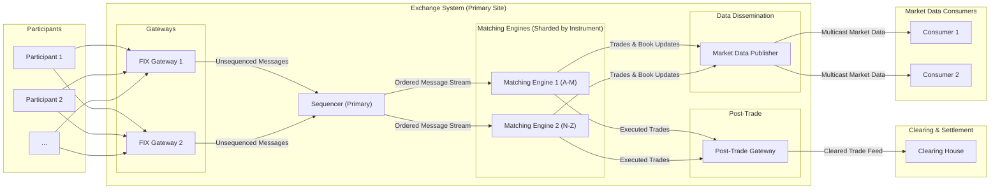

# High-Level Design: Stock Exchange

## 1. Document Information

- **Document Title**: Stock Exchange Platform - High-Level Design
- **Version**: 1.0
- **Date**: 2025-08-26
- **Author**: Jules (AI Agent)
- **Status**: Draft

---

## 2. Executive Summary

### 2.1 Purpose
This document provides the high-level design for a modern, high-performance, and resilient stock exchange platform. The system is designed to serve as a fair, orderly, and transparent marketplace for the trading of securities, ensuring equitable access and deterministic matching for all participants.

### 2.2 Scope

**In Scope:**
-   Secure connectivity for registered market participants (brokers, market makers) via the FIX protocol.
-   A Central Limit Order Book (CLOB) to manage and display open orders.
-   A deterministic matching engine that adheres strictly to Price-Time priority rules.
-   Support for standard order types (Market, Limit, Stop) and trading sessions (Opening Auction, Continuous Trading, Closing Auction).
-   Dissemination of real-time market data (trades and quotes) to all participants via a multicast feed.
-   Gateway for routing cleared trades to a designated clearing and settlement system.
-   Regulatory reporting and audit trail logging.

**Out of Scope:**
-   The clearing and settlement systems themselves.
-   Brokerage-specific applications and user interfaces.
-   Advanced and exotic order types.
-   Historical data analysis and reporting tools for participants.

### 2.3 High-Level Architecture Overview
The architecture is designed for high availability, fault tolerance, and deterministic performance. It features redundant components at every layer. The core of the system is a central **Matching Engine** which processes orders received from participant **Gateways** in a sequence determined by a central **Sequencer**. A **Market Data Publisher** disseminates the results of the matching process to all participants. The entire system is built to ensure fairness and to eliminate any single point of failure.

---

## 3. System Overview

### 3.1 Business Context
A stock exchange is a cornerstone of a modern economy, providing a platform for companies to raise capital and for investors to trade securities. The exchange's integrity, reliability, and fairness are critical for maintaining investor confidence and ensuring efficient capital markets.

### 3.2 System Purpose
The primary purpose of this system is to provide a regulated, automated, and highly available venue for matching buy and sell orders for securities. It must ensure that the market is fair for all participants, with transparent rules and equitable access to information and trading.

### 3.3 Success Criteria
-   **Fairness**: The system must guarantee that its Price-Time matching priority is never violated. All participants must have equitable access to the matching engine.
-   **Availability**: 99.999% uptime during trading hours, with a comprehensive disaster recovery plan to handle data center failures.
-   **Throughput**: The system must handle a peak load of over 1 million orders per second and disseminate over 10 million market data messages per second.
-   **Latency**: While not aiming for the lowest possible latency for a single user (unlike HFT), the system must provide low and, crucially, deterministic latency. P99 order acknowledgement latency should be < 100 microseconds.
-   **Regulatory Compliance**: The system must meet all regulatory requirements for audit trails, reporting, and market surveillance.

### 3.4 Assumptions
-   The exchange operates in a regulated environment under the oversight of a body like the SEC.
-   Market participants are sophisticated firms (brokers, market makers) who connect via standardized protocols (FIX).
-   The system will have a designated clearing house partner to handle post-trade settlement.

### 3.5 Constraints
-   **Fairness is Paramount**: Any design choice that could compromise fairness or determinism is unacceptable.
-   **High Availability**: The system must be designed with redundancy at every level to avoid being a single point of failure for the market.
-   **Auditability**: Every order, modification, cancellation, and trade must be logged in a tamper-evident manner.
-   **Standard Protocols**: The system must use industry-standard protocols like FIX for interoperability with participants.

---

## 4. Requirements Analysis

### 4.1 Functional Requirements
-   **FR-001 (Participant Connectivity)**: The system shall provide secure gateways for participants to submit and manage orders using the FIX protocol.
-   **FR-002 (Order Management)**: The system shall support creating, modifying, and canceling standard order types (Market, Limit, Stop, Immediate-or-Cancel).
-   **FR-003 (Matching Engine)**: The system must implement a matching algorithm based on strict Price-Time priority. A higher-priced buy order takes precedence; a lower-priced sell order takes precedence. For orders at the same price, the one that arrived first takes precedence.
-   **FR-004 (Trading Sessions)**: The system shall support different trading sessions, including an opening auction to determine the opening price, a continuous trading session, and a closing auction.
-   **FR-005 (Market Data Dissemination)**: The system shall publish real-time information about the order book (quotes) and executed trades via a high-performance multicast data feed.
-   **FR-006 (Clearing Feed)**: The system shall generate a real-time feed of all executed trades to be sent to the designated clearing house.
-   **FR-007 (Market Control)**: The system shall provide tools for market operations staff to halt or resume trading in a specific security or the entire market.

### 4.2 Non-Functional Requirements
-   **Fairness & Determinism**: The matching of any two orders must be a deterministic outcome based solely on the orders' attributes and their sequence of arrival.
-   **Availability**: 99.999% uptime. The system must have a hot-hot or hot-warm disaster recovery site in a separate geographical location. RTO < 5 minutes. RPO = 0.
-   **Performance**:
    -   Throughput: Support > 1 million incoming messages/sec and > 10 million outgoing market data messages/sec.
    -   Latency: P99 latency for order acknowledgement < 100 µs. P99 latency for market data dissemination (from trade to publish) < 50 µs.
-   **Reliability**: The system must guarantee zero message loss for orders and trade reports.
-   **Security**: The system must prevent unauthorized access, ensure participants cannot affect each other's orders, and be resilient to DDoS attacks on its public-facing infrastructure.
-   **Scalability**: The architecture must be able to scale to handle increases in the number of listed securities, participants, and overall message volume.

---

## 5. Architecture Design

### 5.1 Architecture Principles
- **Fairness is Paramount**: The system must be architected to provide no participant with a systemic speed or information advantage. All orders are processed in a deterministic sequence.
- **Resilience by Redundancy**: Every critical component must be redundant with automated failover to prevent single points of failure.
- **Data Integrity**: The system must guarantee that no orders or trades are ever lost, even in a failure scenario.
- **Deterministic Processing**: Given the same set of inputs in the same sequence, the system must always produce the exact same output.

### 5.2 Architecture Patterns
- **Input Sequencing**: A central logical sequencer is used to create a single, canonical, and auditable stream of all incoming messages (orders, cancels, etc.). This is the foundation of fairness.
- **Redundant Components**: All critical components (Gateways, Sequencers, Matching Engines) are deployed in at least a primary/backup configuration.
- **Event Sourcing**: The state of the Central Limit Order Book (CLOB) is built by replaying the ordered stream of events from the sequencer. This pattern simplifies recovery and auditing.

### 5.3 High-Level Architecture Diagram

### 5.4 Component Overview
- **FIX Gateway**: Terminates participant connections, authenticates them, and handles the FIX protocol. It forwards valid application messages to the Sequencer.
- **Sequencer**: The logical heart of the exchange. It receives messages from all gateways and assigns them a unique, strictly increasing sequence number. This creates a single, deterministic log of all events.
- **Matching Engine**: Consumes the ordered stream from the Sequencer. It maintains the CLOB for a set of instruments and executes trades according to the Price-Time priority algorithm. It can be sharded by instrument for scalability.
- **Market Data Publisher**: Takes the output from the Matching Engine (trades, book updates) and broadcasts it to all participants via a low-latency multicast feed.
- **Post-Trade Gateway**: Sends reports of executed trades to the designated clearing house for settlement.

### 5.5 Technology Stack
- **Programming Language**: **Java 17+** with a low-latency JVM (e.g., Azul Zing or OpenJDK with ZGC/Shenandoah). Java's maturity, performance, and strong ecosystem make it a robust choice for a complex system like an exchange. C++ is also a viable alternative.
- **Messaging**: A high-performance messaging library like **Aeron** for internal, point-to-point, and multicast communication.
- **Networking**: High-end data center networking switches. **Multicast** for market data feeds. TCP for FIX sessions.
- **Operating System**: Linux, tuned for low-latency operations.

### 5.6 Architecture Decision Records (ADRs)

#### 5.6.1 ADR-001: Central Sequencer for Fairness
- **Decision**: To channel all incoming order messages through a single logical sequencer before matching.
- **Justification**: This ensures a total ordering of events across all participants, which is the technical foundation of a fair market. It eliminates races and ambiguity about which order arrived first.
- **Consequences**: The sequencer can become a throughput bottleneck. It must be highly optimized and is a critical component that requires robust redundancy and failover.

---

## 6. Detailed Component Design

### 6.1 Component 1: FIX Gateway
- **Purpose**: To provide a secure and reliable entry point for participants.
- **Responsibilities**:
    -   Manage TCP connections and FIX sessions for hundreds of participants.
    -   Parse and validate FIX messages.
    -   Perform session-level logic (logon, logout, heartbeats).
    -   Forward valid business messages (e.g., NewOrderSingle) to the Sequencer with a high-precision timestamp.
    -   Receive acknowledgements and execution reports back from the Matching Engine and route them to the correct participant.

### 6.2 Component 2: Sequencer
- **Purpose**: To create a single, ordered log of all material events.
- **Responsibilities**:
    -   Receive messages from all gateways.
    -   Assign a globally unique, monotonic sequence number.
    -   Persist this ordered log to a durable medium (e.g., replicated disk or memory) for recovery.
    -   Stream the sequenced log to all Matching Engine instances.
- **Internal Design**: Typically runs as a primary/backup pair. The primary handles all sequencing. The backup receives the same inputs and is ready to take over in milliseconds if the primary fails.

### 6.3 Component 3: Matching Engine
- **Purpose**: To match buy and sell orders according to deterministic rules.
- **Responsibilities**:
    -   Consume the ordered event stream from the Sequencer.
    -   For each instrument, maintain the Central Limit Order Book (CLOB) in memory.
    -   Apply order actions (add, cancel, modify) to the book.
    -   When an incoming order crosses the spread, generate one or more trades based on Price-Time priority.
    -   Generate output events: Execution Reports for the affected participants and public Trade and Quote events for the Market Data Publisher.
- **Internal Design**: Sharded by instrument or group of instruments. Each shard is typically single-threaded to ensure deterministic processing of the book without lock contention.

### 6.4 Component 4: Market Data Publisher
- **Purpose**: To provide a transparent view of the market to all participants.
- **Responsibilities**:
    -   Consume the public trade and quote events from the Matching Engine(s).
    -   Format these events into the exchange's public market data protocol.
    -   Publish the messages on redundant multicast channels for low-latency, one-to-many distribution.

---

## 7. Data Design

### 7.1 Data Models
- **Central Limit Order Book (CLOB)**: The primary data structure, held in memory for each instrument. It is not a table but a complex object. Conceptually, it contains two sides:
    -   **Bids (Buy Orders)**: Sorted by price descending, then time ascending.
    -   **Asks (Sell Orders)**: Sorted by price ascending, then time ascending.
    This structure allows for instant identification of the best bid and offer (the spread) and efficient application of the matching algorithm.

- **Order Object**: A detailed in-memory representation of an order.
  - `order_id`: Unique identifier.
  - `participant_id`: Who sent the order.
  - `instrument_id`: What is being traded.
  - `sequence_id`: The global sequence number assigned by the Sequencer.
  - `timestamp`: High-precision arrival timestamp.
  - `price`, `quantity`, `side`, `type`.

- **Trade Object**: An object created when a trade occurs.
  - `trade_id`, `instrument_id`, `price`, `quantity`, `timestamp`, `aggressor_order_id`, `passive_order_id`.

### 7.2 Data Storage Strategy
- **In-Memory State**: The live order books for all instruments are held exclusively in the RAM of the Matching Engine servers for microsecond-level access.
- **Durable Event Log**: The canonical log of sequenced messages from the Sequencer is the ultimate source of truth. This log is durably persisted to replicated, high-speed NVMe SSDs before being processed. In a catastrophic failure, the entire state of the exchange can be deterministically rebuilt by replaying this log.
- **Asynchronous Trade Persistence**: Executed trades are asynchronously written to a relational database (e.g., PostgreSQL) by the Post-Trade Gateway. This database is used for regulatory reporting, billing, and archival, not for live trading.

---

## 8. API Design

### 8.1 API Architecture
The exchange exposes two primary external APIs: one for order management (bi-directional) and one for market data (broadcast).

### 8.2 API Specifications

#### 8.2.1 Order Entry API
- **Protocol**: **FIX (Financial Information eXchange)**, typically version 4.2 or 4.4. This is the global industry standard.
- **Transport**: TCP over a secure connection (TLS).
- **Key Messages Supported**:
    - `NewOrderSingle (Tag 35=D)`: To submit a new order.
    - `OrderCancelRequest (35=F)`: To cancel an existing order.
    - `OrderCancelReplaceRequest (35=G)`: To modify an existing order.
- **Key Messages Sent by Exchange**:
    - `ExecutionReport (35=8)`: To acknowledge orders, cancellations, modifications, and report fills (trades).

#### 8.2.2 Market Data API
- **Protocol**: A custom, highly efficient binary protocol designed to convey the maximum amount of information in the smallest possible packet size.
- **Transport**: UDP Multicast. This allows for low-latency, one-to-many distribution of data to all participants simultaneously.
- **Key Messages**:
    - `AddOrder`: A new order has been added to the book.
    - `ModifyOrder`: An order in the book has been modified (e.g., quantity reduced).
    - `DeleteOrder`: An order has been removed from the book.
    - `Trade`: A trade has occurred.
    - `TopOfBookQuote`: A summary of the best bid and offer.

---

## 9. Security Design

### 9.1 Security Architecture
The security model is designed to protect the integrity of the market, ensure fair access, and prevent financial loss or data leakage.

### 9.2 Authentication & Authorization
- **Participant Authentication**: Participants are authenticated at the FIX Gateway. This is a multi-layered process involving:
    1.  IP Whitelisting.
    2.  Secure connection setup (TLS).
    3.  FIX Logon message credentials (`SenderCompID`, `Password`, etc.).
- **Authorization**: Once authenticated, a participant's session is checked against an entitlements database. They are only authorized to trade specific markets or instruments, and their messages are validated against these permissions.

### 9.3 Data Security
- **Data Segregation**: The system is architected to ensure that no participant can see another participant's orders except through the public information disseminated in the market data feed.
- **Encryption**: All participant-facing TCP connections (FIX sessions) are encrypted with TLS. The internal multicast market data feed is typically not encrypted for performance reasons, as it is considered public data within a secured network environment.

### 9.4 Application Security
- **Market Surveillance**: The exchange must provide a real-time feed of all activity to a dedicated Market Surveillance team/system. This system uses its own set of rules to detect potentially abusive behavior such as spoofing, layering, or wash trading.
- **Throttling and Rate Limits**: The FIX Gateways enforce strict, well-defined limits on the number of messages a participant can send over a period of time. This prevents a single participant from overwhelming the system, either accidentally or maliciously.
- **Denial-of-Service (DDoS) Protection**: The exchange's network perimeter is protected by specialized DDoS mitigation hardware and services.

---

## 10. Scalability & Performance

### 10.1 Performance Requirements
The system is designed to provide low and deterministic latency, as detailed in Section 4.2. The primary performance goal is fairness, ensuring no participant has an unfair technical advantage.

### 10.2 Scalability Strategy
- **Horizontal Scaling**:
    -   **Matching Engine**: The system scales by sharding instruments across multiple matching engine instances. For example, stocks A-M run on Engine 1, N-Z on Engine 2. This allows for a near-linear increase in capacity as more securities are listed.
    -   **Gateways**: The number of FIX gateways can be increased to handle a growing number of participant connections.
- **Vertical Scaling**: Core components like the Sequencer and Matching Engines are run on powerful servers with large amounts of RAM to hold the entire order book and process events with minimal latency.

---

## 11. Deployment & Operations

### 11.1 Deployment Architecture
The system is deployed across at least two geographically separate data centers: a primary site and a disaster recovery (DR) site. All critical components are redundant within the primary site and have a corresponding instance in the DR site.

### 11.2 Environment Strategy
- **Development**: Local developer workstations.
- **Certification (Cert)**: A dedicated environment for participants to test their FIX client implementations against the exchange's gateways and matching logic. Passing certification is mandatory before production access is granted.
- **Production**: The live trading environment.

### 11.3 CI/CD Pipeline
Deployment to production is a highly controlled, manual process that occurs during off-market hours (e.g., weekends). It involves a coordinated plan, extensive pre-deployment testing in the Cert environment, and a series of post-deployment checks before the market opens.

### 11.4 Operations & Monitoring
- **Market Operations Team**: A dedicated team that monitors the health of the market, manages trading halts and resumes, and serves as the first point of contact for participant issues.
- **Network Operations Center (NOC)**: Monitors the health of the underlying infrastructure (servers, network, etc.).
- **Alerting**: Automated alerts for any technical or business metric that deviates from its norm (e.g., latency, message rates, trade volumes).

---

## 12. Testing Strategy

### 12.1 Participant Conformance Testing
Before any participant is allowed to connect to the production environment, they must pass a rigorous conformance test in the Cert environment. This test validates that their software correctly implements the FIX protocol and adheres to all exchange rules.

### 12.2 Disaster Recovery (DR) Testing
The exchange must conduct regular, full-scale DR tests where the entire system is failed over to the secondary data center. These tests are often observed by regulators and are critical for proving the exchange's resilience.

### 12.3 Performance & Load Testing
The system is continuously tested against simulated loads that are multiples of the highest historical peak volume to ensure it can handle future growth and extreme market events.

---

## 13. Risk Analysis

| Risk | Impact | Probability | Mitigation |
|------|--------|-------------|------------|
| Sequencer Failure | Critical | Low | Hot-hot or hot-warm backup sequencer with automated, sub-second failover. |
| Data Center Failure | Critical | Low | A fully operational disaster recovery site in a separate geographical location, tested regularly. |
| Split-Brain Scenario | Critical | Low | Use of a consensus mechanism or a "witness" site to ensure only one primary sequencer is active at any time. |
| Regulatory Non-Compliance | High | Low | Regular audits, tamper-evident logging, and a dedicated compliance team. |

---

## 14. Implementation Plan (High-Level)

- **Phase 1 (Core Engine)**: Build the Sequencer and a single Matching Engine instance.
- **Phase 2 (Connectivity)**: Build the FIX Gateway and Market Data Publisher.
- **Phase 3 (Integration & Testing)**: Integrate all components and conduct extensive internal testing.
- **Phase 4 (Certification)**: Open the Cert environment for participants to begin conformance testing.
- **Phase 5 (Launch)**: Go live with a limited set of securities and participants.
- **Phase 6 (Expansion)**: Gradually add more securities and participants to the platform.

---

## 15. Appendices

### Appendix A: Glossary
- **CLOB**: Central Limit Order Book. The data structure at the heart of the exchange that holds all open orders.
- **FIX**: Financial Information eXchange. The industry-standard protocol for order management.
- **Sequencer**: A component that assigns a single, definitive sequence to all incoming messages, ensuring fairness.
- **Price-Time Priority**: The core matching rule: best price wins; for the same price, first order wins.
- **Multicast**: A network protocol for one-to-many data distribution, used for market data feeds.
